MM-Cov-Vac raw data processing, clustering and cell type assignment
================
jenssle
2023-04-06

## Setup

### Load packages

``` r
library(tidyverse)
library(scater)
library(scran)
library(scuttle)
library(patchwork)
library(bluster)
library(batchelor)
library(ggplotify)
library(cowplot)
library(pheatmap)
library(randomcoloR)
library(edgeR)
library(DropletUtils)
library(Seurat)
library(basilisk)
library(reticulate)
library(ggalluvial)
library(MOFA2)
```

### Read in the data

For the following processing, two experiments will be analyzed jointly.
The first (MM3) aimed at comparing the peripheral immune
response/environment after two and three doses of mRNA based
vaccination. The second experiment (MM4) compares the peripheral immune
cell compartment after the third vaccination (TP5) and a later timepoint
where either patients developed COVID-19 (BTI/breakthrough infection).

The raw count data after sevenbridges pipeline’s processing for read
alignment and technical QC.

``` r
#set directory
setwd("~/sc_analysis_je/MM_CoV_Vac_CITE_analysis/20221020_MM3_MM4_downstream")

# MM3 data
df1 <- read.csv(
    "Combined_MM3-WTA_RSEC_MolsPerCell.csv",
    skip = 7
  )

dim(df1)
```

    ## [1] 19969 24766

``` r
# MM 4 data 
df2 <- read.csv(
  "Combined_MM4-WTA_RSEC_MolsPerCell.csv",
  skip = 7
)

dim(df2)
```

    ## [1] 22783 30033

The meta data for those dfs.

``` r
#load the coldata for batchA
coldata1 <- read_csv("MM3-WTA_ADT_Sample_Tag_Calls_Donors.csv") %>%
    dplyr::mutate(invalid = (Sample_Name == "Multiplet" | Sample_Name == "Undetermined")) %>%
    dplyr::mutate(batch = "MM3")
```

    ## Rows: 19969 Columns: 3
    ## ── Column specification ────────────────────────────────────────────────────────
    ## Delimiter: ","
    ## chr (2): Sample_Tag, Sample_Name
    ## dbl (1): Cell_Index
    ## 
    ## ℹ Use `spec()` to retrieve the full column specification for this data.
    ## ℹ Specify the column types or set `show_col_types = FALSE` to quiet this message.

``` r
#load the coldata for MM4
coldata2 <- read.csv("MM4-WTA_ADT_Sample_Tag_Calls_Donors.csv") %>%
    dplyr::mutate(invalid = (Sample_Name == "Multiplet" | Sample_Name == "Undetermined")) %>%
    dplyr::mutate(batch = "MM4")

#combine both coldatas
coldata <- rbind(coldata1, coldata2)
```

Show the patient ID’s.

``` r
unique(coldata$Sample_Name)
```

    ##  [1] "Multiplet"                 "Donor6_TP5_Ctrl"          
    ##  [3] "Undetermined"              "Donor1_TP3_MM"            
    ##  [5] "Donor4_TP3_MM"             "Donor5_TP3_Ctrl"          
    ##  [7] "Donor2_TP5_MM"             "Donor6_TP3_Ctrl"          
    ##  [9] "Donor1_TP5_MM"             "Donor3_TP5_MM"            
    ## [11] "Donor2_TP3_MM"             "Donor4_TP5_MM"            
    ## [13] "Donor3_TP3_MM"             "Donor7_Breakthrough_MM"   
    ## [15] "Donor11_Breakthrough_Ctrl" "Donor8_Breakthrough_MM"   
    ## [17] "Donor11_TP5_Ctrl"          "Donor8_TP5_MM"            
    ## [19] "Donor7_TP5_MM"             "Donor10_TP5_Ctrl"         
    ## [21] "Donor4_Breakthrough_MM"    "Donor9_TP5_MM"            
    ## [23] "Donor10_Breakthrough_Ctrl" "Donor9_Breakthrough_MM"

Add the additional information regarding the samples.

``` r
coldata <- coldata %>%
  dplyr::mutate(Sample_Name = case_when(
    Sample_Tag == "SampleTag10_hs" ~ "Donor5_TP5_Ctrl", 
    TRUE ~ Sample_Name
  ))  %>%
  dplyr::mutate(group = case_when(
    grepl("Ctrl", Sample_Name) ~ "Responder",
    grepl("Donor2", Sample_Name) ~ "NonResponder",
    grepl("Donor1", Sample_Name) ~ "NonResponder",
    grepl("Donor3", Sample_Name) ~ "Responder",
    grepl("Donor4", Sample_Name) ~ "Responder", 
    grepl("Donor7", Sample_Name) ~ "NonResponder",
    grepl("Donor8", Sample_Name) ~ "NonResponder",
    grepl("Donor9", Sample_Name) ~ "Responder"
  )) %>% 
  dplyr::mutate(status = case_when(
    grepl("Ctrl", Sample_Name) ~ "healthy",
    grepl("MM", Sample_Name) ~ "MM"
  )) %>%
  mutate(timepoint = case_when(
    grepl("TP3", Sample_Name) ~ "TP3", 
    grepl("TP5", Sample_Name) ~ "TP5",
    grepl("Breakthrough", Sample_Name) ~ "breakInf"
  ))
```

Check the percentage of multiplets.

``` r
sum(coldata$Sample_Name == "Multiplet")/sum(!is.na(coldata$Sample_Name))
```

    ## [1] 0.1676413

Visualize the different dataset structures.

``` r
coldata %>%
  pivot_longer(!c(Cell_Index:batch), names_to = "levels", values_to = "assign") %>%
  ggplot(aes(x = batch, fill = Sample_Name)) +
  geom_bar() +
  theme_bw() +
  facet_wrap(~ levels, nrow = 3)
```

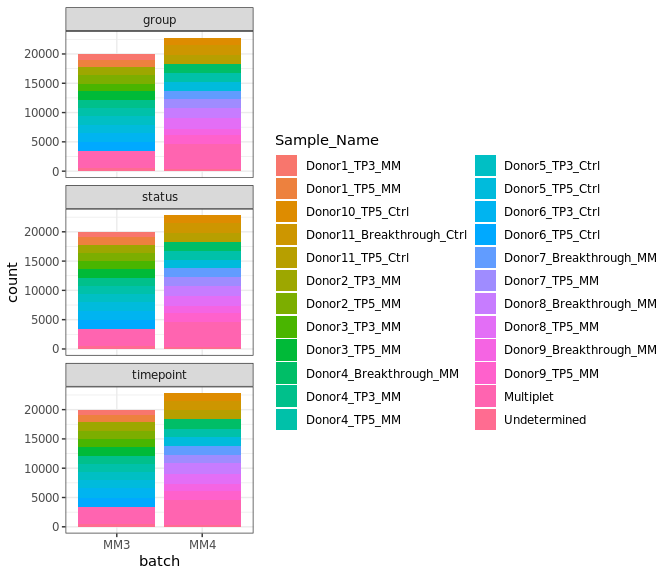<!-- -->

Generate the sce object.

``` r
# for the MM3 data
df_t1 <- df1[,-1] %>% t()

rownames(df_t1) <- colnames(df1[,-1])
colnames(df_t1) <- df1$Cell_Index

sceMM3 <- SingleCellExperiment(assays = list(counts = df_t1),
      colData = coldata1)

# for the MM4 data 
df_t2 <- df2[,-1] %>% t()

rownames(df_t2) <- colnames(df2[,-1])
colnames(df_t2) <- df2$Cell_Index

sceMM4 <- SingleCellExperiment(assays = list(counts = df_t2),
      colData = coldata2)
```

Here, we create a sce object of both batches combined, then split for
the data modalities (WTA and AbSeq), perform the QCsteps for each
modality individually and normalize both modalities. To achieve a
multi-omics integration and multimodal dimension reduction, we later
train a MOFA model on both modalities and search for latent factors that
associate with the batch information. These latent factors will then be
removed from the latent space that is further utilized for clustering
and cell type assignment.

Combine both sce objects. Therefore, we first subset for shared
features.

``` r
#set the universe
universe <- intersect(rownames(sceMM3), rownames(sceMM4))

#subset the sce objects
sceMM3_shared <- sceMM3[universe,]

sceMM4_shared <- sceMM4[universe,]

#create a combined counts df
all_counts <- cbind(assays(sceMM3_shared)$counts, assays(sceMM4_shared)$counts)
dim(all_counts)
```

    ## [1] 23991 42752

``` r
#generawte the joined object
sceMM <- SingleCellExperiment(assays = list(counts = all_counts), 
                              colData = coldata)

sceMM <- sceMM[,!duplicated(colnames(sceMM))]
```

Filter out the unvalids.

``` r
sceMM <- sceMM[,!colData(sceMM)$invalid]
```

Assign the type of feature to rowData information.

``` r
is_AbO <- grepl("pAbO", rownames(sceMM))
rowData(sceMM)$Type <- rep("gene", nrow(sceMM))
rowData(sceMM)$Type[grep("pAbO", rownames(sceMM))] <- "AbO"
table(rowData(sceMM)$Type)
```

    ## 
    ##   AbO  gene 
    ##    49 23942

Split the sce object.

``` r
sceMM_split <- splitAltExps(sceMM, rowData(sceMM)$Type)
altExpNames(sceMM_split)
```

    ## [1] "AbO"

``` r
colData(altExp(sceMM_split)) <- colData(sceMM)
colData(altExp(sceMM_split))
```

    ## DataFrame with 34719 rows and 8 columns
    ##          Cell_Index     Sample_Tag            Sample_Name   invalid       batch
    ##           <numeric>    <character>            <character> <logical> <character>
    ## 830798       830798 SampleTag12_hs        Donor6_TP5_Ctrl     FALSE         MM3
    ## 466682       466682 SampleTag01_hs          Donor1_TP3_MM     FALSE         MM3
    ## 248192       248192 SampleTag07_hs          Donor4_TP3_MM     FALSE         MM3
    ## 646430       646430 SampleTag10_hs        Donor5_TP5_Ctrl     FALSE         MM3
    ## 624022       624022 SampleTag04_hs          Donor2_TP5_MM     FALSE         MM3
    ## ...             ...            ...                    ...       ...         ...
    ## 1340582     1340582 SampleTag04_hs Donor8_Breakthrough_MM     FALSE         MM4
    ## 12829447   12829447 SampleTag07_hs          Donor9_TP5_MM     FALSE         MM4
    ## 8717194     8717194 SampleTag12_hs Donor11_Breakthrough..     FALSE         MM4
    ## 2812468     2812468 SampleTag10_hs        Donor5_TP5_Ctrl     FALSE         MM4
    ## 6500793     6500793 SampleTag03_hs          Donor8_TP5_MM     FALSE         MM4
    ##                 group      status   timepoint
    ##           <character> <character> <character>
    ## 830798      Responder     healthy         TP5
    ## 466682   NonResponder          MM         TP3
    ## 248192      Responder          MM         TP3
    ## 646430      Responder     healthy         TP5
    ## 624022   NonResponder          MM         TP5
    ## ...               ...         ...         ...
    ## 1340582  NonResponder          MM    breakInf
    ## 12829447    Responder          MM         TP5
    ## 8717194     Responder     healthy    breakInf
    ## 2812468     Responder     healthy         TP5
    ## 6500793  NonResponder          MM         TP5

``` r
counts(altExp(sceMM_split))[1:10,1:10]
```

    ##                                       830798 466682 248192 646430 624022 505783
    ## CCR7.CCR7.AHS0273.pAbO                    41     22     34     21     16     34
    ## CD102.ICAM2.AHS0155.pAbO                  14     46    127     97     33     69
    ## CD103.ITGAE.AHS0001.pAbO                   2      2      2      8      1      0
    ## CD11b.ICRF44.ITGAM.AHS0184.pAbO            4     60      3     13     10     12
    ## CD122.MIK.BETA3.IL2RB.AHS0146.pAbO        17      6     15     12      8     17
    ## CD127.IL7R.AHS0028.pAbO                   13     16     24     28     15     28
    ## CD14.MPHIP9.CD14.AHS0037.pAbO              6      8      4      6      3     12
    ## CD152.CTLA4.AHS0017.pAbO                  80    140     96    134     87     88
    ## CD161.DX12.KLRB1.AHS0002.pAbO              8      2     10     13      6      5
    ## CD16.B73.1.FCGR3A_FCGR3B.AHS0242.pAbO      2      0      3      4      3      3
    ##                                       444059 774222 716778 360428
    ## CCR7.CCR7.AHS0273.pAbO                    24    129     24     36
    ## CD102.ICAM2.AHS0155.pAbO                  72     88     84     91
    ## CD103.ITGAE.AHS0001.pAbO                   6     20      3      4
    ## CD11b.ICRF44.ITGAM.AHS0184.pAbO           42     72      8     13
    ## CD122.MIK.BETA3.IL2RB.AHS0146.pAbO        16     87     13     23
    ## CD127.IL7R.AHS0028.pAbO                   38     68     12     30
    ## CD14.MPHIP9.CD14.AHS0037.pAbO              6     18      6      4
    ## CD152.CTLA4.AHS0017.pAbO                 140    236    104    163
    ## CD161.DX12.KLRB1.AHS0002.pAbO             13     37     11     10
    ## CD16.B73.1.FCGR3A_FCGR3B.AHS0242.pAbO      4     96      0      9

### Quality control

Taking advantage from the contamination by ambient solution, most cells
should have non-zero counts for the AbO. This can be investigated by the
cleanTagCounts function and marked for removal. Since we don’t have a
isotype control, the ambient scaling factor for each cell will be
computed.

``` r
qc.stats <- cleanTagCounts(altExp(sceMM_split))
summary(qc.stats$zero.ambient)
```

    ##    Mode   FALSE    TRUE 
    ## logical   34699      20

Filter out the low quality cells by filtering out outliers by library
size, detected features, high mitochondrial transcript percentage and
AbO QC metrics.

``` r
### Remove dead and low quality cells 
#save unfiltered object for later performance evaluation
sce_unfiltered <- sceMM_split 
#identify mitochondrial transcripts 
is.mito <- grep("^MT\\.", rownames(sceMM_split )) ###check regular expresssions
rownames(sceMM_split [is.mito,])
```

    ##  [1] "MT.ATP6" "MT.ATP8" "MT.CO1"  "MT.CO2"  "MT.CO3"  "MT.CYB"  "MT.ND1" 
    ##  [8] "MT.ND2"  "MT.ND3"  "MT.ND4"  "MT.ND4L" "MT.ND5"  "MT.ND6"

``` r
#identify QC metrics
stats <- perCellQCMetrics(sceMM_split , subset = list(Mito = is.mito))
#check QC metrics
colSums(as.matrix(stats))
```

    ##                   sum              detected      subsets_Mito_sum 
    ##            80687410.0            32525126.0            15940916.0 
    ## subsets_Mito_detected  subsets_Mito_percent       altexps_AbO_sum 
    ##              420854.0              752422.9            82598207.0 
    ##  altexps_AbO_detected   altexps_AbO_percent                 total 
    ##             1563796.0             1714948.4           163285617.0

``` r
#compute the high mito samples
high.mito <- isOutlier(stats$subsets_Mito_percent, type="higher", batch = sceMM_split$batch)
#identify outliers for libsize on both ends 
lib_cut <- isOutlier(stats$sum, type = "both", batch = sceMM_split$batch)
#identify outliers for low number of features detected
low_detected <- isOutlier(stats$detected, type = "lower", batch = sceMM_split$batch)
#combine both 
discard <- lib_cut | low_detected | qc.stats$discard | high.mito
#evaluate number of cell to remove 
DataFrame(LibSize=sum(lib_cut), Detected=sum(low_detected), AbO.zero = sum(qc.stats$discard), Total=sum(discard), Mito = sum(high.mito))
```

    ## DataFrame with 1 row and 5 columns
    ##     LibSize  Detected  AbO.zero     Total      Mito
    ##   <integer> <integer> <integer> <integer> <integer>
    ## 1       560        10       485      3178      2357

``` r
colData(sceMM_split) <- cbind(colData(sce_unfiltered), stats)
```

Check diagnostic plots.

``` r
colData(sce_unfiltered) <- cbind(colData(sce_unfiltered), stats)
sce_unfiltered$discard <- discard
gridExtra::grid.arrange(
  plotColData(
    sce_unfiltered,
    x = "batch",
    y = "sum",
    colour_by = "discard"
  ) +
    scale_y_log10() + ggtitle("Total count") +
    theme(axis.text.x = element_text(angle = 90)),
  plotColData(
    sce_unfiltered,
    x = "batch",
    y = "detected",
    colour_by = "discard"
  ) +
    scale_y_log10() + ggtitle("Detected features") +
    theme(axis.text.x = element_text(angle = 90)),
  plotColData(
    sce_unfiltered,
    x = "batch",
    y = "subsets_Mito_percent",
    colour_by = "discard"
  ) + ggtitle("Mito percent") +
    theme(axis.text.x = element_text(angle = 90)),
  plotColData(
    sce_unfiltered,
    x = "batch",
    y = "altexps_AbO_detected",
    colour_by = "discard"
  ) + ggtitle("AbO detected") +
    scale_y_log10() +
    theme(axis.text.x = element_text(angle = 90)),
  ncol = 2
)
```

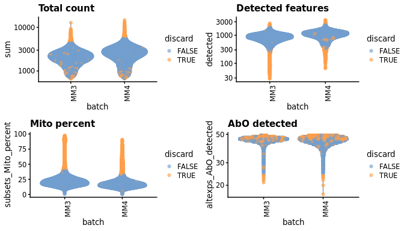<!-- -->

Evaluate fraction of cells to be removed.

``` r
sum(discard)/length(discard)
```

    ## [1] 0.09153489

Remove low quality cells.

``` r
#filter sce to remove low quality cells 
sceMM.split <- sceMM_split[,!discard]
```

## Normalization

Given the biases for AbO “sequencing” (binary nature of abundance with
most cells low expression and some with high expression as well as the a
priori selection of the set of AbO), a certain normalization should be
used on the AbO expression data

Following the OSCA recommendation, we used the median-based
normalization apporach.

First, calculate the “baseline abundance” that should follow a bimodal
distribution.

### compare normalized and unnormalized AbO counts

``` r
baseline <- ambientProfileBimodal(altExp(sceMM.split))
head(baseline)
```

    ##             CCR7.CCR7.AHS0273.pAbO           CD102.ICAM2.AHS0155.pAbO 
    ##                          6.2452513                          8.1574462 
    ##           CD103.ITGAE.AHS0001.pAbO    CD11b.ICRF44.ITGAM.AHS0184.pAbO 
    ##                          0.4458934                          5.8436580 
    ## CD122.MIK.BETA3.IL2RB.AHS0146.pAbO            CD127.IL7R.AHS0028.pAbO 
    ##                          5.0987265                          3.7733825

Then, the size factors to equalize the coverage of the non-upregulated
majority is computed to eliminate the cell-to-cell difference in capture
efficency.

``` r
sf.amb <- medianSizeFactors(altExp(sceMM.split), reference=baseline)
summary(sf.amb)
```

    ##     Min.  1st Qu.   Median     Mean  3rd Qu.     Max. 
    ## 0.009144 0.591569 0.863625 1.000000 1.224033 5.559794

Now, store the sizeFactors for the altExp (meaning AbO data).

``` r
sizeFactors(altExp(sceMM.split)) <- sf.amb
```

Finally, the scaling normalization and log-transformation will be
applied to the RNA counts and the AbO counts using the respective size
factors for the latter.

``` r
sceMM.split <- logNormCounts(sceMM.split, use.altexps=TRUE)
```

Check the count names for both main and altExp.

``` r
assayNames(sceMM.split)
```

    ## [1] "counts"    "logcounts"

``` r
assayNames(altExp(sceMM.split))
```

    ## [1] "counts"    "logcounts"

## Clustering on the basis of MOFA

To use the multimodal data, that we have at hand for the inferrence of
latent factors, we first generate a seurat object and use this for MOFA
training. Later, we attach the MOFA latent factors to the respective
single cell object and then work on with clustering and the following
assignment.

First, a seurat object was created from the sce object (somehow, this
works better then providing a sce object).

``` r
# create seurat object by retrieving counts data and colData from the subsetted sce object
sce_seurat <- CreateSeuratObject(counts = counts(sceMM.split), meta.data = as.data.frame(colData(sceMM.split)))
# fill data slot with the processed and normalized logcounts data from sce object
sce_seurat <- SetAssayData(object = sce_seurat, slot = "data", new.data = logcounts(sceMM.split))
# centering and unit variance is recommended by mofa, therefore centering and scaling is applied 
sce_seurat <- ScaleData(sce_seurat, do.center = TRUE, do.scale = TRUE)
```

A seurat assay object was created for the AbO data.

``` r
# create AbO assay object to add to sce seurat
AbO_assay <- CreateAssayObject(counts = counts(altExp(sceMM.split)))
# fill data slot with logcounts of AbO data
AbO_assay <- SetAssayData(object = AbO_assay, slot = "data", new.data = logcounts(altExp(sceMM.split)))
# centering and unit variance is recommended by mofa, therefore centering and scaling is applied 
AbO_assay <- ScaleData(AbO_assay, do.center = TRUE, do.scale = TRUE)
```

The assay object was included to the initial seurat object stemming from
the sce RNA data.

``` r
sce_seurat[["AbO"]] <- AbO_assay
```

Define features to be included in mofa object. Since we only have a
limited number of RNA and AbO features, we included all.

``` r
#select top 5000 highly variable genes in seurat object
sce_seurat <- FindVariableFeatures(sce_seurat, 
                                   selection.method = "vst",
                                   nfeatures = 5000)
rna_vec <- c(sce_seurat@assays$RNA@var.features)
AbO_vec <- c(rownames(sce_seurat@assays$AbO))
feature_list <- list(rna_vec, AbO_vec)
names(feature_list) <- c("RNA", "AbO")
```

### prepare and train MOFA object

CAVE: the model was trained on a computing cluster allowing for
extensive multi-threading.

``` r
########################
## set up mofa object ##
########################
#create mofa object
mofa_sce <- create_mofa(sce_seurat, 
                        assays = c("RNA", "AbO"),
                        features = feature_list)
#define mofa options (recommended to run with default options)
model_opts <- get_default_model_options(mofa_sce)
#define number of factors
model_opts$num_factors <- 25
#prepare model 
mofa_sce <- prepare_mofa(
  mofa_sce, 
  model_options = model_opts
)
##############
## run mofa ##
##############
# define reticulate path for the python and R connection
reticulate::use_python("/home/jenssle/miniconda3/bin/python", required = TRUE)
mofa_sce <- run_mofa(mofa_sce)
```

Check for correlation between the factors (poor model fit is indicated
by a correlation between the factors).

``` r
plot_factor_cor(mofa_sce)
```

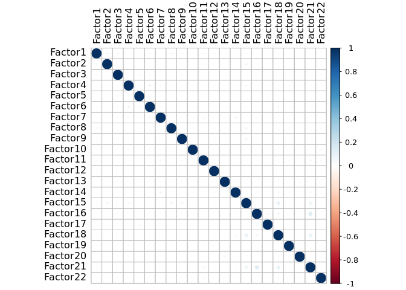<!-- -->

Check for variance explained per inferred latent factor.

``` r
# plot variance explained 
plot_variance_explained(mofa_sce, max_r2 = 20)
```

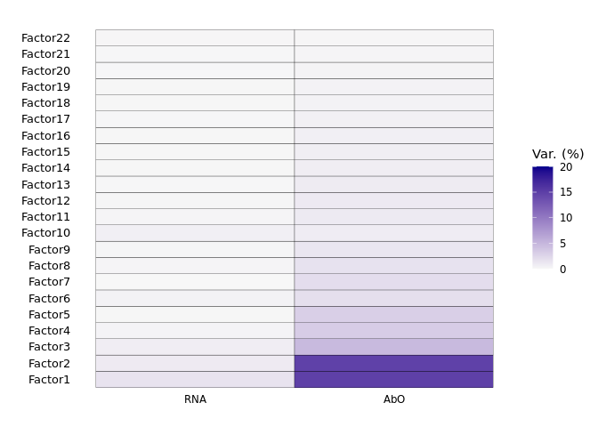<!-- -->

Derive the latent factor matrix from the trained mofa object.

``` r
factors_mofa <- get_factors(mofa_sce, factors = "all")
factors_df <- factors_mofa$group1 %>% as.data.frame()
```

### Identify batch factor

To identify the batch factor, we fitted a logistic regression model to
identify LFs that associate with the batch vector.

First, create common df

``` r
col_df <- colData(sceMM.split) %>%
  as.data.frame() %>%
  dplyr::select(Cell_Index, batch) %>%
  left_join(factors_df %>%
              rownames_to_column("Cell_Index") %>%
              mutate(Cell_Index = as.integer(Cell_Index)),
            by = "Cell_Index") %>%
  mutate(batch = case_when(
    batch =="MM3" ~ 1, 
    TRUE ~ 0
  ))
```

Now, fit the univariate binomial glm for each factor

``` r
#set output df 
final_df <- data.frame(
  Factor = as.character,
  OR = as.numeric(),
  `2.5 %` = as.numeric(),
  `97.5 %` = as.numeric(),
  p.value = as.numeric()
)

#generate factor vec
factor_vec <- colnames(col_df[,-c(1,2)])

#run the glm loop
for(i in factor_vec) {
  
  #fit the model
  glm.fit <-
    glm(
      as.formula(
        paste0("batch", "~", i)),
      family = binomial, 
      data = col_df
      )
  
  #fetch the coef and confint
  int <-
    exp(
      cbind(OR = coef(glm.fit),
            confint(glm.fit)
            )
      ) %>% 
    as.data.frame() 
  #set row names
  rownames(int) <- rownames(exp(cbind(OR = coef(glm.fit), confint(glm.fit))))
  
  #fetch the pval
  int_pValue <- 
    broom::tidy(glm.fit) %>%
    dplyr::select(p.value)
  
  #generate the output df 
  output_df <- cbind(int, int_pValue) %>%
    rownames_to_column("Factor")
  
  final_df <- rbind(final_df, output_df)
  
}
```

``` r
final_df <- final_df %>%
  filter(Factor != "(Intercept)") %>%
  mutate(fdr = p.adjust(p.value, method = "BH"))

final_df
```

    ##      Factor         OR       2.5 %      97.5 %       p.value           fdr
    ## 1   Factor1 0.98917109 0.972865493 1.005739982  1.990294e-01  2.304551e-01
    ## 2   Factor2 0.73431081 0.719993745 0.748873620 4.555508e-208 2.004424e-207
    ## 3   Factor3 0.00346129 0.003011394 0.003965846  0.000000e+00  0.000000e+00
    ## 4   Factor4 1.28929900 1.259757908 1.319602041 3.514302e-102 9.664331e-102
    ## 5   Factor5 3.17525194 3.071394830 3.283588302  0.000000e+00  0.000000e+00
    ## 6   Factor6 1.86734151 1.819878428 1.916349272  0.000000e+00  0.000000e+00
    ## 7   Factor7 1.43127025 1.393312557 1.470425984 4.368337e-150 1.601724e-149
    ## 8   Factor8 1.08191921 1.057209427 1.107258700  2.501761e-11  3.439922e-11
    ## 9   Factor9 1.17839794 1.150356507 1.207283228  1.692539e-40  3.102989e-40
    ## 10 Factor10 1.32862412 1.298866203 1.359146476 4.010097e-133 1.260316e-132
    ## 11 Factor11 1.12015708 1.094064604 1.146925085  4.213200e-21  7.130031e-21
    ## 12 Factor12 1.56077733 1.518906045 1.604191790 6.364451e-224 3.500448e-223
    ## 13 Factor13 0.96584834 0.941085138 0.991249948  8.717550e-03  1.065478e-02
    ## 14 Factor14 1.30251842 1.269898410 1.336081553  1.913637e-92  4.677781e-92
    ## 15 Factor15 0.79155115 0.765625350 0.817860117  8.148352e-44  1.629670e-43
    ## 16 Factor16 0.77043438 0.749588629 0.791755574  7.045399e-78  1.549988e-77
    ## 17 Factor17 1.12066623 1.092149802 1.149982174  4.918269e-18  7.728708e-18
    ## 18 Factor18 0.99664746 0.973280793 1.020548291  7.807549e-01  8.179337e-01
    ## 19 Factor19 0.99267438 0.968239140 1.017727430  5.631200e-01  6.194320e-01
    ## 20 Factor20 1.00232507 0.976340096 1.029001666  8.624183e-01  8.624183e-01
    ## 21 Factor21 0.92701942 0.903389328 0.950965346  7.083484e-09  9.166861e-09
    ## 22 Factor22 0.90500735 0.882084604 0.928335717  1.890807e-14  2.773184e-14

Add MOFA dimreds to initial sce object.

``` r
reducedDim(sceMM.split, "MOFA") <- as.matrix(factors_df)

#create tSNE representation 
sceMM.split <- runTSNE(sceMM.split, dimred =  "MOFA", name = "tSNE_mofa")
# plot tsne_mofa
plotReducedDim(sceMM.split, "tSNE_mofa", colour_by="batch")
```

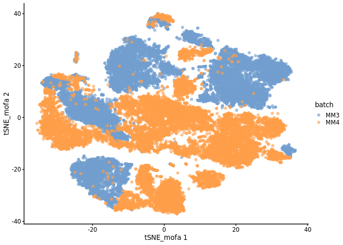<!-- -->

Visualize the first two mofa factors.

``` r
plotReducedDim(sceMM.split, "MOFA", colour_by = "batch")
```

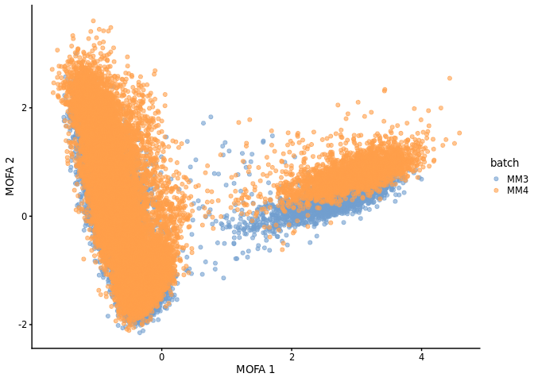<!-- -->

Visualize the MOFA factors suspect for containing the batch effect.

``` r
plotReducedDim(sceMM.split, "MOFA", ncomponents = c(3,5), colour_by = "batch")
```

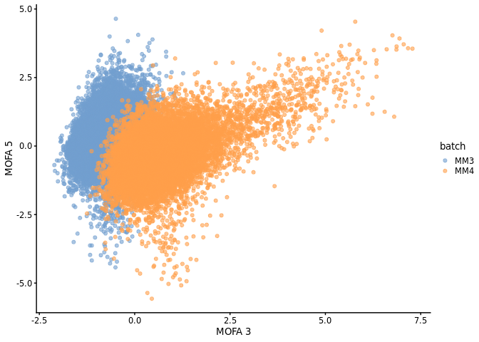<!-- -->

Now, add the reduced dim without the factors with the batch effect.

``` r
reducedDim(sceMM.split, "MOFA") <- as.matrix(factors_df[,-c(3,5)])

#create tSNE representation 
sceMM.split <- runTSNE(sceMM.split, dimred =  "MOFA", name = "tSNE_mofa")
# plot tsne_mofa
plotReducedDim(sceMM.split, "tSNE_mofa", colour_by="batch")
```

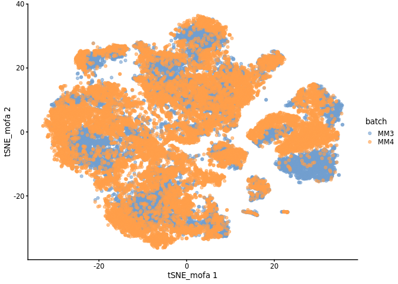<!-- -->

This batch removal seems to work quite well, so we continued with the
MOFA dimred without the batch-explaining factors.

### Clustering

``` r
set.seed(42)
mofa.labels <- clusterCells(sceMM.split,
                            use.dimred = 'MOFA',
                            BLUSPARAM = NNGraphParam(cluster.fun =
                                                       "leiden",
                                                     k = 50))  
table(mofa.labels)
```

    ## mofa.labels
    ##    1    2    3    4    5    6    7    8    9   10   11   12   13   14   15   16 
    ## 2376 4649  793  974 4438 3737  827   49 1969 5978  951 1979  537  641  753  496 
    ##   17 
    ##  394

Add the mofa-derived labels to sce object.

``` r
colData(sceMM.split)$mofa.label <- mofa.labels 
colData(altExp(sceMM.split))$mofa.label <- mofa.labels
```

Visualize the labels.

``` r
# plot tsne_mofa
plotReducedDim(sceMM.split, "tSNE_mofa", colour_by="mofa.label")
```

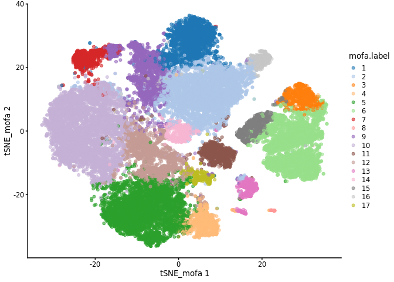<!-- -->

Visualize via UMAP.

``` r
sceMM.split <- runUMAP(sceMM.split, dimred =  "MOFA", name = "UMAP_mofa")
# plot tsne_mofa
plotReducedDim(sceMM.split, "UMAP_mofa", colour_by="mofa.label")
```

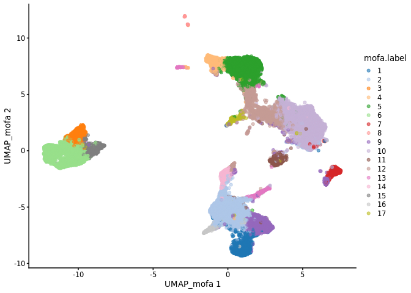<!-- -->

## Marker detection

### RNA marker

``` r
marker.info.RNA <- scoreMarkers(sceMM.split, groups = colData(sceMM.split)$mofa.label)
#create empty vector to store to markers
marker_list_RNA <- vector()
for(i in 1:17) {
  chosen <- marker.info.RNA[[i]] 
  ordered <- chosen[order(chosen$mean.AUC, decreasing=TRUE),] #select top markers by mean.AUC
  top_marker <- ordered@rownames[1:10] #select top 5 markers per cluster 
  
  marker_list_RNA <- c(marker_list_RNA, top_marker)
  
}
unique_marker_list_RNA <- unique(marker_list_RNA)
heatmap_marker <- plotGroupedHeatmap(sceMM.split, 
                                     features=unique_marker_list_RNA,
                                     group="mofa.label", 
                                     center=TRUE, 
                                     zlim=c(-1.5, 1.5), 
                                     cluster_rows = FALSE, 
                                     treeheight_col = 5, 
                                     fontsize=7, 
                                     block = "batch")
```

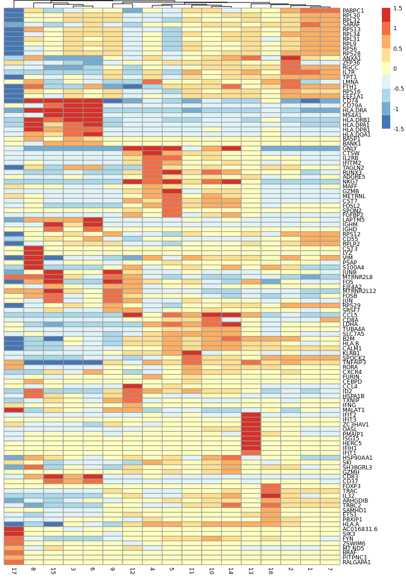<!-- -->

### Protein marker

``` r
marker.info.prot <- scoreMarkers(altExp(sceMM.split), groups = colData(altExp(sceMM.split))$mofa.label)
#create empty vector to store to markers
marker_list_prot <- vector()
for(i in 1:17) {
  chosen <- marker.info.prot[[i]] 
  ordered <- chosen[order(chosen$mean.AUC, decreasing=TRUE),] #select top markers by mean.AUC
  top_marker <- ordered@rownames[1:8] #select top 5 markers per cluster 
  
  marker_list_prot <- c(marker_list_prot, top_marker)
  
}
unique_marker_list_prot <- unique(marker_list_prot)
heatmap_marker.prot <- plotGroupedHeatmap(altExp(sceMM.split), 
                                     features=unique_marker_list_prot,
                                     group="mofa.label", 
                                     center=TRUE, 
                                     zlim=c(-1.5, 1.5), 
                                     cluster_rows = FALSE, 
                                     treeheight_col = 5, 
                                     fontsize=7)
```

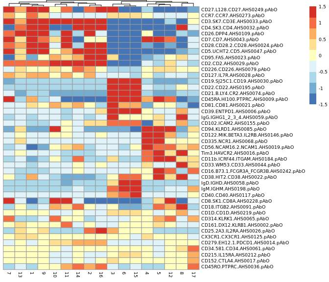<!-- -->

On the basis of these expression markers, we pre-assign groups of
clusters that feature cells from the same population.

B cells –> 3,6,15

NK cells –> 4,5

CD4+ T cells –> 1, 2, 8, 9, 13, 14, 16

CD8+ T cells –> 7, 10, 11, 12

undefined, maybe myeloid –> 17

Save the intermediate object

``` r
saveRDS(sceMM.split, "20230404_sceMM.split.rds")
```

## Subclustering

For the subclustering, we again create wrapper functions that help with
the mofa factor generation.

``` r
seurat_converter <- function(sce) {
  
  # create seurat object by retrieving counts data and colData from the subsetted sce object
  sce_seurat <-
    CreateSeuratObject(counts = counts(sce),
                       meta.data = as.data.frame(colData(sce)))
  
  # fill data slot with the processed and normalized logcounts data from sce object
  sce_seurat <-
    SetAssayData(object = sce_seurat,
                 slot = "data",
                 new.data = logcounts(sce))
  
  # centering and unit variance is recommended by mofa, therefore centering and scaling is applied
  sce_seurat <-
    ScaleData(sce_seurat, do.center = TRUE, do.scale = TRUE)
  
  # create AbO assay object to add to sce seurat
  AbO_assay <- CreateAssayObject(counts = counts(altExp(sce)))
  
  # fill data slot with logcounts of AbO data
  AbO_assay <-
    SetAssayData(object = AbO_assay,
                 slot = "data",
                 new.data = logcounts(altExp(sce)))
  
  # centering and unit variance is recommended by mofa, therefore centering and scaling is applied
  AbO_assay <- ScaleData(AbO_assay, do.center = TRUE, do.scale = TRUE)
  
  #set the AbO assay
  sce_seurat[["AbO"]] <- AbO_assay
  
  #select top 5000 highly variable genes in seurat object
  sce_seurat <- FindVariableFeatures(sce_seurat,
                                     selection.method = "vst",
                                     nfeatures = 5000)
  
  return(sce_seurat)
  
}
```

Create also a wrapper function, that takes the trained mofa model and
attaches the factors as a new dimred to the respective sce object.

``` r
mofa_extractor_w <- function(sce, mofa) {
  
  factors_mofa <- get_factors(mofa, factors = "all")
  
  factors_df <- factors_mofa$group1 %>% as.data.frame()
  
  reducedDim(sce, "MOFA") <- as.matrix(factors_df)
  
  return(sce)
  
}

mofa_extractor_wo <- function(sce, mofa, vec) {
  
  factors_mofa <- get_factors(mofa, factors = "all")
  
  factors_df <- factors_mofa$group1 %>% as.data.frame()
  
  reducedDim(sce, "MOFA") <- as.matrix(factors_df[,-vec])
  
  return(sce)
  
}
```

Create a third wrapper function for the RNA marker gene visualization.

``` r
rna_marker_heatmapper <- function(sce, n) {
  
  marker.info.RNA <-
    scoreMarkers(sce, groups = colData(sce)$mofa.label, block = sce$batch)
  
  #create empty vector to store to markers
  marker_list_RNA <- vector()
  
  for (i in 1:n) {
    chosen <- marker.info.RNA[[i]]
    
    ordered <-
      chosen[order(chosen$mean.AUC, decreasing = TRUE), ] #select top markers by mean.AUC
    
    top_marker <-
      ordered@rownames[1:8] #select top 5 markers per cluster
    
    marker_list_RNA <- c(marker_list_RNA, top_marker)
    
  }
  
  unique_marker_list_RNA <- unique(marker_list_RNA)
  
  heatmap_marker <- plotGroupedHeatmap(
    sce,
    features = unique_marker_list_RNA,
    group = "mofa.label",
    center = TRUE,
    zlim = c(-1.5, 1.5),
    cluster_rows = FALSE,
    treeheight_col = 5,
    fontsize = 7,
    block = "batch"
  )
  
  return(heatmap_marker)
  
}
```

Create a fourth wrapper function for extracting the relevant surface
markers.

``` r
prot_marker_heatmapper <- function(sce, n) {
  
  marker.info.prot <-
    scoreMarkers(altExp(sce), groups = colData(altExp(sce))$mofa.label, block = sce$batch)
  
  #create empty vector to store to markers
  marker_list_prot <- vector()
  
  for (i in 1:n) {
    chosen <- marker.info.prot[[i]]
    
    ordered <-
      chosen[order(chosen$mean.AUC, decreasing = TRUE), ] #select top markers by mean.AUC
    
    top_marker <-
      ordered@rownames[1:8] #select top 5 markers per cluster
    
    marker_list_prot <- c(marker_list_prot, top_marker)
    
  }
  
  unique_marker_list_prot <- unique(marker_list_prot)
  
  heatmap_marker.prot <- plotGroupedHeatmap(
    altExp(sce),
    features = unique_marker_list_prot,
    group = "mofa.label",
    center = TRUE,
    zlim = c(-1.5, 1.5),
    cluster_rows = FALSE,
    treeheight_col = 5,
    fontsize = 7, 
    block = "batch"
  )
  
  return(heatmap_marker.prot)
  
}
```

Create a wrapper function for batch effect detection.

``` r
batch_detecter <- function(sce, mofa) {
  
  #fetch latent factors
  factors_mofa <- get_factors(mofa, factors = "all")
  factors_df <- factors_mofa$group1 %>% as.data.frame()
  
  #fetch coldata
  col_df <- colData(sce) %>%
  as.data.frame() %>%
  dplyr::select(Cell_Index, batch) %>%
  left_join(factors_df %>%
              rownames_to_column("Cell_Index") %>%
              mutate(Cell_Index = as.integer(Cell_Index)),
            by = "Cell_Index") %>%
  mutate(batch = case_when(
    batch =="MM3" ~ 1, 
    TRUE ~ 0
  ))
  
  #set output df
  final_df <- data.frame(
    Factor = as.character,
    OR = as.numeric(),
    `2.5 %` = as.numeric(),
    `97.5 %` = as.numeric(),
    p.value = as.numeric()
  )
  
  #generate factor vec
  factor_vec <- colnames(col_df[, -c(1, 2)])
  
  #run the glm loop
  for (i in factor_vec) {
    #fit the model
    glm.fit <-
      glm(as.formula(paste0("batch", "~", i)),
          family = binomial,
          data = col_df)
    
    #fetch the coef and confint
    int <-
      exp(cbind(OR = coef(glm.fit),
                confint(glm.fit))) %>%
      as.data.frame()
    #set row names
    rownames(int) <-
      rownames(exp(cbind(OR = coef(glm.fit), confint(glm.fit))))
    
    #fetch the pval
    int_pValue <-
      broom::tidy(glm.fit) %>%
      dplyr::select(p.value)
    
    #generate the output df
    output_df <- cbind(int, int_pValue) %>%
      rownames_to_column("Factor")
    
    final_df <- rbind(final_df, output_df)
    
  }
  
  # filter output
  final_df <- final_df %>%
  filter(Factor != "(Intercept)") %>%
  mutate(fdr = p.adjust(p.value, method = "BH"))
  
  #return output
  return(final_df)
}
```

### B cells

First, subset the respective object

``` r
sceMM.split.B <- sceMM.split[, sceMM.split$mofa.label %in% c(3,6,15)]
```

Convert into seurat

``` r
mofaB_seurat <- seurat_converter(sceMM.split.B)
```

    ## Centering and scaling data matrix

    ## Warning: Feature names cannot have underscores ('_'), replacing with dashes
    ## ('-')

    ## Warning: Feature names cannot have underscores ('_'), replacing with dashes
    ## ('-')

    ## Centering and scaling data matrix

Run mofa for dimred

``` r
########################
## set up mofa object ##
########################
#create mofa object
mofa_sce <- create_mofa(mofaB_seurat, 
                        assays = c("RNA", "AbO"),
                        features = feature_list)
#define mofa options (recommended to run with default options)
model_opts <- get_default_model_options(mofa_sce)
#define number of factors
model_opts$num_factors <- 25
#prepare model 
mofa_sce <- prepare_mofa(
  mofa_sce, 
  model_options = model_opts
)
##############
## run mofa ##
##############
# define reticulate path for the python and R connection
reticulate::use_python("/home/jenssle/miniconda3/bin/python", required = TRUE)
mofa_sce.B <- run_mofa(mofa_sce)
```

Check for the batch-associated latent factors.

``` r
b_lf <- batch_detecter(sceMM.split.B, mofa_sce.B)

b_lf
```

    ##    Factor           OR        2.5 %       97.5 %       p.value           fdr
    ## 1 Factor1 1.319847e-03 8.414699e-04 2.007201e-03 1.049134e-196 4.721102e-196
    ## 2 Factor2 3.334310e+00 3.076066e+00 3.620858e+00 2.471174e-184 7.413522e-184
    ## 3 Factor3 1.474040e+00 1.388605e+00 1.566128e+00  1.185717e-36  2.134290e-36
    ## 4 Factor4 1.734838e+00 1.634286e+00 1.842938e+00  3.012819e-72  6.778842e-72
    ## 5 Factor5 1.148401e+00 1.084266e+00 1.216635e+00  2.475964e-06  2.785460e-06
    ## 6 Factor6 8.848379e-01 8.374854e-01 9.346063e-01  1.229243e-05  1.229243e-05
    ## 7 Factor7 8.067236e-01 7.595418e-01 8.563373e-01  2.212032e-12  3.318048e-12
    ## 8 Factor8 8.438261e-01 7.944097e-01 8.958928e-01  3.053540e-08  3.925980e-08
    ## 9 Factor9 4.473105e+16 4.113274e+15 5.208918e+17 1.266150e-211 1.139535e-210

Retreive the relevant factors and add to sce object.

``` r
sceMM.split.B <- mofa_extractor_w(sceMM.split.B, mofa_sce.B)
```

Plot with batch effect present.

``` r
#create tSNE representation 
sceMM.split.B <- runTSNE(sceMM.split.B, dimred =  "MOFA", name = "tSNE_mofaB")
# plot tsne_mofa
plotReducedDim(sceMM.split.B, "tSNE_mofaB", colour_by="batch")
```

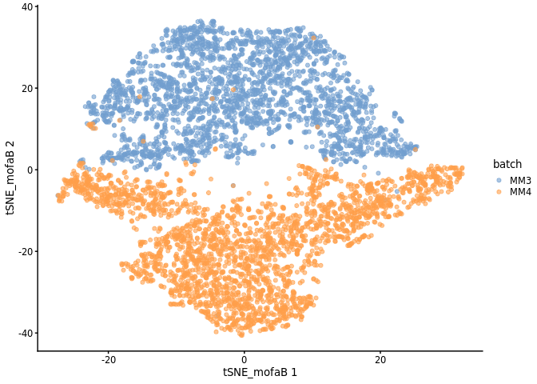<!-- -->

Add the batch corrected factors and generate tSNEMOFA.

``` r
batchvec <- c(1,2,9)

sceMM.split.B <- mofa_extractor_wo(sceMM.split.B, mofa_sce.B, batchvec)

#create tSNE representation 
sceMM.split.B <- runTSNE(sceMM.split.B, dimred =  "MOFA", name = "tSNE_mofaB")
```

Visualize the dimred.

``` r
# plot tsne_mofa
plotReducedDim(sceMM.split.B, "tSNE_mofaB", colour_by="batch")
```

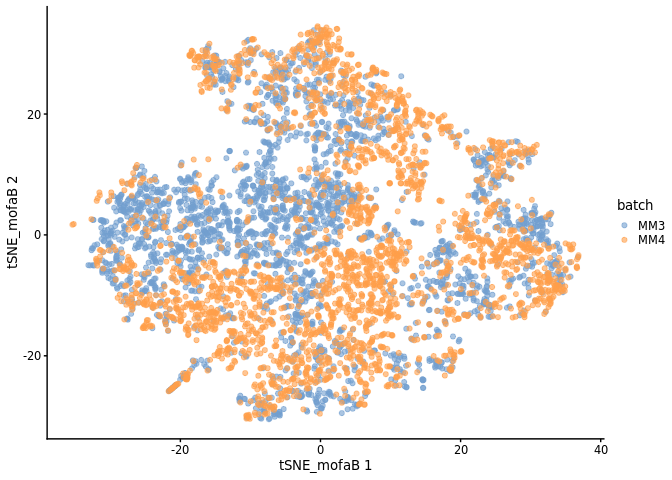<!-- -->

Cluster.

``` r
set.seed(42)
mofa.labels <- clusterCells(sceMM.split.B,
                            use.dimred = 'MOFA',
                            BLUSPARAM = NNGraphParam(cluster.fun =
                                                       "leiden",
                                                     k = 40)) 
table(mofa.labels)
```

    ## mofa.labels
    ##    1    2    3    4    5    6 
    ## 1366  910  457   51 1043 1456

Add the mofa-derived labels to sce object.

``` r
colData(sceMM.split.B)$mofa.label <- mofa.labels 
colData(altExp(sceMM.split.B))$mofa.label <- mofa.labels
```

Visualize the labels.

``` r
# plot tsne_mofa
plotReducedDim(sceMM.split.B, "tSNE_mofaB", colour_by="mofa.label")
```

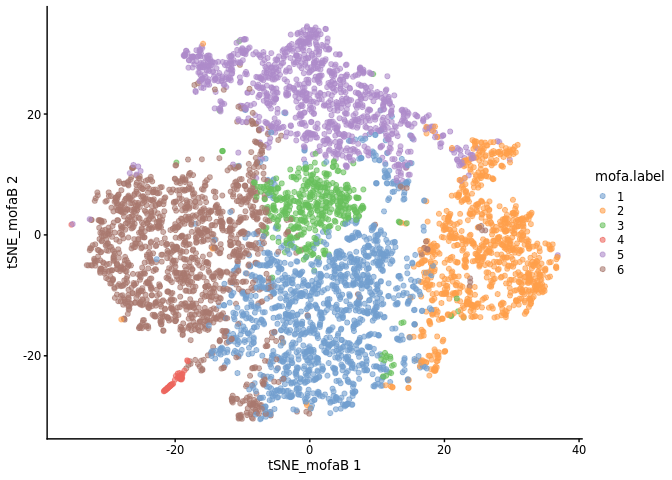<!-- -->

Show the marker genes.

``` r
rna_marker_heatmapper(sceMM.split.B,6)
```

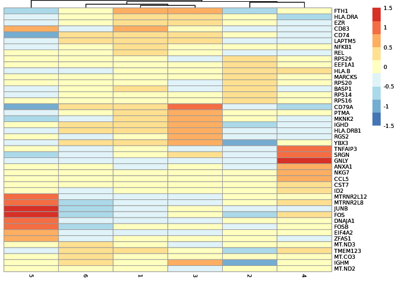<!-- -->

Show the marker proteins.

``` r
prot_marker_heatmapper(sceMM.split.B, 6)
```

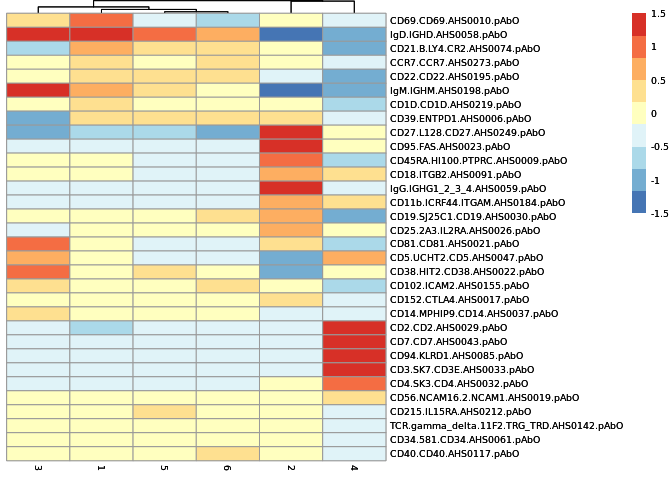<!-- -->

Assignment

1 \<- IgD CD69+ mature naive B cells

2 \<- IgG memory B cells

3 \<- IgM IgD mature naive B cells

4 \<- no b cells (to be removed)

5,6 \<- IgD CD69- mature naive B cells

Save the object.

``` r
saveRDS(sceMM.split.B, "20230404_sceMM.split.B_unassigned.rds")
```

Remove the intermediate objects.

``` r
rm(mofa_sce.B)
rm(mofaB_seurat)
```

Assign the objects.

``` r
sceMM.split.B_assigned <- sceMM.split.B

colData(sceMM.split.B_assigned)$cell_type <-
  case_when(
    colData(sceMM.split.B_assigned)$mofa.label == "1"  ~ "IgD CD69+ mature naive B cells",
    colData(sceMM.split.B_assigned)$mofa.label == "2"  ~ "IgG memory B cells",
    colData(sceMM.split.B_assigned)$mofa.label == "3"  ~ "IgM IgD mature naive B cells",
    colData(sceMM.split.B_assigned)$mofa.label == "5" |
      colData(sceMM.split.B_assigned)$mofa.label == "6" ~ "IgD CD69- mature naive B cells",
    colData(sceMM.split.B_assigned)$mofa.label == "4" ~ "rm" 
  ) 
  
plotReducedDim(sceMM.split.B_assigned, "tSNE_mofaB", colour_by="cell_type")  
```

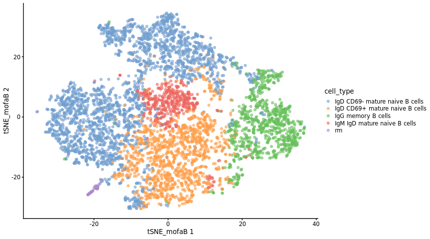<!-- -->

### NK cells

First, subset the respective object.

``` r
sceMM.split.NK <- sceMM.split[, sceMM.split$mofa.label %in% c(4,5)]
```

Convert into seurat.

``` r
mofaNK_seurat <- seurat_converter(sceMM.split.NK)
```

    ## Centering and scaling data matrix

    ## Warning: Feature names cannot have underscores ('_'), replacing with dashes
    ## ('-')

    ## Warning: Feature names cannot have underscores ('_'), replacing with dashes
    ## ('-')

    ## Centering and scaling data matrix

Run mofa for dimred.

``` r
########################
## set up mofa object ##
########################
#create mofa object
mofa_sce <- create_mofa(mofaNK_seurat, 
                        assays = c("RNA", "AbO"),
                        features = feature_list)
#define mofa options (recommended to run with default options)
model_opts <- get_default_model_options(mofa_sce)
#define number of factors
model_opts$num_factors <- 25
#prepare model 
mofa_sce <- prepare_mofa(
  mofa_sce, 
  model_options = model_opts
)
##############
## run mofa ##
##############
# define reticulate path for the python and R connection
reticulate::use_python("/home/jenssle/miniconda3/bin/python", required = TRUE)
mofa_sce.NK <- run_mofa(mofa_sce)
```

Check for the batch-explaining latent factors.

``` r
NK_lf <- batch_detecter(sceMM.split.NK, mofa_sce.NK)

NK_lf
```

    ##      Factor           OR        2.5 %       97.5 %       p.value           fdr
    ## 1   Factor1 0.7459005107 0.7046874796 0.7890898657  2.969300e-24  7.126321e-24
    ## 2   Factor2 0.8486308079 0.8019910444 0.8977597077  1.165846e-08  1.998594e-08
    ## 3   Factor3 0.0004384677 0.0002466378 0.0007463424 2.679605e-165 3.215526e-164
    ## 4   Factor4 1.8342558273 1.7229237528 1.9544875750  2.442050e-79  9.768201e-79
    ## 5   Factor5 0.4285145320 0.3984690738 0.4601483843 6.513748e-118 3.908249e-117
    ## 6   Factor6 1.2200831415 1.1415254544 1.3047383771  5.441028e-09  1.088206e-08
    ## 7   Factor7 1.6072853863 1.5106445363 1.7112556465  2.419731e-50  7.259193e-50
    ## 8   Factor8 0.9425808339 0.8923378784 0.9955712730  3.418478e-02  4.102174e-02
    ## 9   Factor9 0.9316712956 0.8771144567 0.9895062996  2.136118e-02  3.204176e-02
    ## 10 Factor10 1.0692797746 1.0064978814 1.1362370068  3.025601e-02  4.034134e-02
    ## 11 Factor11 1.0200686877 0.9648919357           NA  5.586375e-01  6.094227e-01
    ## 12 Factor12 1.0069438315 0.9508531179 1.0902397077  7.877607e-01  7.877607e-01

Retreive the relevant factors and add to sce object.

``` r
sceMM.split.NK <- mofa_extractor_w(sceMM.split.NK, mofa_sce.NK)
```

Plot with batch effect present.

``` r
#create tSNE representation 
sceMM.split.NK <- runTSNE(sceMM.split.NK, dimred =  "MOFA", name = "tSNE_mofaNK")
# plot tsne_mofa
plotReducedDim(sceMM.split.NK, "tSNE_mofaNK", colour_by="batch")
```

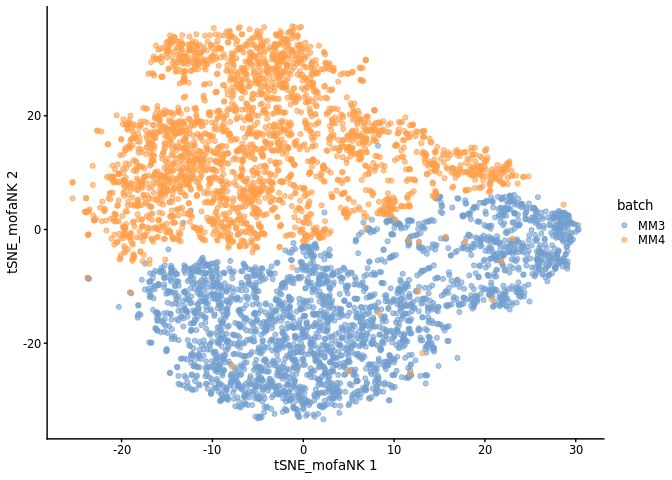<!-- -->

Plot after removal of batch-related LFs.

``` r
batchvec <- c(3,5)

sceMM.split.NK <- mofa_extractor_wo(sceMM.split.NK, mofa_sce.NK, batchvec)

#create tSNE representation 
sceMM.split.NK <- runTSNE(sceMM.split.NK, dimred =  "MOFA", name = "tSNE_mofaNK")
```

Visualize dimred.

``` r
# plot tsne_mofa
plotReducedDim(sceMM.split.NK, "tSNE_mofaNK", colour_by="batch")
```

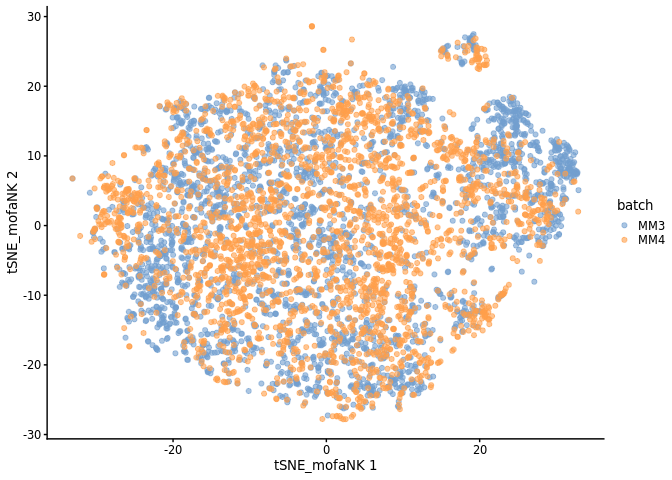<!-- -->

Cluster.

``` r
set.seed(42)
mofa.labels <- clusterCells(sceMM.split.NK,
                            use.dimred = 'MOFA',
                            BLUSPARAM = NNGraphParam(cluster.fun =
                                                       "leiden",
                                                     k = 30))  
table(mofa.labels)
```

    ## mofa.labels
    ##    1    2    3    4    5    6    7    8 
    ##  805 1160  768 2305  193  179    1    1

Add the mofa-derived labels to sce object.

``` r
colData(sceMM.split.NK)$mofa.label <- mofa.labels 
colData(altExp(sceMM.split.NK))$mofa.label <- mofa.labels
```

Visualize the labels.

``` r
# plot tsne_mofa
plotReducedDim(sceMM.split.NK, "tSNE_mofaNK", colour_by="mofa.label")
```

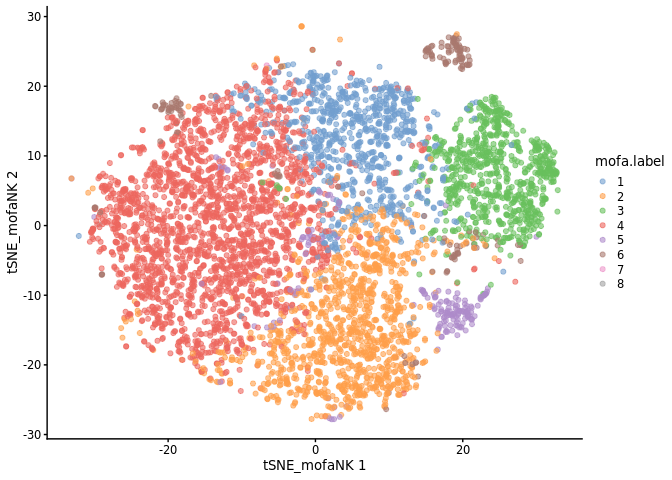<!-- -->

Show the marker genes.

``` r
rna_marker_heatmapper(sceMM.split.NK, 6)
```

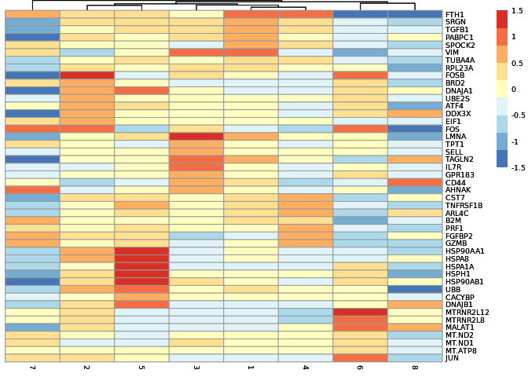<!-- -->

Show the marker proteins.

``` r
prot_marker_heatmapper(sceMM.split.NK, 6)
```

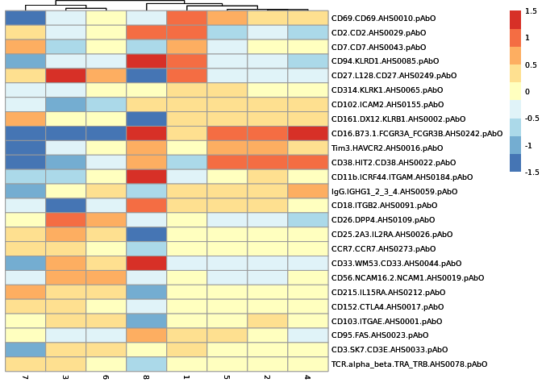<!-- -->

Assignment:

3,6 \<- CD56 bright/CD16 dim NK cells

2,4,5 \<- CD16+ CD38+ TIM3+ NK cells

7,8 \<- no NK cells (remove)

1 \<- TGFb+ CD69+ CD94+ CD2+ NK cells (IL2 responsive cluster 4 from
Smith SL et al \[high KLRK1, KLRD1\])

Save object.

``` r
saveRDS(sceMM.split.NK, "20230404_sceMM.split.NK_unassigned.rds")
```

Remove the unwanted stuff.

``` r
rm(mofa_sce.NK)
```

Assign the objects.

``` r
sceMM.split.NK_assigned <- sceMM.split.NK

colData(sceMM.split.NK_assigned)$cell_type <-
  case_when(
    colData(sceMM.split.NK_assigned)$mofa.label == "3" |
      colData(sceMM.split.NK_assigned)$mofa.label == "6" ~ "CD56 bright/CD16 low NK cells",
    colData(sceMM.split.NK_assigned)$mofa.label == "2" |
      colData(sceMM.split.NK_assigned)$mofa.label == "4" |
      colData(sceMM.split.NK_assigned)$mofa.label == "5" ~ "CD16+ CD38+ TIM3+ NK cells",
    colData(sceMM.split.NK_assigned)$mofa.label == "7" |
      colData(sceMM.split.NK_assigned)$mofa.label == "8" ~ "rm",
    colData(sceMM.split.NK_assigned)$mofa.label == "1" ~ "TGFb+ CD69+ CD94+ CD2+ NK cells"
  ) 
  
plotReducedDim(sceMM.split.NK_assigned, "tSNE_mofaNK", colour_by="cell_type")  
```

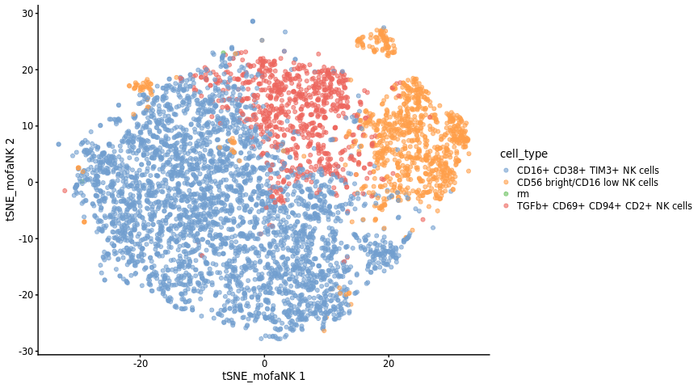<!-- -->

### T cells

First, subset the respective object.

``` r
sceMM.split.T <- sceMM.split[, sceMM.split$mofa.label %in% c(1, 2, 8, 9, 13, 14, 16, 7, 10, 11, 12)]
```

Convert into seurat.

``` r
mofaT_seurat <- seurat_converter(sceMM.split.T)
```

    ## Centering and scaling data matrix

    ## Warning: Feature names cannot have underscores ('_'), replacing with dashes
    ## ('-')

    ## Warning: Feature names cannot have underscores ('_'), replacing with dashes
    ## ('-')

    ## Centering and scaling data matrix

Run mofa for dimred.

``` r
########################
## set up mofa object ##
########################
#create mofa object
mofa_sce <- create_mofa(mofaT_seurat, 
                        assays = c("RNA", "AbO"),
                        features = feature_list)
#define mofa options (recommended to run with default options)
model_opts <- get_default_model_options(mofa_sce)
#define number of factors
model_opts$num_factors <- 25
#prepare model 
mofa_sce <- prepare_mofa(
  mofa_sce, 
  model_options = model_opts
)
##############
## run mofa ##
##############
# define reticulate path for the python and R connection
reticulate::use_python("/home/jenssle/miniconda3/bin/python", required = TRUE)
mofa_sce.T <- run_mofa(mofa_sce)
```

Check for the batch-associated latent factors.

``` r
#fetch latent factors
  factors_mofa <- get_factors(mofa_sce.T, factors = "all")
  factors_df <- factors_mofa$group1 %>% as.data.frame()
  
  #fetch coldata
  col_df <- colData(sceMM.split.T) %>%
  as.data.frame() %>%
  dplyr::select(Cell_Index, batch) %>%
  left_join(factors_df %>%
              rownames_to_column("Cell_Index") %>%
              mutate(Cell_Index = as.integer(Cell_Index)),
            by = "Cell_Index") %>%
  mutate(batch = case_when(
    batch =="MM3" ~ 1, 
    TRUE ~ 0
  ))
  
  #set output df
  final_df <- data.frame(
    Factor = as.character,
    OR = as.numeric(),
    `2.5 %` = as.numeric(),
    `97.5 %` = as.numeric(),
    p.value = as.numeric()
  )
  
  #generate factor vec
  factor_vec <- colnames(col_df[, -c(1, 2, 17)])
  
  #run the glm loop
  for (i in factor_vec) {
    print(i)
    
    #fit the model
    glm.fit <-
      glm(as.formula(paste0("batch", "~", i)),
          family = binomial,
          data = col_df)
    
    #fetch the coef and confint
    int <-
      exp(cbind(OR = coef(glm.fit),
                confint(glm.fit))) %>%
      as.data.frame()
    #set row names
    rownames(int) <-
      rownames(exp(cbind(OR = coef(glm.fit), confint(glm.fit))))
    
    #fetch the pval
    int_pValue <-
      broom::tidy(glm.fit) %>%
      dplyr::select(p.value)
    
    #generate the output df
    output_df <- cbind(int, int_pValue) %>%
      rownames_to_column("Factor")
    
    final_df <- rbind(final_df, output_df)
    
  }
```

    ## [1] "Factor1"
    ## [1] "Factor2"
    ## [1] "Factor3"
    ## [1] "Factor4"
    ## [1] "Factor5"
    ## [1] "Factor6"
    ## [1] "Factor7"
    ## [1] "Factor8"
    ## [1] "Factor9"
    ## [1] "Factor10"
    ## [1] "Factor11"
    ## [1] "Factor12"
    ## [1] "Factor13"
    ## [1] "Factor14"
    ## [1] "Factor16"
    ## [1] "Factor17"
    ## [1] "Factor18"
    ## [1] "Factor19"
    ## [1] "Factor20"
    ## [1] "Factor21"
    ## [1] "Factor22"

``` r
  # filter output
  final_df <- final_df %>%
  filter(Factor != "(Intercept)") %>%
  mutate(fdr = p.adjust(p.value, method = "BH"))

final_df
```

    ##      Factor         OR     2.5 %     97.5 %       p.value           fdr
    ## 1   Factor1 0.75997256 0.7403023 0.78009399  7.569316e-94  2.270795e-93
    ## 2   Factor2 0.35422174 0.3418577 0.36690716  0.000000e+00  0.000000e+00
    ## 3   Factor3 0.01723134 0.0153717 0.01926706  0.000000e+00  0.000000e+00
    ## 4   Factor4 0.92071605 0.8949084 0.94723732  1.211172e-08  1.956509e-08
    ## 5   Factor5 1.86690579 1.8050717 1.93137790 1.091976e-286 7.643830e-286
    ## 6   Factor6 1.50648193 1.4622394 1.55231010 4.479626e-159 1.567869e-158
    ## 7   Factor7 1.71978708 1.6647841 1.77704028 1.008848e-232 5.296451e-232
    ## 8   Factor8 1.24649875 1.2085316 1.28622022  1.032721e-43  2.409683e-43
    ## 9   Factor9 1.19537704 1.1586965 1.23333412  3.754457e-29  7.167600e-29
    ## 10 Factor10 1.02842477 0.9977674 1.06003471  6.952286e-02  7.743587e-02
    ## 11 Factor11 0.97562433 0.9478384 1.00420038  9.396182e-02  9.865992e-02
    ## 12 Factor12 0.82534805 0.7997786 0.85165046  4.849826e-33  1.018463e-32
    ## 13 Factor13 0.73618021 0.7136961 0.75925303  7.197436e-84  1.889327e-83
    ## 14 Factor14 2.46379555 2.3279779 2.60871082 1.240020e-211 5.208085e-211
    ## 15 Factor16 0.95380982 0.9254334 0.98303365  2.138595e-03  2.806906e-03
    ## 16 Factor17 0.86274441 0.8004197 0.91514612  1.476136e-05  2.214205e-05
    ## 17 Factor18 0.93034813 0.8992762 0.96201035  2.741632e-05  3.838285e-05
    ## 18 Factor19 0.99588815 0.9643007 1.02850780  8.021440e-01  8.021440e-01
    ## 19 Factor20 0.95337780 0.9236801 0.98399995  3.089663e-03  3.816642e-03
    ## 20 Factor21 1.32009501 1.2180152 1.43860163  6.833205e-11  1.195811e-10
    ## 21 Factor22 1.37287612 0.9743951 1.93456329  7.006103e-02  7.743587e-02

Retreive the relevant factors and add to sce object.

``` r
sceMM.split.T <- mofa_extractor_w(sceMM.split.T, mofa_sce.T)
```

Plot with batch effect present.

``` r
#create tSNE representation 
sceMM.split.T <- runTSNE(sceMM.split.T, dimred =  "MOFA", name = "tSNE_mofaT")
# plot tsne_mofa
plotReducedDim(sceMM.split.T, "tSNE_mofaT", colour_by="batch")
```

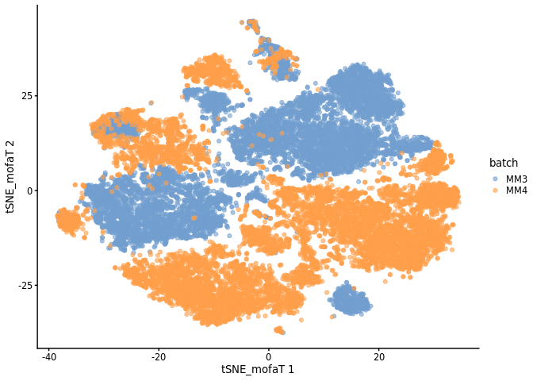<!-- -->

Plot after removal of batch-associated LFs.

``` r
batchvec <- c(2,3,5,6,7,14)

sceMM.split.T <- mofa_extractor_wo(sceMM.split.T, mofa_sce.T, batchvec)

#create tSNE representation 
sceMM.split.T <- runTSNE(sceMM.split.T, dimred =  "MOFA", name = "tSNE_mofaT")
```

Show dimred.

``` r
# plot tsne_mofa
plotReducedDim(sceMM.split.T, "tSNE_mofaT", colour_by="batch")
```

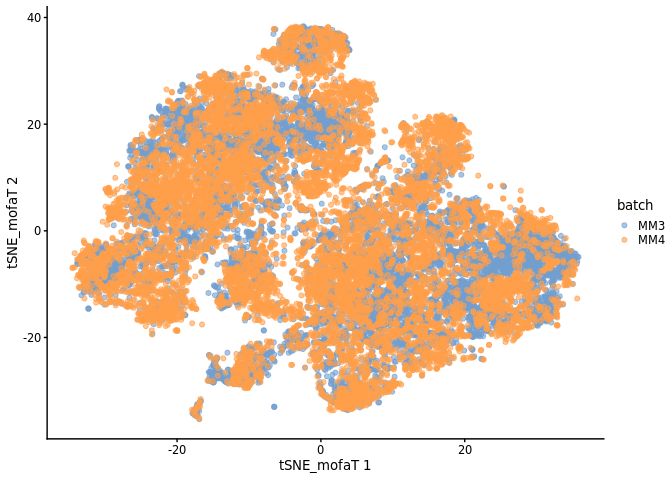<!-- -->

Cluster.

``` r
set.seed(42)
mofa.labels <- clusterCells(sceMM.split.T,
                            use.dimred = 'MOFA',
                            BLUSPARAM = NNGraphParam(cluster.fun =
                                                       "leiden",
                                                     k = 30))  
table(mofa.labels)
```

    ## mofa.labels
    ##    1    2    3    4    5    6    7    8    9   10   11   12   13   14   15   16 
    ## 2085 2127 2022    4 1446  108   64  557  974 2658  965  367  749 2104  692 1164 
    ##   17   18   19   20   21   22   23   24 
    ##  522   62  557 1204   11    8    1    1

Add the mofa-derived labels to sce object.

``` r
colData(sceMM.split.T)$mofa.label <- mofa.labels 
colData(altExp(sceMM.split.T))$mofa.label <- mofa.labels
```

Visualize the labels.

``` r
# plot tsne_mofa
plotReducedDim(sceMM.split.T, "tSNE_mofaT", colour_by="mofa.label")
```

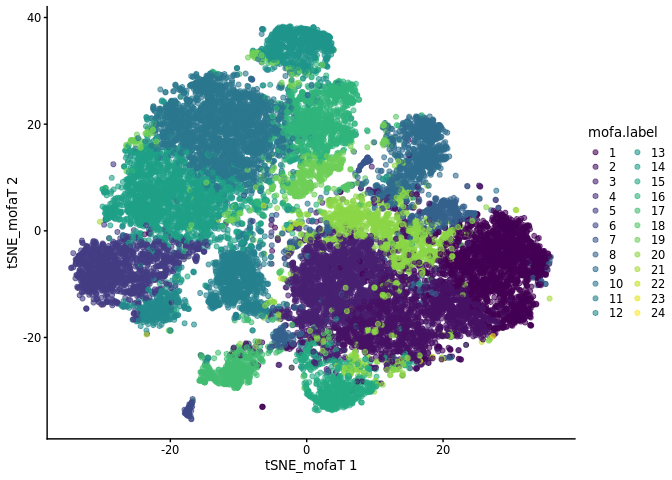<!-- -->

Show the marker genes.

``` r
rna_marker_heatmapper(sceMM.split.T, 24)
```

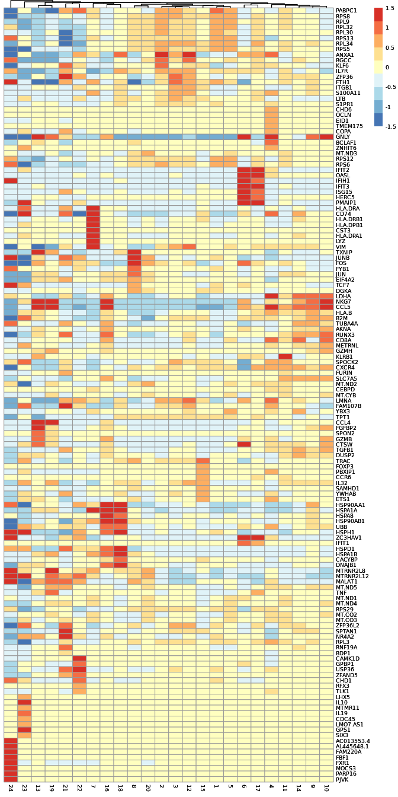<!-- -->

Show the marker proteins.

``` r
prot_marker_heatmapper(sceMM.split.T, 24)
```

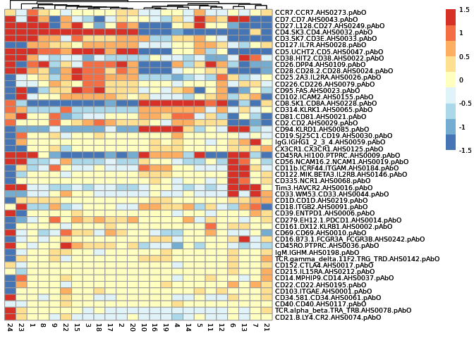<!-- -->

Assignment

1,8 \<- CD4, CD27, CD7, CD45RA+ CD25- –> CD4+ CD45RA+ naive T cells

2, 20 \<- CD4, CD5, CD26, CD27, CD25, CD28 –> CD4+ naive T cells

3, 18 \<- CD4, CD5, CD26, CD27-, CD25, CD28 –> CD4+ memory T cells

9, 17 \<- CD4+ CD226+ CD279+ –> CD4+ cytotoxic T cells

4 \<- remove

5 \<- CD8+ CD7+ CD27+, CD314 (+/-) CD45RA+ –> CD8+ CD45RA+ naive T cells

6 \<- TCR g/d CD94+ CD8- CD4- –> TCR g/d cells

7 \<- CD33, CD38, IgG –> no T cells (remove later)

10 \<- CD8+ CD94+ CD45RA+ CD26- CD27- CD28- –> CD8+ CD45RA+ effector
memory T cells

11,12 \<- CD8+ CD26+ CD28 (+/-) –> CD8+ naive T cells

13 \<- CD16+ CD4/8 neg CD11b, CD38+ –> CD16+ CD38+ NK cells?

14 \<- CD8+ CD26 neg CD279+ CD314+ –> CD8+ central memory T cells

15 \<- CD4+ CD95+ FOXP3 –> T reg

16 \<- CD8+ CD94+ CD45RA- CD26- CD27- CD28- –> CD8+ effector memory T
cells

19 \<- CD56, CD8 (+) CD314 –> NKT cells

21 \<- IgM, CD16, CD34 –> no T cells (remove later)

22 \<- remove

23 \<- remove

24 \<- remove

Save object .

``` r
saveRDS(sceMM.split.T, "20230404_sceMM.split.T_unassigned.rds")
```

Annotate cell type names to labels for T cells.

``` r
sceMM.split.T_assigned <- sceMM.split.T

colData(sceMM.split.T_assigned)$cell_type <-
  case_when(
    colData(sceMM.split.T_assigned)$mofa.label == "1" |
      colData(sceMM.split.T_assigned)$mofa.label == "8" ~ "CD4+ CD45RA+ naive T cells ",
    colData(sceMM.split.T_assigned)$mofa.label == "2" |
      colData(sceMM.split.T_assigned)$mofa.label == "20" ~ "CD4+ naive T cells ",
     colData(sceMM.split.T_assigned)$mofa.label == "3" |
      colData(sceMM.split.T_assigned)$mofa.label == "17" |
      colData(sceMM.split.T_assigned)$mofa.label == "18" ~ "CD4+ memory T cells",
      colData(sceMM.split.T_assigned)$mofa.label == "9"   ~ "CD4+ cytotoxic T cells ",
    colData(sceMM.split.T_assigned)$mofa.label == "5" ~ "CD8+ CD45RA+ naive T cells",
    colData(sceMM.split.T_assigned)$mofa.label == "6" ~ "TCR g/d cells",
    colData(sceMM.split.T_assigned)$mofa.label == "10" ~ "CD8+ CD45RA+ effector memory T cells",
    colData(sceMM.split.T_assigned)$mofa.label == "11" |
     colData(sceMM.split.T_assigned)$mofa.label == "12" ~ "CD8+ naive T cells ",
    colData(sceMM.split.T_assigned)$mofa.label == "13" ~ "CD16+ CD38+ FAS+ NK cells",
    colData(sceMM.split.T_assigned)$mofa.label == "14" ~ "CD8+ central memory T cells",
    colData(sceMM.split.T_assigned)$mofa.label == "15" ~ "T reg",
    colData(sceMM.split.T_assigned)$mofa.label == "16" ~ "CD8+ effector memory T cells",
    colData(sceMM.split.T_assigned)$mofa.label == "19" ~ "NKT cells",
    colData(sceMM.split.T_assigned)$mofa.label == "4" |
      colData(sceMM.split.T_assigned)$mofa.label == "7" |
      colData(sceMM.split.T_assigned)$mofa.label == "21" |
      colData(sceMM.split.T_assigned)$mofa.label == "22" |
      colData(sceMM.split.T_assigned)$mofa.label == "23" |
      colData(sceMM.split.T_assigned)$mofa.label == "24"~ "rm"
  )

plotReducedDim(sceMM.split.T_assigned, "tSNE_mofaT" , colour_by="cell_type")  
```

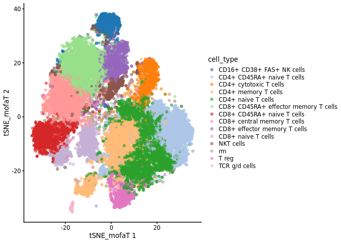<!-- -->

## Assignment

Define the subsets.

``` r
colData(sceMM.split.T_assigned)$subset <- "T cells"
colData(sceMM.split.B_assigned)$subset <- "B cells"
colData(sceMM.split.NK_assigned)$subset <- "NK cells"
```

Merge the cell type and subset information.

``` r
#create combined colData set
combined_coldata <- rbind(colData(sceMM.split.T_assigned), colData(sceMM.split.B_assigned), colData(sceMM.split.NK_assigned))
combined_celltypes <- combined_coldata$cell_type
names(combined_celltypes) <- row.names(combined_coldata)
combined_subset <- combined_coldata$subset
names(combined_subset) <- row.names(combined_coldata)
```

Add the new cell type assignment to the sce object.

``` r
sceMM.split_assigned <- sceMM.split
# for the main Exp
colData(sceMM.split_assigned)$cell_type <- combined_celltypes[row.names(colData(sceMM.split_assigned))]
names(colData(sceMM.split_assigned)$cell_type) <- NULL
colData(sceMM.split_assigned)$subset <- combined_subset[row.names(colData(sceMM.split_assigned))]
names(colData(sceMM.split_assigned)$subset) <- NULL
# for the alt Exp
colData(altExp(sceMM.split_assigned))$cell_type <- combined_celltypes[row.names(colData(altExp(sceMM.split_assigned)))]
names(colData(altExp(sceMM.split_assigned))$cell_type) <- NULL
colData(altExp(sceMM.split_assigned))$subset <- combined_subset[row.names(colData(altExp(sceMM.split_assigned)))]
names(colData(altExp(sceMM.split_assigned))$subset) <- NULL
```

Remove unlabeled cells.

``` r
sceMM.split_assigned_subs <- sceMM.split_assigned[, !is.na(sceMM.split_assigned$cell_type)]

sceMM.split_assigned_subs <- sceMM.split_assigned_subs[, sceMM.split_assigned_subs$cell_type != "rm"]
```

Generate a final dimred from mofa factors after cell type assignment and
removal of cells.

``` r
#create tSNE representation 
sceMM.split_assigned_subs <- runTSNE(sceMM.split_assigned_subs, dimred =  "MOFA", name = "tSNE_mofa")
#create UMAP representation
sceMM.split_assigned_subs <- runUMAP(sceMM.split_assigned_subs, dimred =  "MOFA", name = "UMAP_mofa")
```

Visualize the assigned clusters.

``` r
plotReducedDim(sceMM.split_assigned_subs, "tSNE_mofa" , colour_by="cell_type")  
```

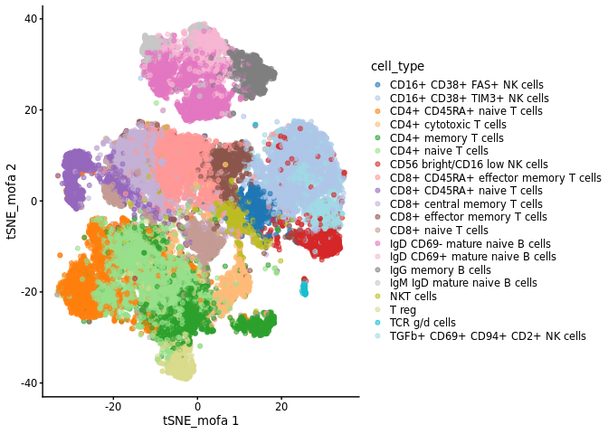<!-- -->

Visualize UMAP.

``` r
plotReducedDim(sceMM.split_assigned_subs, "UMAP_mofa" , colour_by="cell_type") 
```

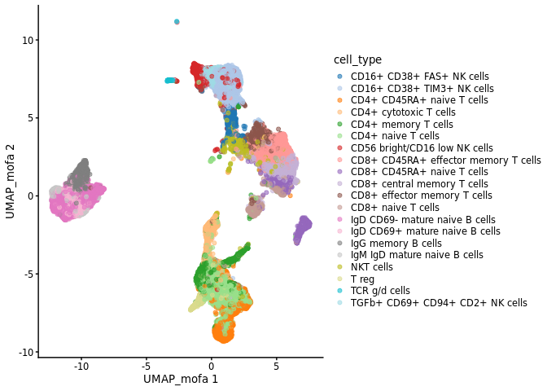<!-- -->

### RNA markers

``` r
#find markers per cluster by controlling for batch and experimental group
marker.info_sce_assigned <- scoreMarkers(sceMM.split_assigned_subs, groups = colData(sceMM.split_assigned_subs)$cell_type, block = sceMM.split_assigned_subs$batch)  
marker.info_sce_assigned
```

    ## List of length 20
    ## names(20): CD16+ CD38+ FAS+ NK cells ... TGFb+ CD69+ CD94+ CD2+ NK cells

``` r
#create empty vector to store to markers
marker_list_sce_assigned<- vector()
for(i in seq_len((length(marker.info_sce_assigned)))) {
  chosen <- marker.info_sce_assigned[[i]] 
  ordered <- chosen[order(chosen$mean.AUC, decreasing=TRUE),] #select top markers by mean.AUC
  top_marker <- ordered@rownames[1:10] #select top 20 markers per cluster 
  
  marker_list_sce_assigned <- c(marker_list_sce_assigned, top_marker)
  
}
unique_marker_list_sce_assigned <- unique(marker_list_sce_assigned)
heatmap_marker_sce_assigned <- plotGroupedHeatmap(sceMM.split_assigned_subs, 
                                     features=unique_marker_list_sce_assigned,
                                     group="cell_type", 
                                     center=TRUE, 
                                     zlim=c(-1.5, 1.5), 
                                     cluster_rows = FALSE, 
                                     treeheight_col = 5, 
                                     fontsize=7, 
                                     block = "batch")
```

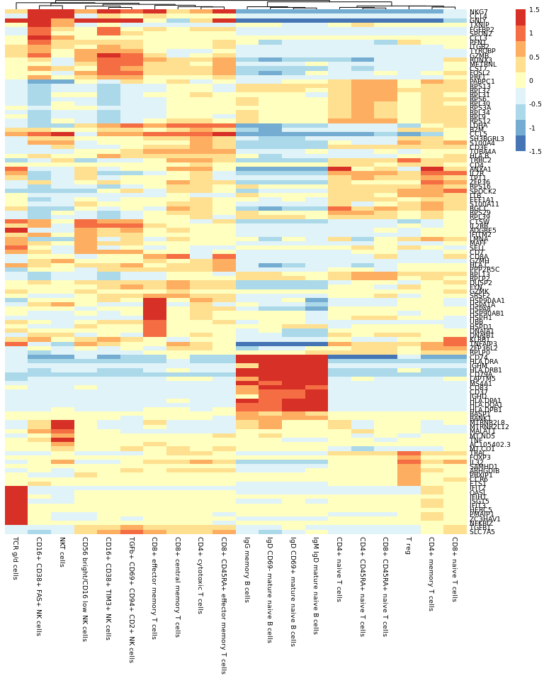<!-- -->

### Protein markers

``` r
#find markers per cluster by controlling for batch and experimental group
marker.info_sce_assigned <-
  scoreMarkers(
    altExp(sceMM.split_assigned_subs),
    groups = colData(altExp(sceMM.split_assigned_subs))$cell_type,
    block = sceMM.split_assigned_subs$batch
  )  
marker.info_sce_assigned
```

    ## List of length 20
    ## names(20): CD16+ CD38+ CD18 (+) NK cells ... TGFb+ CD69+ CD94+ CD2+ NK cells

``` r
#create empty vector to store to markers
marker_list_sce_assigned <- vector()
for (i in seq_len((length(marker.info_sce_assigned)))) {
  chosen <- marker.info_sce_assigned[[i]]
  ordered <-
    chosen[order(chosen$mean.AUC, decreasing = TRUE), ] #select top markers by mean.AUC
  top_marker <-
    ordered@rownames[1:10] #select top 20 markers per cluster
  
  marker_list_sce_assigned <-
    c(marker_list_sce_assigned, top_marker)
  
}
unique_marker_list_sce_assigned <- unique(marker_list_sce_assigned)
heatmap_marker_sce_assigned <-
  plotGroupedHeatmap(
    altExp(sceMM.split_assigned_subs),
    features = unique_marker_list_sce_assigned,
    group = "cell_type",
    center = TRUE,
    zlim = c(-1.5, 1.5),
    cluster_rows = FALSE,
    treeheight_col = 5,
    fontsize = 7, 
    block = "batch"
  )
```

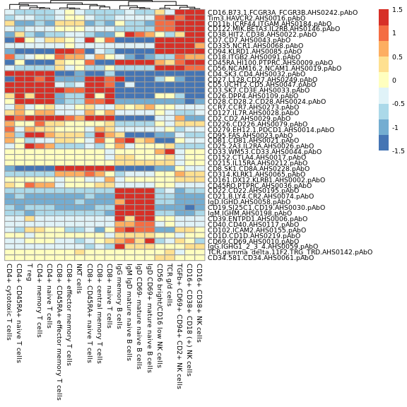<!-- -->

## NK cell subobject

Some NK cells, which showed very mature properties were clustered within
the T cell object. Hence, we create a subobject that only contains those
NK cells from “no breakthrough infections” and without the Donor4
doubling.

``` r
sceMM.split_assigned_subs$subset <- case_when(sceMM.split_assigned_subs$cell_type == "CD16+ CD38+ FAS+ NK cells" ~ "NK cells", 
    TRUE ~ sceMM.split_assigned_subs$subset)

sceMM.split_assigned_subs$comb_ident <- (
  colData(sceMM.split_assigned_subs) %>%
    as.data.frame() %>%
    relocate(batch, .after = "Sample_Name") %>%
    unite("comb_ident", Sample_Name:batch)
)$comb_ident

sce_subNK <-
  sceMM.split_assigned_subs[, sceMM.split_assigned_subs$timepoint != "breakInf" &
                              sceMM.split_assigned_subs$comb_ident != "Donor4_TP5_MM_MM4" &
                              sceMM.split_assigned_subs$subset == "NK cells"]
```

To use the multimodal data, that we have at hand for the inferrence of
latent factors,we first generate a seurat object and use this for MOFA
training. Later, we attach the MOFA latent factors to the respective
single cell object and then work on with clustering and the following
assignment.

First, a seurat object was created from the sce object (somehow, this
works better then providing a sce object).

``` r
# create seurat object by retrieving counts data and colData from the subsetted sce object
sce_seurat <- CreateSeuratObject(counts = counts(sce_subNK), meta.data = as.data.frame(colData(sce_subNK)))
# fill data slot with the processed and normalized logcounts data from sce object
sce_seurat <- SetAssayData(object = sce_seurat, slot = "data", new.data = logcounts(sce_subNK))
# centering and unit variance is recommended by mofa, therefore centering and scaling is applied 
sce_seurat <- ScaleData(sce_seurat, do.center = TRUE, do.scale = TRUE)
```

A seurat assay object was created for the AbO data.

``` r
# create AbO assay object to add to sce seurat
AbO_assay <- CreateAssayObject(counts = counts(altExp(sce_subNK)))
# fill data slot with logcounts of AbO data
AbO_assay <- SetAssayData(object = AbO_assay, slot = "data", new.data = logcounts(altExp(sce_subNK)))
# centering and unit variance is recommended by mofa, therefore centering and scaling is applied 
AbO_assay <- ScaleData(AbO_assay, do.center = TRUE, do.scale = TRUE)
```

The assay object was included to the initial seurat object stemming from
the sce RNA data.

``` r
sce_seurat[["AbO"]] <- AbO_assay
```

Define features to be included in mofa object. Since we only have a
limited number of RNA and AbO features, we included all.

``` r
#select top 5000 highly variable genes in seurat object
sce_seurat <- FindVariableFeatures(sce_seurat, 
                                   selection.method = "vst",
                                   nfeatures = 5000)
rna_vec <- c(sce_seurat@assays$RNA@var.features)
AbO_vec <- c(rownames(sce_seurat@assays$AbO))
feature_list <- list(rna_vec, AbO_vec)
names(feature_list) <- c("RNA", "AbO")
```

### prepare and train MOFA object

CAVE: the model was trained on a computing cluster allowing for
extensive multi-threading.

``` r
########################
## set up mofa object ##
########################
#create mofa object
mofa_sce <- create_mofa(sce_seurat, 
                        assays = c("RNA", "AbO"),
                        features = feature_list)
#define mofa options (recommended to run with default options)
model_opts <- get_default_model_options(mofa_sce)
#define number of factors
model_opts$num_factors <- 25
#prepare model 
mofa_sce <- prepare_mofa(
  mofa_sce, 
  model_options = model_opts
)
##############
## run mofa ##
##############
# define reticulate path for the python and R connection
reticulate::use_python("/home/jenssle/miniconda3/bin/python", required = TRUE)
mofa_sce_subNK <- run_mofa(mofa_sce)
```

Derive the latent factor matrix from the trained mofa object.

``` r
factors_mofa <- get_factors(mofa_sce_subNK, factors = "all")
factors_df <- factors_mofa$group1 %>% as.data.frame()
```

### Identify batch factor

To identify the batch factor, we fitted a logistic regression model to
identify LFs that associate with the batch vector.

First, create common df.

``` r
col_df <- colData(sce_subNK) %>%
  as.data.frame() %>%
  dplyr::select(Cell_Index, batch) %>%
  left_join(factors_df %>%
              rownames_to_column("Cell_Index") %>%
              mutate(Cell_Index = as.integer(Cell_Index)),
            by = "Cell_Index") %>%
  mutate(batch = case_when(
    batch =="MM3" ~ 1, 
    TRUE ~ 0
  ))
```

Now, fit the univariate binomial glm for each factor.

``` r
#set output df 
final_df <- data.frame(
  Factor = as.character,
  OR = as.numeric(),
  `2.5 %` = as.numeric(),
  `97.5 %` = as.numeric(),
  p.value = as.numeric()
)

#generate factor vec
factor_vec <- colnames(col_df[,-c(1,2)])

#run the glm loop
for(i in factor_vec) {
  
  #fit the model
  glm.fit <-
    glm(
      as.formula(
        paste0("batch", "~", i)),
      family = binomial, 
      data = col_df
      )
  
  #fetch the coef and confint
  int <-
    exp(
      cbind(OR = coef(glm.fit),
            confint(glm.fit)
            )
      ) %>% 
    as.data.frame() 
  #set row names
  rownames(int) <- rownames(exp(cbind(OR = coef(glm.fit), confint(glm.fit))))
  
  #fetch the pval
  int_pValue <- 
    broom::tidy(glm.fit) %>%
    dplyr::select(p.value)
  
  #generate the output df 
  output_df <- cbind(int, int_pValue) %>%
    rownames_to_column("Factor")
  
  final_df <- rbind(final_df, output_df)
  
}
```

``` r
final_df <- final_df %>%
  filter(Factor != "(Intercept)") %>%
  mutate(fdr = p.adjust(p.value, method = "BH"))

final_df
```

    ##      Factor          OR       2.5 %      97.5 %       p.value           fdr
    ## 1   Factor1 1.616347031 1.500095898 1.743636134  6.272977e-36  2.038718e-35
    ## 2   Factor2 0.003875888 0.002591795 0.005641311 1.165461e-172 1.515100e-171
    ## 3   Factor3 1.063090233 0.996287184 1.135335832  6.632248e-02  8.621923e-02
    ## 4   Factor4 4.522148097 4.067275443 5.046762988 1.571008e-165 1.021155e-164
    ## 5   Factor5 1.060592346 0.991907657 1.134728719  8.639914e-02  1.021081e-01
    ## 6   Factor6 1.184260925 1.099874393 1.276165648  8.184161e-06  1.182157e-05
    ## 7   Factor7 0.456444943 0.420558089 0.494633397  4.115837e-80  1.783529e-79
    ## 8   Factor8 0.978485148 0.909085980 1.052998413  5.617204e-01  5.617204e-01
    ## 9   Factor9 1.199059153 1.118835339 1.286282388  3.330755e-07  5.412477e-07
    ## 10 Factor10 1.411538037 1.308630194 1.523000541  5.148579e-19  1.115525e-18
    ## 11 Factor11 0.790524418 0.738478511 0.846115099  1.239716e-11  2.302329e-11
    ## 12 Factor12 3.214309414 2.559458692 4.064199795  4.169607e-23  1.084098e-22
    ## 13 Factor13 0.964138373 0.889428588 1.029682443  2.800341e-01  3.033703e-01

Add MOFA dimreds to initial sce object.

``` r
reducedDim(sce_subNK, "MOFA") <- as.matrix(factors_df)

#create tSNE representation 
sce_subNK <- runTSNE(sce_subNK, dimred =  "MOFA", name = "tSNE_mofa")

# plot tsne_mofa
plotReducedDim(sce_subNK, "tSNE_mofa", colour_by="batch")
```

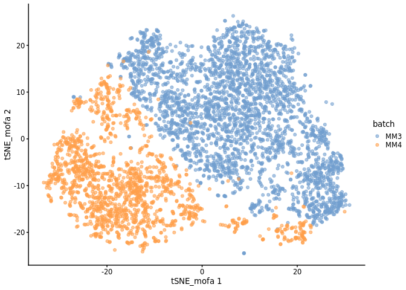<!-- -->

Now, add the reduced dim without the factors with the batch effect.

``` r
reducedDim(sce_subNK, "MOFA") <- as.matrix(factors_df[,-c(2,4,7,11,12)])

#create tSNE representation 
sce_subNK <- runTSNE(sce_subNK, dimred =  "MOFA", name = "tSNE_mofa")
```

Plot the dimred.

``` r
# plot tsne_mofa
plotReducedDim(sce_subNK, "tSNE_mofa", colour_by="batch")
```

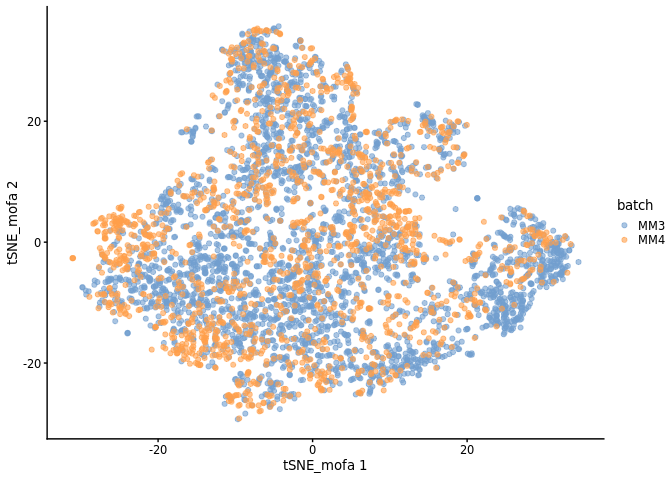<!-- -->

``` r
plotReducedDim(sce_subNK, "tSNE_mofa", colour_by="cell_type")
```

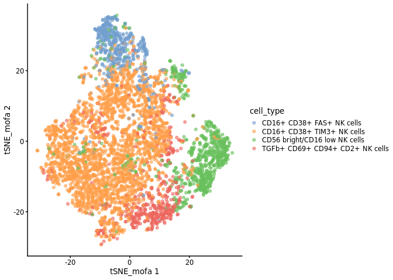<!-- -->

Show the marker proteins.

``` r
altExp(sce_subNK)$cell_type <- sce_subNK$cell_type

#find markers per cluster by controlling for batch and experimental group
marker.info_sce_assigned <-
  scoreMarkers(
    altExp(sce_subNK),
    groups = colData(altExp(sce_subNK))$cell_type,
    block = sce_subNK$batch
  )  
marker.info_sce_assigned
```

    ## List of length 4
    ## names(4): CD16+ CD38+ FAS+ NK cells ... TGFb+ CD69+ CD94+ CD2+ NK cells

``` r
#create empty vector to store to markers
marker_list_sce_assigned <- vector()
for (i in seq_len((length(marker.info_sce_assigned)))) {
  chosen <- marker.info_sce_assigned[[i]]
  ordered <-
    chosen[order(chosen$mean.AUC, decreasing = TRUE), ] #select top markers by mean.AUC
  top_marker <-
    ordered@rownames[1:10] #select top 20 markers per cluster
  
  marker_list_sce_assigned <-
    c(marker_list_sce_assigned, top_marker)
  
}
unique_marker_list_sce_assigned <- unique(marker_list_sce_assigned)
heatmap_marker_sce_assigned <-
  plotGroupedHeatmap(
    altExp(sce_subNK),
    features = unique_marker_list_sce_assigned,
    group = "cell_type",
    center = TRUE,
    zlim = c(-1.5, 1.5),
    cluster_rows = FALSE,
    treeheight_col = 5,
    fontsize = 7, 
    block = "batch"
  )
```

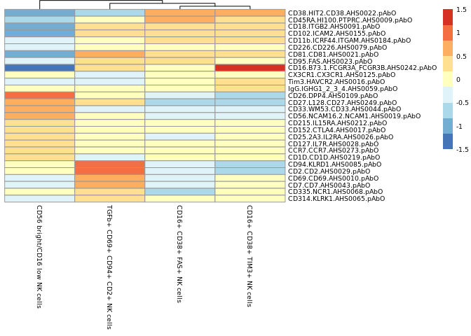<!-- -->

Session Info

``` r
sessionInfo()
```

    ## R version 4.2.2 Patched (2022-11-10 r83330)
    ## Platform: x86_64-pc-linux-gnu (64-bit)
    ## Running under: Ubuntu 20.04.5 LTS
    ## 
    ## Matrix products: default
    ## BLAS:   /usr/lib/x86_64-linux-gnu/openblas-pthread/libblas.so.3
    ## LAPACK: /usr/lib/x86_64-linux-gnu/openblas-pthread/liblapack.so.3
    ## 
    ## locale:
    ##  [1] LC_CTYPE=en_US.UTF-8       LC_NUMERIC=C              
    ##  [3] LC_TIME=en_US.UTF-8        LC_COLLATE=en_US.UTF-8    
    ##  [5] LC_MONETARY=en_US.UTF-8    LC_MESSAGES=en_US.UTF-8   
    ##  [7] LC_PAPER=en_US.UTF-8       LC_NAME=C                 
    ##  [9] LC_ADDRESS=C               LC_TELEPHONE=C            
    ## [11] LC_MEASUREMENT=en_US.UTF-8 LC_IDENTIFICATION=C       
    ## 
    ## attached base packages:
    ## [1] stats4    stats     graphics  grDevices utils     datasets  methods  
    ## [8] base     
    ## 
    ## other attached packages:
    ##  [1] MOFA2_1.6.0                 ggalluvial_0.12.3          
    ##  [3] reticulate_1.25             basilisk_1.8.0             
    ##  [5] sp_1.5-0                    SeuratObject_4.1.0         
    ##  [7] Seurat_4.1.1                DropletUtils_1.16.0        
    ##  [9] edgeR_3.38.1                limma_3.52.2               
    ## [11] randomcoloR_1.1.0.1         pheatmap_1.0.12            
    ## [13] cowplot_1.1.1               ggplotify_0.1.0            
    ## [15] batchelor_1.12.3            bluster_1.6.0              
    ## [17] patchwork_1.1.1             scran_1.24.0               
    ## [19] scater_1.24.0               scuttle_1.6.2              
    ## [21] SingleCellExperiment_1.18.0 SummarizedExperiment_1.26.1
    ## [23] Biobase_2.56.0              GenomicRanges_1.48.0       
    ## [25] GenomeInfoDb_1.32.2         IRanges_2.30.0             
    ## [27] S4Vectors_0.34.0            BiocGenerics_0.42.0        
    ## [29] MatrixGenerics_1.8.1        matrixStats_0.62.0         
    ## [31] forcats_0.5.1               stringr_1.4.0              
    ## [33] dplyr_1.0.9                 purrr_0.3.4                
    ## [35] readr_2.1.2                 tidyr_1.2.0                
    ## [37] tibble_3.1.8                ggplot2_3.4.0              
    ## [39] tidyverse_1.3.2            
    ## 
    ## loaded via a namespace (and not attached):
    ##   [1] scattermore_0.8           R.methodsS3_1.8.2        
    ##   [3] bit64_4.0.5               knitr_1.39               
    ##   [5] irlba_2.3.5               DelayedArray_0.22.0      
    ##   [7] R.utils_2.12.0            data.table_1.14.2        
    ##   [9] rpart_4.1.19              RCurl_1.98-1.7           
    ##  [11] generics_0.1.3            ScaledMatrix_1.4.0       
    ##  [13] RANN_2.6.1                future_1.27.0            
    ##  [15] bit_4.0.4                 tzdb_0.3.0               
    ##  [17] spatstat.data_2.2-0       xml2_1.3.3               
    ##  [19] lubridate_1.8.0           httpuv_1.6.5             
    ##  [21] assertthat_0.2.1          viridis_0.6.2            
    ##  [23] gargle_1.2.0              xfun_0.31                
    ##  [25] hms_1.1.1                 evaluate_0.15            
    ##  [27] promises_1.2.0.1          fansi_1.0.3              
    ##  [29] dbplyr_2.2.1              readxl_1.4.0             
    ##  [31] igraph_1.3.4              DBI_1.1.3                
    ##  [33] htmlwidgets_1.5.4         spatstat.geom_2.4-0      
    ##  [35] googledrive_2.0.0         ellipsis_0.3.2           
    ##  [37] RSpectra_0.16-1           corrplot_0.92            
    ##  [39] backports_1.4.1           V8_4.2.0                 
    ##  [41] deldir_1.0-6              sparseMatrixStats_1.8.0  
    ##  [43] vctrs_0.5.1               ROCR_1.0-11              
    ##  [45] abind_1.4-5               withr_2.5.0              
    ##  [47] progressr_0.10.1          vroom_1.5.7              
    ##  [49] sctransform_0.3.3         goftest_1.2-3            
    ##  [51] cluster_2.1.4             dir.expiry_1.4.0         
    ##  [53] lazyeval_0.2.2            crayon_1.5.1             
    ##  [55] basilisk.utils_1.8.0      labeling_0.4.2           
    ##  [57] pkgconfig_2.0.3           nlme_3.1-160             
    ##  [59] vipor_0.4.5               rlang_1.0.6              
    ##  [61] globals_0.15.1            lifecycle_1.0.3          
    ##  [63] miniUI_0.1.1.1            filelock_1.0.2           
    ##  [65] modelr_0.1.8              rsvd_1.0.5               
    ##  [67] cellranger_1.1.0          polyclip_1.10-0          
    ##  [69] lmtest_0.9-40             Matrix_1.5-3             
    ##  [71] Rhdf5lib_1.18.2           zoo_1.8-10               
    ##  [73] reprex_2.0.1              beeswarm_0.4.0           
    ##  [75] ggridges_0.5.3            googlesheets4_1.0.0      
    ##  [77] png_0.1-7                 viridisLite_0.4.0        
    ##  [79] bitops_1.0-7              R.oo_1.25.0              
    ##  [81] KernSmooth_2.23-20        rhdf5filters_1.8.0       
    ##  [83] DelayedMatrixStats_1.18.0 parallelly_1.32.1        
    ##  [85] spatstat.random_2.2-0     gridGraphics_0.5-1       
    ##  [87] beachmat_2.12.0           scales_1.2.0             
    ##  [89] magrittr_2.0.3            plyr_1.8.7               
    ##  [91] ica_1.0-3                 zlibbioc_1.42.0          
    ##  [93] compiler_4.2.2            dqrng_0.3.0              
    ##  [95] RColorBrewer_1.1-3        fitdistrplus_1.1-8       
    ##  [97] cli_3.4.1                 XVector_0.36.0           
    ##  [99] listenv_0.8.0             pbapply_1.5-0            
    ## [101] MASS_7.3-58               mgcv_1.8-41              
    ## [103] tidyselect_1.1.2          stringi_1.7.8            
    ## [105] highr_0.9                 yaml_2.3.5               
    ## [107] BiocSingular_1.12.0       locfit_1.5-9.6           
    ## [109] ggrepel_0.9.1             grid_4.2.2               
    ## [111] tools_4.2.2               future.apply_1.9.0       
    ## [113] parallel_4.2.2            rstudioapi_0.13          
    ## [115] metapod_1.4.0             gridExtra_2.3            
    ## [117] farver_2.1.1              Rtsne_0.16               
    ## [119] digest_0.6.29             rgeos_0.5-9              
    ## [121] shiny_1.7.2               Rcpp_1.0.9               
    ## [123] broom_1.0.0               later_1.3.0              
    ## [125] RcppAnnoy_0.0.19          httr_1.4.3               
    ## [127] colorspace_2.0-3          rvest_1.0.2              
    ## [129] fs_1.5.2                  tensor_1.5               
    ## [131] splines_4.2.2             uwot_0.1.11              
    ## [133] yulab.utils_0.0.5         statmod_1.4.36           
    ## [135] spatstat.utils_2.3-1      plotly_4.10.0            
    ## [137] xtable_1.8-4              jsonlite_1.8.0           
    ## [139] R6_2.5.1                  pillar_1.8.0             
    ## [141] htmltools_0.5.3           mime_0.12                
    ## [143] glue_1.6.2                fastmap_1.1.0            
    ## [145] BiocParallel_1.30.3       BiocNeighbors_1.14.0     
    ## [147] codetools_0.2-18          utf8_1.2.2               
    ## [149] lattice_0.20-45           spatstat.sparse_2.1-1    
    ## [151] ResidualMatrix_1.6.0      curl_4.3.2               
    ## [153] ggbeeswarm_0.6.0          leiden_0.4.2             
    ## [155] survival_3.4-0            rmarkdown_2.14           
    ## [157] munsell_0.5.0             rhdf5_2.40.0             
    ## [159] GenomeInfoDbData_1.2.8    HDF5Array_1.24.1         
    ## [161] haven_2.5.0               reshape2_1.4.4           
    ## [163] gtable_0.3.0              spatstat.core_2.4-4
