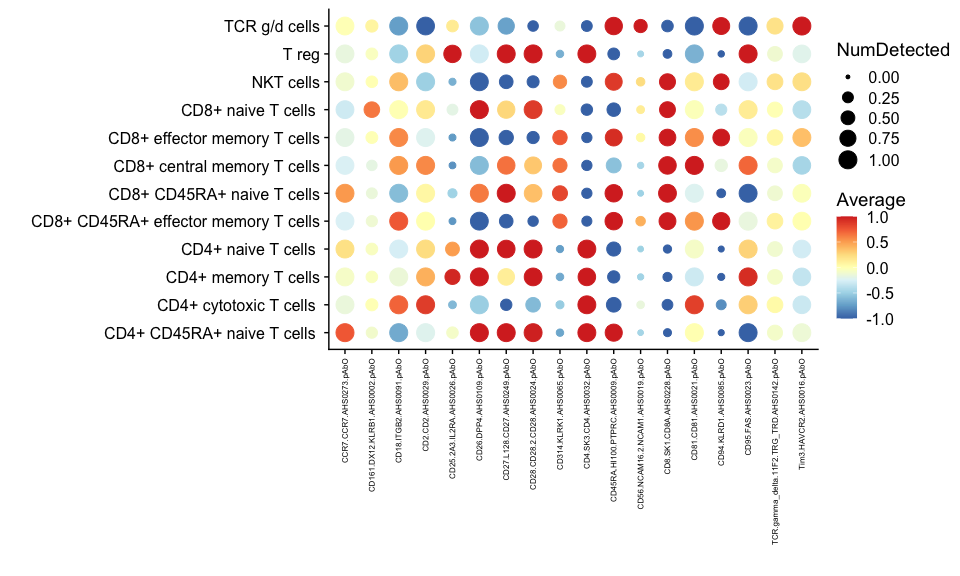

MM-Cov-Vac downstream analysis
================
jenssle
2023-04-06

## Setup

### Load packages

``` r
library(tidyverse)
library(scater)
library(scran)
library(scuttle)
library(patchwork)
library(bluster)
library(batchelor)
library(ggplotify)
library(cowplot)
library(pheatmap)
library(randomcoloR)
library(edgeR)
library(DropletUtils)
library(Seurat)
library(basilisk)
library(reticulate)
library(circlize)
library(ComplexHeatmap)
library(fgsea)
library(miloR)
library(MOFA2)
library(monocle)
library(clusterProfiler)
library(org.Hs.eg.db)
```

## Read in the sce object

For this dataset, we combined two measurement runs (MM3 and MM4) with
data from TP3, TP5 and at breakthrough infection after 3 doses of
BNT162b2 vaccination.

The data processing, normalisation and clustering was performed as
highlighted before. We used MOFA to derive dimension reduction
embeddings and used Leiden clustering to derive the cell-type
assignments.

``` r
sce_cite <- readRDS("20230404_sce_cite.rds")

colData(sce_cite)
```

    ## DataFrame with 31005 rows and 22 columns
    ##          Cell_Index     Sample_Tag            Sample_Name   invalid       batch
    ##           <integer>    <character>            <character> <logical> <character>
    ## 729367       729367 SampleTag02_hs          Donor1_TP5_MM     FALSE         MM3
    ## 781346       781346 SampleTag11_hs        Donor6_TP3_Ctrl     FALSE         MM3
    ## 473987       473987 SampleTag02_hs          Donor1_TP5_MM     FALSE         MM3
    ## 722969       722969 SampleTag10_hs        Donor5_TP5_Ctrl     FALSE         MM3
    ## 765918       765918 SampleTag05_hs          Donor3_TP3_MM     FALSE         MM3
    ## ...             ...            ...                    ...       ...         ...
    ## 315340       315340 SampleTag06_hs Donor4_Breakthrough_MM     FALSE         MM4
    ## 11067656   11067656 SampleTag05_hs          Donor4_TP5_MM     FALSE         MM4
    ## 12829447   12829447 SampleTag07_hs          Donor9_TP5_MM     FALSE         MM4
    ## 8717194     8717194 SampleTag12_hs Donor11_Breakthrough..     FALSE         MM4
    ## 2812468     2812468 SampleTag10_hs Donor10_Breakthrough..     FALSE         MM4
    ##                 group      status   timepoint       sum  detected
    ##           <character> <character> <character> <numeric> <numeric>
    ## 729367   NonResponder          MM         TP5      4280      1358
    ## 781346      Responder     healthy         TP3      4262      1239
    ## 473987   NonResponder          MM         TP5      4253      1435
    ## 722969      Responder     healthy         TP5      4152      1334
    ## 765918      Responder          MM         TP3      4268      1441
    ## ...               ...         ...         ...       ...       ...
    ## 315340      Responder          MM    breakInf       746       441
    ## 11067656    Responder          MM         TP5       714       386
    ## 12829447    Responder          MM         TP5       756       457
    ## 8717194     Responder     healthy    breakInf       702       345
    ## 2812468     Responder     healthy    breakInf       775       485
    ##          subsets_Mito_sum subsets_Mito_detected subsets_Mito_percent
    ##                 <numeric>             <numeric>            <numeric>
    ## 729367                878                    13              20.5140
    ## 781346               1039                    12              24.3782
    ## 473987               1292                    12              30.3786
    ## 722969                937                    12              22.5674
    ## 765918                881                    12              20.6420
    ## ...                   ...                   ...                  ...
    ## 315340                131                    12              17.5603
    ## 11067656              194                    12              27.1709
    ## 12829447               86                    12              11.3757
    ## 8717194               223                    12              31.7664
    ## 2812468               133                    12              17.1613
    ##          altexps_AbO_sum altexps_AbO_detected altexps_AbO_percent     total
    ##                <numeric>            <numeric>           <numeric> <numeric>
    ## 729367              5683                   46             57.0411      9963
    ## 781346              3519                   42             45.2255      7781
    ## 473987              3179                   45             42.7745      7432
    ## 722969              6329                   47             60.3855     10481
    ## 765918              5044                   47             54.1667      9312
    ## ...                  ...                  ...                 ...       ...
    ## 315340               354                   36             32.1818      1100
    ## 11067656            2212                   48             75.5981      2926
    ## 12829447             270                   36             26.3158      1026
    ## 8717194             2027                   49             74.2763      2729
    ## 2812468             1397                   45             64.3186      2172
    ##          sizeFactor mofa.label              cell_type      subset
    ##           <numeric>   <factor>            <character> <character>
    ## 729367      1.82092          1 CD4+ CD45RA+ naive T..     T cells
    ## 781346      1.81327          2    CD4+ naive T cells      T cells
    ## 473987      1.80944          3 IgD CD69+ mature nai..     B cells
    ## 722969      1.76647          2    CD4+ memory T cells     T cells
    ## 765918      1.81582          4 TGFb+ CD69+ CD94+ CD..    NK cells
    ## ...             ...        ...                    ...         ...
    ## 315340     0.317385         14 CD4+ cytotoxic T cel..     T cells
    ## 11067656   0.303771         9     CD4+ naive T cells      T cells
    ## 12829447   0.321640         2     CD4+ memory T cells     T cells
    ## 8717194    0.298666         9               NKT cells     T cells
    ## 2812468    0.329723         9     CD4+ naive T cells      T cells
    ##                      comb_ident
    ##                     <character>
    ## 729367        Donor1_TP5_MM_MM3
    ## 781346      Donor6_TP3_Ctrl_MM3
    ## 473987        Donor1_TP5_MM_MM3
    ## 722969      Donor5_TP5_Ctrl_MM3
    ## 765918        Donor3_TP3_MM_MM3
    ## ...                         ...
    ## 315340   Donor4_Breakthrough_..
    ## 11067656      Donor4_TP5_MM_MM4
    ## 12829447      Donor9_TP5_MM_MM4
    ## 8717194  Donor11_Breakthrough..
    ## 2812468     Donor5_TP5_Ctrl_MM4

Visualize the assignments

``` r
plotReducedDim(sce_cite, "tSNE_mofa", colour_by="cell_type", point_size = 0.5) 
```

<!-- -->

## Marker features for celltypes

The cell-type aassignment was done with in detail manual annotation of
inferred clusters from subclustering analysis. Since the marker features
per cell-type are quite numerous, we wanted to visualize a broad
overview. Hence, we limited the marker-per-cell-type n to 2 for this
overview visualization.

### RNA marker

``` r
marker.info_sce_assigned <-
  scoreMarkers(sce_cite,
               groups = colData(sce_cite)$cell_type,
               block = sce_cite$batch)  

marker.info_sce_assigned
```

    ## List of length 20
    ## names(20): CD16+ CD38+ FAS+ NK cells ... TGFb+ CD69+ CD94+ CD2+ NK cells

``` r
marker_list_sce_assigned<- vector()

for(i in seq_len((length(marker.info_sce_assigned)))) {

  chosen <- marker.info_sce_assigned[[i]] 

  ordered <- chosen[order(chosen$mean.AUC, decreasing=TRUE),]

  top_marker <- ordered@rownames[1:2] 
  marker_list_sce_assigned <- c(marker_list_sce_assigned, top_marker)
  
}

unique_marker_list_sce_assigned <- unique(marker_list_sce_assigned)
```

For the graphical visualization via dotplots, one must specify a
“detection limit” at which the respective marker is deemed to be
expressed. Given the global distribution highlighted below (logcount of
1 in high number of cells), we investigate potential thresholds.

``` r
assays(sce_cite)$logcounts %>%
  as.data.frame() %>%
  rownames_to_column("gene_id") %>% 
  filter(gene_id %in% unique_marker_list_sce_assigned) %>%
  pivot_longer(!gene_id, values_to = "logcounts", names_to = "cell_ind") %>%
  ggplot(aes(logcounts)) +
  geom_density()+
  theme_cowplot()
```

<!-- -->

``` r
quantile((assays(sce_cite)$logcounts %>%
  as.data.frame() %>%
  rownames_to_column("gene_id") %>% 
  filter(gene_id %in% unique_marker_list_sce_assigned) %>%
  pivot_longer(!gene_id, values_to = "logcounts", names_to = "cell_ind"))$logcounts, probs = 0.75)
```

    ##      75% 
    ## 2.427899

Since 75% of the measured features are below a logcount of 2.5, we set
the detection limit to 2.5 to have sufficient threshold.

Set a named vector to ensure the right color scheme for all following
visualizations.

``` r
cell_types <- unique(sce_cite$cell_type)

color_vec <- c("#F09955", "#B5E3A4", "#EFC4D8", "#6CAD5D", "#B8DFE7", "#3C76AF", "#939393", "#D05F5A", "#D0D0D0", "#9F81C3", 
               "#6EC0CE", "#F6C896", "#DC92C9", "#F3ACA9", "#C8ADA7", "#BFCFE9", "#CBBDD9", "#E0E1A6", "#98736A", 
               "#C6C762")

names(color_vec) <- cell_types
```

The colors will be the same as in the tSNE-MOFA plot above. Hence, for
the celltype proportion plots, no color guide is included.

Set order of cell_types.

``` r
ct_order <- c("CD4+ naive T cells ","CD4+ CD45RA+ naive T cells ","CD4+ memory T cells","CD4+ cytotoxic T cells ",
              "CD8+ naive T cells ", "CD8+ CD45RA+ naive T cells", "CD8+ central memory T cells", 
              "CD8+ effector memory T cells", "CD8+ CD45RA+ effector memory T cells",
              "T reg", "TCR g/d cells", "NKT cells",
              "CD56 bright/CD16 low NK cells", "TGFb+ CD69+ CD94+ CD2+ NK cells", "CD16+ CD38+ TIM3+ NK cells","CD16+ CD38+ FAS+ NK cells",
              "IgD CD69- mature naive B cells", "IgD CD69+ mature naive B cells", "IgM IgD mature naive B cells", "IgG memory B cells"
              )
```

Visualize as dot plots.

``` r
plotDots(
  sce_cite,
  features = unique_marker_list_sce_assigned,
  block = "batch",
  exprs_values = "logcounts",
  detection_limit = 2.5,
  group = "cell_type", 
  center = TRUE,
  zlim=c(-2, 2)
) +
  theme_cowplot() +
  theme(axis.text.x = element_text(angle = 90, vjust = 0.5, hjust=1, size = 8)) +
  coord_flip()+
  labs(x="", y="") +
  scale_x_discrete(limits = rev(ct_order))
```

<!-- -->

### AbO Marker

Select the top two surface markers. Since there are markers that are
important from the subclustering analysis of the individual
compartments, but are not called in the top two criterion, we also
included those.

``` r
colData(altExp(sce_cite))$cell_type <- colData(sce_cite)$cell_type

marker.info_sce_assigned <-
  scoreMarkers(
    altExp(sce_cite),
    groups = colData(altExp(sce_cite))$cell_type,
    block = altExp(sce_cite)$batch
  )  

marker.info_sce_assigned
```

    ## List of length 20
    ## names(20): CD16+ CD38+ FAS+ NK cells ... TGFb+ CD69+ CD94+ CD2+ NK cells

``` r
marker_list_sce_assigned<- vector()

for(i in seq_len((length(marker.info_sce_assigned)))) {

  chosen <- marker.info_sce_assigned[[i]] 

  ordered <- chosen[order(chosen$mean.AUC, decreasing=TRUE),] #select top markers by mean.AUC

  top_marker <- ordered@rownames[1:2] #select top 20 markers per cluster 
  
  marker_list_sce_assigned <- c(marker_list_sce_assigned, top_marker)
  
}

unique_marker_list_sce_assigned <- c(unique(marker_list_sce_assigned), "Tim3.HAVCR2.AHS0016.pAbO", "TCR.gamma_delta.11F2.TRG_TRD.AHS0142.pAbO", "IgG.IGHG1_2_3_4.AHS0059.pAbO")
```

Check again for the 75% cut-off

``` r
quantile(((assays(altExp(sce_cite)))$logcounts %>%
  as.data.frame() %>%
  rownames_to_column("gene_id") %>% 
  filter(gene_id %in% unique_marker_list_sce_assigned) %>%
  pivot_longer(!gene_id, values_to = "logcounts", names_to = "cell_ind"))$logcounts, probs = 0.75)
```

    ##      75% 
    ## 5.046842

Visualizse

``` r
plotDots(
  altExp(sce_cite),
  features = unique_marker_list_sce_assigned,
  block = "batch",
  exprs_values = "logcounts",
  detection_limit = 5,
  group = "cell_type", 
  center = TRUE,
  zlim=c(-2, 2)
) +
  theme_cowplot() +
  theme(axis.text.x = element_text(angle = 90, vjust = 0.5, hjust=1, size = 6),
        axis.text.y = element_text(size = 6)) +
  coord_flip()+
  labs(x="", y="")+
  scale_x_discrete(limits = rev(ct_order))
```

<!-- -->

## Frequencies of celltypes per condition

In this initial step, we want to get an overview aver the cell type
proportions regarding the different experimental layers in our data set.
Since the B-, T-, NK- and NKT-cells were sorted per donor, we first
normalize the number of inferred cells per subtype to the respective
sorted numbers from the respective donor.

``` r
library(readxl)

cell_df <- colData(sce_cite) %>%
  as.data.frame() %>%
  mutate(Comb_ID = paste(Sample_Name, batch, sep = "_"), 
         Comb_ID = case_when(cell_type == "NKT cells" ~ paste(Comb_ID, cell_type, sep = "_"), 
                                    TRUE ~ paste(Comb_ID, subset, sep = "_")))

#read in cell sort numbers 
cell_sort <- read_excel("20230325_SortedCells.xlsx") %>%
  mutate(Comb_ID = paste(ID, Subtype, sep = "_")) %>%
  dplyr::select(Comb_ID, N_cells)

meta <- colData(sce_cite) %>%
  as.data.frame() %>%
  mutate(Comb_ID = paste(Sample_Name, batch, sep = "_"), 
         Comb_ID = case_when(cell_type == "NKT cells" ~ paste(Comb_ID, cell_type, sep = "_"), 
                                    TRUE ~ paste(Comb_ID, subset, sep = "_"))) %>%
  distinct(Comb_ID, .keep_all = TRUE) %>%
  dplyr::select(Comb_ID, status, timepoint, group)

cell_df <- cell_df %>%
  group_by(cell_type, Comb_ID) %>%
  summarise(n = n()) %>%
  left_join(cell_sort, by = "Comb_ID") %>%
  mutate(frac_sort = n/N_cells) %>%
  left_join(meta, by = "Comb_ID")
```

    ## `summarise()` has grouped output by 'cell_type'. You can override using the
    ## `.groups` argument.

### Compare responder status cell proportions in MM

The data after breakthrough infection was excluded to focus first at the
timepoints after vaccination. Since in the next plot, the comparison btw
MM and healthy is done, we focused here only on MM individuals.

``` r
cell_df %>%
  filter(timepoint != "breakInf") %>%
  filter(status != "healthy") %>%
  group_by(group, cell_type) %>%
  summarise(n = sum(frac_sort)) %>%
  mutate(frac = case_when(
    group == "Responder" ~ n / sum((
      cell_df %>%
        filter(timepoint != "breakInf") %>%
        filter(status != "healthy") %>%
        group_by(group, cell_type) %>%
        summarise(n = sum(frac_sort)) %>%
        filter(group == "Responder")
    )$n
    ),
    group == "NonResponder" ~ n / sum((
      cell_df %>%
        filter(timepoint != "breakInf") %>%
        filter(status != "healthy") %>%
        group_by(group, cell_type) %>%
        summarise(n = sum(frac_sort)) %>%
        filter(group == "NonResponder")
    )$n
    )
  )) %>%
  mutate(group = case_when(group == "Responder" ~ "R", TRUE ~ "N")) %>%
  ggplot(aes(group, frac, fill = factor(cell_type, levels = ct_order))) +
  geom_col(colour = "black") +
  theme_cowplot() +
  coord_flip() +
  labs(x = "", y = "cell proportions") +
  scale_fill_manual(values = color_vec) +
  guides(fill = "none") 
```

    ## `summarise()` has grouped output by 'group'. You can override using the
    ## `.groups` argument.
    ## `summarise()` has grouped output by 'group'. You can override using the
    ## `.groups` argument.
    ## `summarise()` has grouped output by 'group'. You can override using the
    ## `.groups` argument.
    ## `summarise()` has grouped output by 'group'. You can override using the
    ## `.groups` argument.
    ## `summarise()` has grouped output by 'group'. You can override using the
    ## `.groups` argument.

<!-- -->

### MM vs. Heathy cell proportions

Again, without cells after breakthrough infection.

``` r
cell_df %>%
  filter(timepoint != "breakInf") %>%
  #filter(status == "healthy") %>%
  group_by(status, cell_type) %>%
  summarise(n = sum(frac_sort)) %>%
  mutate(frac = case_when(status == "MM" ~ n / sum((
    cell_df %>%
      filter(timepoint != "breakInf") %>%
      filter(status == "MM") %>%
      group_by(group, cell_type) %>%
      summarise(n = sum(frac_sort))
  )$n
  ),
  status == "healthy" ~ n / sum((
    cell_df %>%
      filter(timepoint != "breakInf") %>%
      filter(status == "healthy") %>%
      group_by(group, cell_type) %>%
      summarise(n = sum(frac_sort))
  )$n
  ))) %>%
  mutate(status = case_when(status == "MM" ~ "M", TRUE ~ "C")) %>%
  ggplot(aes(status, frac, fill = factor(cell_type, levels = ct_order))) +
  geom_col(colour = "black") +
  theme_cowplot() +
  coord_flip() +
  labs(x = "", y = "cell proportions") +
  scale_fill_manual(values = color_vec) +
  guides(fill = "none") 
```

    ## `summarise()` has grouped output by 'status'. You can override using the
    ## `.groups` argument.
    ## `summarise()` has grouped output by 'group'. You can override using the
    ## `.groups` argument.
    ## `summarise()` has grouped output by 'group'. You can override using the
    ## `.groups` argument.
    ## `summarise()` has grouped output by 'group'. You can override using the
    ## `.groups` argument.
    ## `summarise()` has grouped output by 'group'. You can override using the
    ## `.groups` argument.

<!-- -->

### TP3 vs. TP5 vs. breakthrough cell type proportions

``` r
cell_df %>%
  filter(timepoint != "breakInf") %>%
  group_by(timepoint, cell_type) %>%
  summarise(n = sum(frac_sort)) %>%
  mutate(frac = case_when(
    timepoint == "TP3" ~ n / sum((
      cell_df %>%
         filter(timepoint != "breakInf") %>%
  group_by(timepoint, cell_type) %>%
  summarise(n = sum(frac_sort)) %>%
        filter(timepoint == "TP3")
    )$n
    ),
    timepoint == "TP5" ~ n / sum((
      cell_df %>%
         filter(timepoint != "breakInf") %>%
  group_by(timepoint, cell_type) %>%
  summarise(n = sum(frac_sort)) %>%
        filter(timepoint == "TP5")
    )$n
    )
  )) %>%
  mutate(timepoint = case_when(timepoint == "TP5" ~ "5", TRUE ~ "3")) %>%
  ggplot(aes(timepoint, frac, fill = factor(cell_type, levels = ct_order))) +
  geom_col(colour="black") +
  theme_cowplot() +
  coord_flip() +
  labs(x ="", y="cell proportions") +
  scale_fill_manual(values = color_vec) +
  guides(fill = "none")
```

    ## `summarise()` has grouped output by 'timepoint'. You can override using the
    ## `.groups` argument.
    ## `summarise()` has grouped output by 'timepoint'. You can override using the
    ## `.groups` argument.
    ## `summarise()` has grouped output by 'timepoint'. You can override using the
    ## `.groups` argument.
    ## `summarise()` has grouped output by 'timepoint'. You can override using the
    ## `.groups` argument.
    ## `summarise()` has grouped output by 'timepoint'. You can override using the
    ## `.groups` argument.

<!-- -->

### Timepoint cell proportions

``` r
cell_df %>%
  group_by(timepoint, cell_type) %>%
  summarise(n = sum(frac_sort)) %>%
  ggplot(aes(factor(cell_type, levels = ct_order), n, fill = timepoint)) +
  geom_bar(position = "fill", stat = "identity") +
  theme_cowplot() +
  #scale_fill_manual(values = c("grey", "#B9CCE4" ,"#F68C1F")) +
  theme(axis.text.x = element_text(size = 6, angle = 90, vjust = 0.5, hjust=1)) +
  labs(x = "", y = "cell proportions") 
```

    ## `summarise()` has grouped output by 'timepoint'. You can override using the
    ## `.groups` argument.

<!-- -->

### Response status cell proportions

Here with the respective ctrl donors included.

``` r
cell_df %>%
  filter(timepoint != "breakInf") %>%
  mutate(grouper = case_when(status == "healthy" ~ "Ctrl",
                             TRUE ~ group)) %>%
  group_by(grouper, cell_type) %>%
  summarise(n = n()) %>%
  ggplot(aes(factor(cell_type, levels = ct_order), n, fill = grouper)) +
  geom_bar(position = "fill",
           stat = "identity",
           color = "black") +
  theme_cowplot() +
  scale_fill_manual(values = c("grey", "#B9CCE4" , "#F68C1F")) +
  theme(
    axis.text.x = element_text(
      angle = 90,
      vjust = 0.5,
      hjust = 1
    ),
    axis.text = element_text(size = 6),
    axis.title = element_text(size = 6),
    legend.text = element_text(size = 6),
    legend.title = element_text(size = 6)
  ) +
  guides(fill = "none")+
  labs(x = "", y = "cell proportions") 
```

    ## `summarise()` has grouped output by 'grouper'. You can override using the
    ## `.groups` argument.

<!-- -->

### tSNE_MOFA visualization

Since there are certain differences for the CD4+ T cell compartment as
well as the NK cell compartment, the tSNE_mofa graphs for R vs. NR in MM
are visualized.

``` r
plotReducedDim(sce_cite[,sce_cite$status == "MM"], "tSNE_mofa", colour_by="cell_type", other_fields = "group", point_size = 0.5) +
  facet_wrap("group") +
  guides(colour = "none")
```

<!-- -->

# T-cell subinvestigation

``` r
sce_T <- readRDS("20230404_sceT_sub.rds")

plotReducedDim(sce_T, "tSNE_mofa", colour_by="cell_type", point_size = 0.5) +
  scale_color_manual(values = color_vec[unique(sce_T$cell_type)])
```

    ## Scale for 'colour' is already present. Adding another scale for 'colour',
    ## which will replace the existing scale.

<!-- -->

Derive the marker proteins

``` r
altExp(sce_T)$cell_type <- sce_T$cell_type

marker.info.prot <-
    scoreMarkers(altExp(sce_T), groups = colData(altExp(sce_T))$cell_type,
                 block = altExp(sce_T)$batch)
  
  #create empty vector to store to markers
  marker_list_prot <- vector()
  
  for (i in 1:12) {
    chosen <- marker.info.prot[[i]]
    
    ordered <-
      chosen[order(chosen$mean.AUC, decreasing = TRUE), ] #select top markers by mean.AUC
    
    top_marker <-
      ordered@rownames[1:2] #select top 5 markers per cluster
    
    marker_list_prot <- c(marker_list_prot, top_marker)
    
  }
  
  unique_marker_list_prot <- c(unique(marker_list_prot),"TCR.gamma_delta.11F2.TRG_TRD.AHS0142.pAbO", "CD45RA.HI100.PTPRC.AHS0009.pAbO")
```

Visualize these.

``` r
plotDots(
  altExp(sce_T),
  features = unique_marker_list_prot,
  block = "batch",
  exprs_values = "logcounts",
  detection_limit = 3,
  group = "cell_type", 
  center = TRUE,
  zlim=c(-1, 1)
) +
  theme_cowplot() +
  theme(axis.text.x = element_text(angle = 90, vjust = 0.5, hjust=1, size = 6)) +
  coord_flip()+
  labs(x="", y="") 
```

<!-- -->

Derive the marker genes.

``` r
marker.info.rna<-
    scoreMarkers(sce_T, groups = colData(sce_T)$cell_type,
                 block = sce_T$batch)
  
  #create empty vector to store to markers
  marker_list_rna <- vector()
  
  for (i in 1:12) {
    chosen <- marker.info.rna[[i]]
    
    ordered <-
      chosen[order(chosen$mean.AUC, decreasing = TRUE), ] #select top markers by mean.AUC
    
    top_marker <-
      ordered@rownames[1:5] #select top 5 markers per cluster
    
    marker_list_rna <- c(marker_list_rna, top_marker)
    
  }
  
  unique_marker_list_rna <- c(unique(marker_list_rna))
```

Visualize these.

``` r
plotDots(
  sce_T,
  features = unique_marker_list_rna,
  block = "batch",
  exprs_values = "logcounts",
  detection_limit = 3,
  group = "cell_type", 
  center = TRUE,
  zlim=c(-1, 1)
) +
  theme_cowplot() +
  theme(axis.text.x = element_text(angle = 90, vjust = 0.5, hjust=1, size = 6)) +
  coord_flip()+
  labs(x="", y="") 
```

<!-- -->

### T-cell differential abundance analysis

Here, the T-cell object from the subclustering is used. The dimred
embedding via MOFA was created for all the T-cells from the
subclustering object. One patient was sequenced in the MM3 and MM4 run
(MM3: TP3 and TP5, MM4 TP5 and BreakInf). Hence we excluded his TP5 data
from the MM4 run. Since we wanted to look first only into the
vaccination response, we also excluded cells measured after breakthrough
infection.

``` r
sce_T$comb_id <- (colData(sce_T) %>%
  as.data.frame() %>%
  unite("comb_id", c("Sample_Name", "batch"), sep = "_", remove = FALSE))$comb_id
  

sce_T <- sce_T[, sce_T$timepoint != "breakInf" &
                 sce_T$comb_id != "Donor4_TP5_MM_MM4"]

#create Milo object
sceMM_milo <- Milo(sce_T)

sceMM_milo
```

    ## class: Milo 
    ## dim: 23942 13817 
    ## metadata(0):
    ## assays(2): counts logcounts
    ## rownames(23942): A1BG A1BG.AS1 ... ZYX ZZEF1
    ## rowData names(1): Type
    ## colnames(13817): 729367 781346 ... 5927868 12829447
    ## colData names(22): Cell_Index Sample_Tag ... subset comb_id
    ## reducedDimNames(4): MOFA tSNE_mofa UMAP_mofa tSNE_mofaT
    ## mainExpName: gene
    ## altExpNames(0):
    ## nhoods dimensions(2): 1 1
    ## nhoodCounts dimensions(2): 1 1
    ## nhoodDistances dimension(1): 0
    ## graph names(0):
    ## nhoodIndex names(1): 0
    ## nhoodExpression dimension(2): 1 1
    ## nhoodReducedDim names(0):
    ## nhoodGraph names(0):
    ## nhoodAdjacency dimension(2): 1 1

Construct the KNN graph.

``` r
sceMM_milo_knn <- buildGraph(sceMM_milo, 
                             k = 30,             #use the same k as for the initial clustering
                             d = 15,             #use the same number of dimensions used for initial clustering
                             reduced.dim = "MOFA") 
```

    ## Constructing kNN graph with k:30

Define the representative neighbourhoods on the KNN graph.

``` r
sceMM_milo_knn_nhoods <- makeNhoods(
  sceMM_milo_knn, 
  prop = 0.1, 
  k = 30, #use the same k as for the initial clustering
  d = 15, #use the same number of dimensions used for initial clustering
  refined = TRUE, #do not run with random, since batch correction was not performed with a graph based alg (i.e. BBKNN)
  reduced_dims = "MOFA")
```

    ## Checking valid object

    ## Running refined sampling with reduced_dim

``` r
plotNhoodSizeHist(sceMM_milo_knn_nhoods) # according to vignette, the distribution should peak btw 50 and 100, or average at least 5x n samples
```

<!-- -->

Counting the cells in the neighbourhoods.

``` r
sceMM_milo_knn_nhoods <- countCells(sceMM_milo_knn_nhoods, 
                                    meta.data= as.data.frame(colData(sceMM_milo_knn_nhoods)),
                                    sample = "Sample_Name")
```

    ## Checking meta.data validity

    ## Counting cells in neighbourhoods

``` r
head(nhoodCounts(sceMM_milo_knn_nhoods))
```

    ## 6 x 17 sparse Matrix of class "dgCMatrix"

    ##    [[ suppressing 17 column names 'Donor1_TP5_MM', 'Donor6_TP3_Ctrl', 'Donor5_TP5_Ctrl' ... ]]

    ##                                             
    ## 1 1 14  2 5  4  6 9  1  3 5 4  6  2 2  . 3 6
    ## 2 1 10 11 6  3  9 8 28  3 1 4  .  . . 12 1 2
    ## 3 .  2  . .  1  2 1 10  4 . .  1 18 .  1 . .
    ## 4 .  5  6 3  2 10 5  1  3 7 . 17  3 .  1 6 2
    ## 5 .  3  2 1 14  1 1  . 12 6 3  1  1 4  9 . 7
    ## 6 .  5  7 1  2 10 2 17  2 8 6  1  . .  7 . 1

Defining the experimental design.

``` r
sce_MM_milo_design <- data.frame(colData(sceMM_milo_knn_nhoods))[,c("Sample_Name", "status", "group", "batch", "timepoint")]

sce_MM_milo_design <- sce_MM_milo_design %>%
  distinct(Sample_Name, .keep_all = TRUE)

rownames(sce_MM_milo_design) <- sce_MM_milo_design$Sample_Name

nkt_counts <- data.frame(Sample_Name = c("Donor1_TP3_MM", "Donor1_TP5_MM", "Donor2_TP3_MM", "Donor2_TP5_MM", "Donor3_TP3_MM", "Donor3_TP5_MM", "Donor4_TP3_MM", "Donor4_TP5_MM", "Donor5_TP3_Ctrl", "Donor5_TP5_Ctrl", "Donor6_TP3_Ctrl", "Donor6_TP5_Ctrl", "Donor7_TP5_MM", "Donor8_TP5_MM", "Donor9_TP5_MM", "Donor10_TP5_Ctrl", "Donor11_TP5_Ctrl"),
                          n_nkt = c(5, 5, 5, 2.738, 5, 5, 5, 5, 3.065, 5, 5, 5, 5, 5, 5, 2.793,5))

sce_MM_milo_design <- left_join(sce_MM_milo_design, nkt_counts, by = "Sample_Name")

rownames(sce_MM_milo_design) <- sce_MM_milo_design$Sample_Name

sce_MM_milo_design
```

    ##                       Sample_Name  status        group batch timepoint n_nkt
    ## Donor1_TP5_MM       Donor1_TP5_MM      MM NonResponder   MM3       TP5 5.000
    ## Donor6_TP3_Ctrl   Donor6_TP3_Ctrl healthy    Responder   MM3       TP3 5.000
    ## Donor5_TP5_Ctrl   Donor5_TP5_Ctrl healthy    Responder   MM3       TP5 5.000
    ## Donor6_TP5_Ctrl   Donor6_TP5_Ctrl healthy    Responder   MM3       TP5 5.000
    ## Donor3_TP5_MM       Donor3_TP5_MM      MM    Responder   MM3       TP5 5.000
    ## Donor4_TP5_MM       Donor4_TP5_MM      MM    Responder   MM3       TP5 5.000
    ## Donor2_TP3_MM       Donor2_TP3_MM      MM NonResponder   MM3       TP3 5.000
    ## Donor2_TP5_MM       Donor2_TP5_MM      MM NonResponder   MM3       TP5 2.738
    ## Donor3_TP3_MM       Donor3_TP3_MM      MM    Responder   MM3       TP3 5.000
    ## Donor4_TP3_MM       Donor4_TP3_MM      MM    Responder   MM3       TP3 5.000
    ## Donor1_TP3_MM       Donor1_TP3_MM      MM NonResponder   MM3       TP3 5.000
    ## Donor5_TP3_Ctrl   Donor5_TP3_Ctrl healthy    Responder   MM3       TP3 3.065
    ## Donor8_TP5_MM       Donor8_TP5_MM      MM NonResponder   MM4       TP5 5.000
    ## Donor9_TP5_MM       Donor9_TP5_MM      MM    Responder   MM4       TP5 5.000
    ## Donor7_TP5_MM       Donor7_TP5_MM      MM NonResponder   MM4       TP5 5.000
    ## Donor10_TP5_Ctrl Donor10_TP5_Ctrl healthy    Responder   MM4       TP5 2.793
    ## Donor11_TP5_Ctrl Donor11_TP5_Ctrl healthy    Responder   MM4       TP5 5.000

Compute the neighbourhood connectivity.

``` r
sceMM_milo_knn_nhoods <- calcNhoodDistance(sceMM_milo_knn_nhoods,
                                           d = 15, 
                                           reduced.dim = "MOFA"
                                           )

colData(sceMM_milo_knn_nhoods)
```

    ## DataFrame with 13817 rows and 22 columns
    ##          Cell_Index     Sample_Tag      Sample_Name   invalid       batch
    ##           <integer>    <character>      <character> <logical> <character>
    ## 729367       729367 SampleTag02_hs    Donor1_TP5_MM     FALSE         MM3
    ## 781346       781346 SampleTag11_hs  Donor6_TP3_Ctrl     FALSE         MM3
    ## 722969       722969 SampleTag10_hs  Donor5_TP5_Ctrl     FALSE         MM3
    ## 830522       830522 SampleTag12_hs  Donor6_TP5_Ctrl     FALSE         MM3
    ## 825444       825444 SampleTag12_hs  Donor6_TP5_Ctrl     FALSE         MM3
    ## ...             ...            ...              ...       ...         ...
    ## 8287560     8287560 SampleTag07_hs    Donor9_TP5_MM     FALSE         MM4
    ## 9616577     9616577 SampleTag09_hs Donor10_TP5_Ctrl     FALSE         MM4
    ## 12685829   12685829 SampleTag07_hs    Donor9_TP5_MM     FALSE         MM4
    ## 5927868     5927868 SampleTag01_hs    Donor7_TP5_MM     FALSE         MM4
    ## 12829447   12829447 SampleTag07_hs    Donor9_TP5_MM     FALSE         MM4
    ##                 group      status   timepoint       sum  detected
    ##           <character> <character> <character> <numeric> <numeric>
    ## 729367   NonResponder          MM         TP5      4280      1358
    ## 781346      Responder     healthy         TP3      4262      1239
    ## 722969      Responder     healthy         TP5      4152      1334
    ## 830522      Responder     healthy         TP5      4201      1290
    ## 825444      Responder     healthy         TP5      4235      1218
    ## ...               ...         ...         ...       ...       ...
    ## 8287560     Responder          MM         TP5       792       408
    ## 9616577     Responder     healthy         TP5       814       462
    ## 12685829    Responder          MM         TP5       752       494
    ## 5927868  NonResponder          MM         TP5       720       380
    ## 12829447    Responder          MM         TP5       756       457
    ##          subsets_Mito_sum subsets_Mito_detected subsets_Mito_percent
    ##                 <numeric>             <numeric>            <numeric>
    ## 729367                878                    13              20.5140
    ## 781346               1039                    12              24.3782
    ## 722969                937                    12              22.5674
    ## 830522               1047                    12              24.9226
    ## 825444               1279                    12              30.2007
    ## ...                   ...                   ...                  ...
    ## 8287560               170                    12             21.46465
    ## 9616577               124                    12             15.23342
    ## 12685829               44                    11              5.85106
    ## 5927868               208                    12             28.88889
    ## 12829447               86                    12             11.37566
    ##          altexps_AbO_sum altexps_AbO_detected altexps_AbO_percent     total
    ##                <numeric>            <numeric>           <numeric> <numeric>
    ## 729367              5683                   46             57.0411      9963
    ## 781346              3519                   42             45.2255      7781
    ## 722969              6329                   47             60.3855     10481
    ## 830522              4854                   45             53.6057      9055
    ## 825444              3892                   46             47.8898      8127
    ## ...                  ...                  ...                 ...       ...
    ## 8287560             1020                   42             56.2914      1812
    ## 9616577              323                   37             28.4081      1137
    ## 12685829             478                   42             38.8618      1230
    ## 5927868              447                   42             38.3033      1167
    ## 12829447             270                   36             26.3158      1026
    ##          sizeFactor mofa.label              cell_type      subset
    ##           <numeric>   <factor>            <character> <character>
    ## 729367      1.82092          1 CD4+ CD45RA+ naive T..     T cells
    ## 781346      1.81327          2    CD4+ naive T cells      T cells
    ## 722969      1.76647          3    CD4+ memory T cells     T cells
    ## 830522      1.78731          1 CD4+ CD45RA+ naive T..     T cells
    ## 825444      1.80178          5 CD8+ CD45RA+ naive T..     T cells
    ## ...             ...        ...                    ...         ...
    ## 8287560    0.336956         9  CD4+ cytotoxic T cel..     T cells
    ## 9616577    0.346316         16 CD8+ effector memory..     T cells
    ## 12685829   0.319938         9  CD4+ cytotoxic T cel..     T cells
    ## 5927868    0.306324         14 CD8+ central memory ..     T cells
    ## 12829447   0.321640         3     CD4+ memory T cells     T cells
    ##                       comb_id
    ##                   <character>
    ## 729367      Donor1_TP5_MM_MM3
    ## 781346    Donor6_TP3_Ctrl_MM3
    ## 722969    Donor5_TP5_Ctrl_MM3
    ## 830522    Donor6_TP5_Ctrl_MM3
    ## 825444    Donor6_TP5_Ctrl_MM3
    ## ...                       ...
    ## 8287560     Donor9_TP5_MM_MM4
    ## 9616577  Donor10_TP5_Ctrl_MM4
    ## 12685829    Donor9_TP5_MM_MM4
    ## 5927868     Donor7_TP5_MM_MM4
    ## 12829447    Donor9_TP5_MM_MM4

Testing Responder vs. Non-Responder while accounting for MM vs. Healhy,
the number of sorted NKT cells, the timepoint of sample acquisition and
the batch information.

``` r
da_results <- testNhoods(sceMM_milo_knn_nhoods, 
                         design = ~ status + timepoint + batch + n_nkt + group, 
                         design.df = sce_MM_milo_design,
                         reduced.dim = "MOFA"
                         )
```

    ## Using TMM normalisation

    ## Performing spatial FDR correction withk-distance weighting

``` r
head(da_results)
```

    ##         logFC   logCPM           F    PValue       FDR Nhood SpatialFDR
    ## 1  0.04368642 10.51593 0.003192199 0.9549708 0.9976267     1  0.9985727
    ## 2 -0.53437277 10.45033 0.177565113 0.6736901 0.9327674     2  0.9494994
    ## 3  1.73236301 10.36403 2.142655668 0.1440031 0.6385102     3  0.6920945
    ## 4  1.76760815 10.50791 2.571202896 0.1095780 0.5760387     4  0.6238298
    ## 5  0.98413143 10.05147 0.793340665 0.3736028 0.7943391     5  0.8258626
    ## 6 -0.28278886 10.18654 0.049663210 0.8237589 0.9641688     6  0.9712489

Visualize the result for differential testing responder status at an FDR
level of 0.2.

``` r
sceMM_milo_knn_nhoods <- buildNhoodGraph(sceMM_milo_knn_nhoods)

## Plot single-cell UMAP
tsne_pl <- plotReducedDim(sceMM_milo_knn_nhoods, dimred = "tSNE_mofa", colour_by="group", text_by = "cell_type", 
                          text_size = 3, point_size=0.05) +
  guides(fill="none")

## Plot neighbourhood graph
nh_graph_pl <- plotNhoodGraphDA(sceMM_milo_knn_nhoods, da_results, layout="tSNE_mofa",alpha=0.2)
  
tsne_pl + nh_graph_pl +
  plot_layout(guides="collect")
```

<!-- -->

Visualize these results now for the cell types.

``` r
da_results <- annotateNhoods(sceMM_milo_knn_nhoods, da_results, coldata_col = "cell_type")
```

    ## Converting cell_type to factor...

``` r
plotDAbeeswarm(da_results, group.by = "cell_type", alpha = 0.2)+
  theme_cowplot()+
  labs(x="logFC", y="")
```

    ## Converting group.by to factor...

<!-- -->

Finding markers of DA populations.

``` r
sceMM_milo_knn_nhoods <- logNormCounts(sceMM_milo_knn_nhoods)

da_results$NhoodGroup <- as.numeric(da_results$SpatialFDR < 0.2 & da_results$logFC > 0)

da_nhood_markers <- findNhoodGroupMarkers(sceMM_milo_knn_nhoods, da_results, aggregate.samples = TRUE, sample_col = "Sample_Name")
```

    ## Warning: Zero sample variances detected, have been offset away from zero

    ## Warning: Zero sample variances detected, have been offset away from zero

``` r
rownames(da_nhood_markers) <- da_nhood_markers$GeneID
```

Visualize the detected markers.

``` r
ggplot(da_nhood_markers, aes(logFC_1,-log10(adj.P.Val_1))) + 
  geom_point(alpha=0.5, size=0.5) +
  geom_hline(yintercept = 2)+
  theme_bw()
```

<!-- -->

Visualize via heatmap for markers found ad FDR 10% with at least 0.5
logFC.

``` r
markers <- rownames(da_nhood_markers)[da_nhood_markers$adj.P.Val_1 < 0.1 & da_nhood_markers$logFC_1 > 0.5]

plotNhoodExpressionGroups(
  sceMM_milo_knn_nhoods,
  da_results,
  features = markers,
  cluster_features = TRUE,
  subset.nhoods = da_results$SpatialFDR < 0.2 &
    da_results$logFC > 0,
  scale = TRUE,
  grid.space = "fixed",
  show_rownames = FALSE
)
```

    ## Warning in plotNhoodExpressionGroups(sceMM_milo_knn_nhoods, da_results, :
    ## Nothing in nhoodExpression(x): computing for requested features...

<!-- -->

Lets check whether these genes that are characteristic for the
overrepresented features also belong to a relevant biological
term/pattern.

Perform for GO gene collection.

``` r
library(msigdbr)

z <- mapIds(org.Hs.eg.db, markers, "ENTREZID", "SYMBOL")
```

    ## 'select()' returned 1:1 mapping between keys and columns

``` r
m_t2g <- msigdbr(species = "Homo sapiens", category = "C5") %>% 
  dplyr::select(gs_name, entrez_gene)

x1 <- enricher(z, TERM2GENE = m_t2g)

dotplot(x1) 
```

<!-- -->

And perform for Hallmark gene set collection.

``` r
m_t2g <- msigdbr(species = "Homo sapiens", category = "H") %>% 
  dplyr::select(gs_name, entrez_gene)

x1 <- enricher(z, TERM2GENE = m_t2g, pvalueCutoff = 0.05)

dotplot(x1)
```

<!-- -->

### Differential expression analysis for T cells of interest

``` r
sce_cite_ni <- sce_cite[,sce_cite$timepoint != "breakInf" &
                          sce_cite$comb_ident != "Donor4_TP5_MM_MM4"]
```

First, create a pseudo-bulk object for differential expression analysis.

``` r
merged_sce <- aggregateAcrossCells(sce_cite_ni, 
                                   id = colData(sce_cite_ni)[,c("cell_type", "Sample_Name")])
```

    ## Warning: 'use.altexps=' is deprecated.
    ## Use 'applySCE(x, aggregateAcrossCells)' instead.

``` r
dim(merged_sce)
```

    ## [1] 23942   335

``` r
#remove all pseudobulk samples with "insufficient" cells 
merged_sce_filt <- merged_sce[,merged_sce$ncells >= 5]

dim(merged_sce_filt)
```

    ## [1] 23942   306

Create wrapper function to filter the output of DEA analysis.

``` r
de_output_filter <- function(de.results) {
  
  #create empty df to store results filtered by FDR 1%
  de_output_df <- data.frame(logFC = as.numeric(),
                          logCPM = as.numeric(),
                          `F` = as.numeric(),
                          PValue = as.numeric(),
                          FDR = as.numeric(),
                          cell_type = as.character())

  #create vector of cell type names to loop over 
  vec_results = c(names(de.results))

  #loop over cell types and filter for FDR 1%
  for(i in vec_results) {
  
    cur.results <- de.results[[i]]
  
    cur.results[order(cur.results$PValue),]
    
    cur.results_filt <- cur.results %>% 
      as.data.frame() %>%
      filter(FDR < 0.1) %>% 
      mutate(cell_type = as.character(i))
  
    de_output_df <- rbind(de_output_df, cur.results_filt)
  
  }
  
  return(de_output_df)
}
```

Run DEA for responder status. The batch vector and other experimental
levels are included in the design matrix.

``` r
# Differential testing using the wrapper function
de.results <- pseudoBulkDGE(merged_sce_filt, 
    label=merged_sce_filt$cell_type,
    design=~ status + batch + timepoint +group,
    coef="groupResponder",
    condition=merged_sce_filt$group
)
```

Quickly visualize the diff.expression patterns.

``` r
# Extract the DE results for this specific cell type 
de.results[["CD4+ memory T cells"]] %>%
  as.data.frame() %>%
  drop_na(logFC) %>%
  mutate(q_val = -log10(FDR)) %>%
  mutate(q_viz = case_when(FDR < 0.1 ~ q_val, TRUE ~ 0)) %>%
  ggplot(aes(logFC, q_val, color = q_viz))+
    geom_point()+
    theme_bw()
```

<!-- -->

Quickly visualize the diff.expression patterns.

``` r
# Extract the DE results for this specific cell type 
de.results[["CD4+ cytotoxic T cells "]] %>%
  as.data.frame() %>%
  drop_na(logFC) %>%
  mutate(q_val = -log10(FDR)) %>%
  mutate(q_viz = case_when(FDR < 0.1 ~ q_val, TRUE ~ 0)) %>%
  ggplot(aes(logFC, q_val, color = q_viz))+
    geom_point()+
    theme_bw()
```

<!-- -->

Perform a GSEA via fgsea with the F-statistic from the differential
testing as ranking variable.

Load the two gene set collections to be used in the analysis.

``` r
pthw_reactome <- gmtPathways("c2.cp.reactome.v7.4.symbols.gmt")
pthw_hallmark <- gmtPathways("h.all.v7.4.symbols.gmt")
```

Run the analysis for or CD4+ M T cells.

``` r
# Extract the DE results for this specific cell type 
cur.results <- de.results[["CD4+ memory T cells"]]

# order by the p-value 
diff_res <-  cur.results[order(cur.results$PValue),] %>% as.data.frame() %>%
  rownames_to_column("gene_id")

#generate an ranked vector by the logFC
diff_exp_vec <- dplyr::select(diff_res, gene_id, `F`) %>%
  drop_na(`F`) %>%
  arrange(desc(`F`)) %>%
  dplyr::distinct(gene_id, .keep_all = TRUE) %>%
  deframe()

#perform gsea for the reactome dataset
fgsea.res_reac <- fgseaMultilevel(
  pathways = pthw_reactome,
  stats = diff_exp_vec,
  minSize = 15,
  maxSize = 500,
  #scoreType = "pos"
  ) %>%
  arrange(desc(NES)) %>%
  filter(padj < 0.05)
```

    ## Warning in preparePathwaysAndStats(pathways, stats, minSize, maxSize,
    ## gseaParam, : All values in the stats vector are greater than zero and scoreType
    ## is "std", maybe you should switch to scoreType = "pos".

``` r
fgsea.res_hm <- fgseaMultilevel(
  pathways = pthw_hallmark,
  stats = diff_exp_vec,
  minSize = 15,
  maxSize = 500,
  #scoreType = "pos"
  ) %>%
  arrange(desc(NES)) %>%
  filter(padj < 0.05)
```

    ## Warning in preparePathwaysAndStats(pathways, stats, minSize, maxSize,
    ## gseaParam, : All values in the stats vector are greater than zero and scoreType
    ## is "std", maybe you should switch to scoreType = "pos".

``` r
fgsea_res_comb <- rbind(fgsea.res_reac, fgsea.res_hm) %>% 
  arrange(desc(NES))

# Visualize the results  
ggplot(fgsea_res_comb,
         aes(
           x = fct_reorder(pathway, as.numeric(NES)),
           y = as.numeric(NES)
         )) +
  coord_flip() +
  theme_bw() +
  labs(title = "CD4+ M (FDR 5%)", x = "", y = "NES") +
  geom_col(aes(fill = as.numeric(padj))) +
  theme(
    axis.line = element_line(size = 0.8),
    axis.line.y = element_blank(),
    axis.text = element_text(size = 8, colour = "black"),
    axis.title = element_text(size = 12),
    panel.grid.major.x = element_blank(),
    panel.grid.major.y = element_blank(),
    panel.grid.minor.x = element_blank(),
    panel.grid.minor.y = element_blank(),
    axis.ticks.y = element_blank(),
    panel.border = element_blank()
  ) +
  scale_fill_viridis_c() +
  labs(fill = "p.adj") +
  theme(
    axis.text = element_text(size = 6),
    axis.title = element_text(size = 6),
    legend.text = element_text(size = 6),
    legend.title = element_text(size = 6),
    plot.title = element_text(size = 6)
  )
```

<!-- -->

Run the analysis for CD4 cyt T cells.

``` r
# Extract the DE results for this specific cell type 
cur.results <- de.results[["CD4+ cytotoxic T cells "]]

# order by the p-value 
diff_res <-  cur.results[order(cur.results$PValue),] %>% as.data.frame() %>%
  rownames_to_column("gene_id")

#generate an ranked vector by the logFC
diff_exp_vec <- dplyr::select(diff_res, gene_id, `F`) %>%
  drop_na(`F`) %>%
  arrange(desc(`F`)) %>%
  dplyr::distinct(gene_id, .keep_all = TRUE) %>%
  deframe()

#perform gsea for the reactome dataset
fgsea.res_reac <- fgseaMultilevel(
  pathways = pthw_reactome,
  stats = diff_exp_vec,
  minSize = 15,
  maxSize = 500,
  #scoreType = "pos"
  ) %>%
  arrange(desc(NES)) %>%
  filter(padj < 0.05)
```

    ## Warning in preparePathwaysAndStats(pathways, stats, minSize, maxSize,
    ## gseaParam, : All values in the stats vector are greater than zero and scoreType
    ## is "std", maybe you should switch to scoreType = "pos".

``` r
fgsea.res_hm <- fgseaMultilevel(
  pathways = pthw_hallmark,
  stats = diff_exp_vec,
  minSize = 15,
  maxSize = 500,
  #scoreType = "pos"
  ) %>%
  arrange(desc(NES)) %>%
  filter(padj < 0.05)
```

    ## Warning in preparePathwaysAndStats(pathways, stats, minSize, maxSize,
    ## gseaParam, : All values in the stats vector are greater than zero and scoreType
    ## is "std", maybe you should switch to scoreType = "pos".

``` r
fgsea_res_comb <- rbind(fgsea.res_reac, fgsea.res_hm) %>% 
  arrange(desc(NES))

# Visualize the results  
ggplot(fgsea_res_comb,
         aes(
           x = fct_reorder(pathway, as.numeric(NES)),
           y = as.numeric(NES)
         )) +
  coord_flip() +
  theme_bw() +
  labs(title = "CD4+ cyt (FDR 5%)", x = "", y = "NES") +
  geom_col(aes(fill = as.numeric(padj))) +
  theme(
    axis.line = element_line(size = 0.8),
    axis.line.y = element_blank(),
    axis.text = element_text(size = 8, colour = "black"),
    axis.title = element_text(size = 12),
    panel.grid.major.x = element_blank(),
    panel.grid.major.y = element_blank(),
    panel.grid.minor.x = element_blank(),
    panel.grid.minor.y = element_blank(),
    axis.ticks.y = element_blank(),
    panel.border = element_blank()
  ) +
  scale_fill_viridis_c() +
  labs(fill = "p.adj")
```

<!-- -->

# NK-cell subinvestigation

This was again carried out on the NK cell sub object derived after the
clustering and cell type annotation.

``` r
sce_NK <- readRDS("20230404_sceNK_sub.rds")

plotReducedDim(sce_NK, "tSNE_mofa", colour_by="cell_type", point_size = 0.5) +
  scale_color_manual(values = color_vec[unique(sce_NK$cell_type)])
```

    ## Scale for 'colour' is already present. Adding another scale for 'colour',
    ## which will replace the existing scale.

<!-- -->

Derive the marker proteins.

``` r
marker.info.prot <-
    scoreMarkers(altExp(sce_NK), groups = colData(altExp(sce_NK))$cell_type,
                 block = altExp(sce_NK)$batch)
  
  #create empty vector to store to markers
  marker_list_prot <- vector()
  
  for (i in 1:4) {
    chosen <- marker.info.prot[[i]]
    
    ordered <-
      chosen[order(chosen$mean.AUC, decreasing = TRUE), ] #select top markers by mean.AUC
    
    top_marker <-
      ordered@rownames[1:2] #select top 5 markers per cluster
    
    marker_list_prot <- c(marker_list_prot, top_marker)
    
  }
  
  unique_marker_list_prot <- c(unique(marker_list_prot), "Tim3.HAVCR2.AHS0016.pAbO", "CD95.FAS.AHS0023.pAbO")
```

Visualize the marker proteins.

``` r
colData(altExp(sce_NK))$cell_type <- colData(sce_NK)$cell_type

plotDots(
  altExp(sce_NK),
  features = unique_marker_list_prot,
  block = "batch",
  exprs_values = "logcounts",
  detection_limit = 5,
  group = "cell_type", 
  center = TRUE,
  zlim=c(-1, 1)
) +
  theme_cowplot() +
  theme(axis.text.x = element_text(angle = 90, vjust = 0.5, hjust=1, size = 6)) +
  coord_flip()+
  labs(x="", y="") 
```

<!-- -->

### NK-cell differential abundance analysis

``` r
#create Milo object
sceMM_milo <- Milo(sce_NK)

sceMM_milo
```

    ## class: Milo 
    ## dim: 23942 4694 
    ## metadata(0):
    ## assays(2): counts logcounts
    ## rownames(23942): A1BG A1BG.AS1 ... ZYX ZZEF1
    ## rowData names(1): Type
    ## colnames(4694): 765918 648036 ... 5764244 9457988
    ## colData names(22): Cell_Index Sample_Tag ... subset comb_ident
    ## reducedDimNames(3): MOFA tSNE_mofa UMAP_mofa
    ## mainExpName: gene
    ## altExpNames(0):
    ## nhoods dimensions(2): 1 1
    ## nhoodCounts dimensions(2): 1 1
    ## nhoodDistances dimension(1): 0
    ## graph names(0):
    ## nhoodIndex names(1): 0
    ## nhoodExpression dimension(2): 1 1
    ## nhoodReducedDim names(0):
    ## nhoodGraph names(0):
    ## nhoodAdjacency dimension(2): 1 1

Construct the KNN graph.

``` r
sceMM_milo_knn <- buildGraph(sceMM_milo, 
                             k = 50,        #use the same k as for the initial clustering
                             d = 8,        #use the same number of dimensions used for initial clustering
                             reduced.dim = "MOFA" 
)
```

    ## Constructing kNN graph with k:50

Define the representative neighbourhoods on the KNN graph.

``` r
sceMM_milo_knn_nhoods <- makeNhoods(
  sceMM_milo_knn, 
  prop = 0.2, 
  k = 50, #use the same k as for the initial clustering
  d = 8, #use the same number of dimensions used for initial clustering
  refined = TRUE, #do not run with random, since batch correction was not performed with a graph based alg (i.e. BBKNN)
  reduced_dims = "MOFA")
```

    ## Checking valid object

    ## Running refined sampling with reduced_dim

``` r
plotNhoodSizeHist(sceMM_milo_knn_nhoods) # according to vignette, the distribution should peak btw 50 and 100, or average at least 5x n samples
```

<!-- -->

Counting the cells in the neighbourhoods.

``` r
sceMM_milo_knn_nhoods <- countCells(sceMM_milo_knn_nhoods, 
                                    meta.data= as.data.frame(colData(sceMM_milo_knn_nhoods)),
                                    sample = "Sample_Name")
```

    ## Checking meta.data validity

    ## Counting cells in neighbourhoods

``` r
head(nhoodCounts(sceMM_milo_knn_nhoods))
```

    ## 6 x 17 sparse Matrix of class "dgCMatrix"

    ##    [[ suppressing 17 column names 'Donor3_TP3_MM', 'Donor6_TP3_Ctrl', 'Donor2_TP3_MM' ... ]]

    ##                                             
    ## 1 6  6  . 2 13 1 .  1  6  . 3 . 16 3 . 11 14
    ## 2 2  6 40 6  5 3 4 27  8  2 4 8  4 . 1  3  1
    ## 3 4  3 14 .  2 1 6 16  6 12 3 2  . 2 8  8  3
    ## 4 3  . 11 .  6 . 1  9  2  3 2 1 16 1 .  .  4
    ## 5 3 33  . .  7 6 .  . 16  . 3 5  5 . .  4  9
    ## 6 1  4 18 9  8 9 4 12  6  1 9 8  4 1 7  5  6

Defining the experimental design.

``` r
sce_MM_milo_design <- data.frame(colData(sceMM_milo_knn_nhoods))[,c("Sample_Name", "status", "batch", "group", "timepoint")]

sce_MM_milo_design <- sce_MM_milo_design %>%
  distinct(Sample_Name, .keep_all = TRUE)

rownames(sce_MM_milo_design) <- sce_MM_milo_design$Sample_Name

rownames(sce_MM_milo_design) <- sce_MM_milo_design$Sample_Name

sce_MM_milo_design
```

    ##                       Sample_Name  status batch        group timepoint
    ## Donor3_TP3_MM       Donor3_TP3_MM      MM   MM3    Responder       TP3
    ## Donor6_TP3_Ctrl   Donor6_TP3_Ctrl healthy   MM3    Responder       TP3
    ## Donor2_TP3_MM       Donor2_TP3_MM      MM   MM3 NonResponder       TP3
    ## Donor3_TP5_MM       Donor3_TP5_MM      MM   MM3    Responder       TP5
    ## Donor5_TP5_Ctrl   Donor5_TP5_Ctrl healthy   MM3    Responder       TP5
    ## Donor5_TP3_Ctrl   Donor5_TP3_Ctrl healthy   MM3    Responder       TP3
    ## Donor1_TP5_MM       Donor1_TP5_MM      MM   MM3 NonResponder       TP5
    ## Donor2_TP5_MM       Donor2_TP5_MM      MM   MM3 NonResponder       TP5
    ## Donor6_TP5_Ctrl   Donor6_TP5_Ctrl healthy   MM3    Responder       TP5
    ## Donor1_TP3_MM       Donor1_TP3_MM      MM   MM3 NonResponder       TP3
    ## Donor4_TP3_MM       Donor4_TP3_MM      MM   MM3    Responder       TP3
    ## Donor4_TP5_MM       Donor4_TP5_MM      MM   MM3    Responder       TP5
    ## Donor8_TP5_MM       Donor8_TP5_MM      MM   MM4 NonResponder       TP5
    ## Donor9_TP5_MM       Donor9_TP5_MM      MM   MM4    Responder       TP5
    ## Donor10_TP5_Ctrl Donor10_TP5_Ctrl healthy   MM4    Responder       TP5
    ## Donor7_TP5_MM       Donor7_TP5_MM      MM   MM4 NonResponder       TP5
    ## Donor11_TP5_Ctrl Donor11_TP5_Ctrl healthy   MM4    Responder       TP5

Compute the neighbourhood connectivity.

``` r
sceMM_milo_knn_nhoods <- calcNhoodDistance(sceMM_milo_knn_nhoods,
                                           d = 8, 
                                           reduced.dim = "MOFA"
                                           )
```

Testing Responder vs. Non-Responder while accounting for MM vs. Healhy,
the number of sorted NKT cells, the timepoint of sample acquisition and
the batch information.

``` r
da_results <- testNhoods(sceMM_milo_knn_nhoods, 
                         design = ~ status +  timepoint + batch  + group, 
                         design.df = sce_MM_milo_design,
                         reduced.dim = "MOFA"
                         )
```

    ## Using TMM normalisation

    ## Performing spatial FDR correction withk-distance weighting

``` r
head(da_results)
```

    ##        logFC   logCPM         F     PValue       FDR Nhood SpatialFDR
    ## 1  1.0650925 11.01086 0.7892414 0.37435508 0.5799021     1  0.5826704
    ## 2 -1.7565744 11.33299 2.9710315 0.08480464 0.2872497     2  0.3012398
    ## 3 -2.0571503 11.25639 3.7116558 0.05406751 0.2399513     3  0.2583610
    ## 4 -1.7400728 10.66031 2.3500937 0.12531319 0.3319481     4  0.3464168
    ## 5  1.0573561 10.94009 0.7104119 0.39933114 0.5918428     5  0.5925221
    ## 6 -0.2130565 11.33571 0.0496776 0.82363065 0.8857197     6  0.8839508

Visualize the result for differential testing of response status.

``` r
sceMM_milo_knn_nhoods <- buildNhoodGraph(sceMM_milo_knn_nhoods)

### Plot single-cell UMAP
tsne_pl <- plotReducedDim(sceMM_milo_knn_nhoods, dimred = "tSNE_mofa", colour_by="group", text_by = "cell_type", 
                          text_size = 3, point_size=0.05) +
  guides(fill="none")
## Plot neighbourhood graph
nh_graph_pl <- plotNhoodGraphDA(sceMM_milo_knn_nhoods, da_results, layout="tSNE_mofa", alpha=0.2)
  
tsne_pl + nh_graph_pl +
  plot_layout(guides="collect")
```

<!-- -->

Visualize these results now for the cell types.

``` r
da_results <- annotateNhoods(sceMM_milo_knn_nhoods, da_results, coldata_col = "cell_type")
```

    ## Converting cell_type to factor...

``` r
plotDAbeeswarm(da_results, group.by = "cell_type", alpha = 0.2)+
  theme_cowplot()+
  labs(x="logFC", y="")
```

    ## Converting group.by to factor...

<!-- -->

Finding markers of DA populations.

``` r
sceMM_milo_knn_nhoods <- logNormCounts(sceMM_milo_knn_nhoods)

da_results$NhoodGroup <- as.numeric(da_results$SpatialFDR < 0.2 & da_results$logFC > 0)

da_nhood_markers <- findNhoodGroupMarkers(sceMM_milo_knn_nhoods, da_results, aggregate.samples = TRUE, sample_col = "Sample_Name")
```

    ## Warning: Zero sample variances detected, have been offset away from zero

    ## Warning: Zero sample variances detected, have been offset away from zero

``` r
rownames(da_nhood_markers) <- da_nhood_markers$GeneID
```

Visualize the detected markers.

``` r
ggplot(da_nhood_markers, aes(logFC_1,-log10(adj.P.Val_1))) + 
  geom_point(alpha=0.5, size=0.5) +
  geom_hline(yintercept = 2)+
  theme_bw()
```

<!-- -->

There are not enough differentially expressed marker genes for the
respective neighbourhoods with increased abundance of responder stemming
cells.

### Functional markers in NK cells

To further characterise the NK cells, we used the phenotypic groups
derived from Smith et. al, 2022, Blood Adv.

#### Cytotoxic markers

``` r
plotDots(
  sce_NK,
  features = c("GNLY", "GZMA", "GZMB", "GZMK", "PRF1"),
  block = "batch",
  exprs_values = "logcounts",
  detection_limit = 1,
  group = "cell_type",
  center = TRUE,
  zlim=c(-0.5, 0.5)
) +
  theme_cowplot() +
  theme(axis.text.x = element_text(angle = 90, vjust = 0.5, hjust=1, size = 6)) +
  labs(x ="", y="cytotoxic markers") 
```

<!-- -->

#### Inhibitory markers

``` r
plotDots(
  sce_NK,
  features = c("KLRD1", "KLRB1", "KLRC1", "FASLG", "LAIR1", "TNFSF10", "TIGIT"),
  block = "batch",
  exprs_values = "logcounts",
  detection_limit = 1,
  group = "cell_type",
  center = TRUE,
  zlim=c(-0.5, 0.5)
) +
  theme_cowplot() +
  theme(axis.text.x = element_text(angle = 90, vjust = 0.5, hjust=1, size = 6)) +
  labs(x ="", y="inhibitory markers")
```

<!-- -->

#### Activating markers

``` r
plotDots(
  sce_NK,
  features = c("FCGR3A", "NCR1", "NCR3", "KLRK1", "KLRC2", "KLRF1", "CD226", "CD244"),
  block = "batch",
  exprs_values = "logcounts",
  detection_limit = 1,
  group = "cell_type",
  center = TRUE,
  zlim=c(-0.5, 0.5)
) +
  theme_cowplot() +
  theme(axis.text.x = element_text(angle = 90, vjust = 0.5, hjust=1, size = 6)) +
  labs(x ="", y="activatory markers")
```

<!-- -->

#### Cytokines and chemokine markers

``` r
plotDots(
  sce_NK,
  features = c("IFNG", "LTB", "CCL3", "CCL4", "CCL5", "XCL1", "XCL2"),
  block = "batch",
  exprs_values = "logcounts",
  detection_limit = 1,
  group = "cell_type",
  center = TRUE,
  zlim=c(-0.5, 0.5)
) +
  theme_cowplot() +
  theme(axis.text.x = element_text(angle = 90, vjust = 0.5, hjust=1, size = 6)) +
  labs(x ="", y="cyt/chem markers")
```

<!-- -->

#### Cytokines and chemokine markers

``` r
plotDots(
  sce_NK,
  features = c("IL7R", "IL2RB", "CXCR3", "CXCR4", "CCR7", "CXCR1", "S1PR5"),
  block = "batch",
  exprs_values = "logcounts",
  detection_limit = 1,
  group = "cell_type",
  center = TRUE,
  zlim=c(-0.5, 0.5)
) +
  theme_cowplot() +
  theme(axis.text.x = element_text(angle = 90, vjust = 0.5, hjust=1, size = 6)) +
  labs(x ="", y="cyt/chem rec")
```

<!-- -->

#### Adhesion molecules

``` r
plotDots(
  sce_NK,
  features = c("ITGAL", "CD2", "CD58", "ITGB2", "SELL", "CD96"),
  block = "batch",
  exprs_values = "logcounts",
  detection_limit = 1,
  group = "cell_type",
  center = TRUE,
  zlim=c(-0.5, 0.5)
) +
  theme_cowplot() +
  theme(axis.text.x = element_text(angle = 90, vjust = 0.5, hjust=1, size = 6)) +
  labs(x ="", y="adh. molecules")
```

<!-- -->

### Enrichment profiles for marker features of NK cell types

Identify the marker genes per NK cell type.

``` r
marker.info.RNA <-
    scoreMarkers(sce_NK, groups = colData(sce_NK)$cell_type,
                 block = sce_NK$batch)
  
#create empty vector to store to markers
marker_list_RNA <- vector()
  
for (i in 1:4) {
    chosen <- marker.info.RNA[[i]]
    
    ordered <-
      chosen[order(chosen$mean.AUC, decreasing = TRUE), ] #select top markers by mean.AUC
    
    top_marker <-
      ordered@rownames[1:5] #select top 5 markers per cluster
    
    marker_list_RNA <- c(marker_list_RNA, top_marker)
    
  }
```

Marker gene enrichment for CD16+ CD38+ TIM3+ NK cells.

``` r
chosen <- marker.info.RNA[["CD16+ CD38+ TIM3+ NK cells"]]
    
ordered <-
  chosen[order(chosen$mean.AUC, decreasing = TRUE),] %>%
  as.data.frame() %>%
  rownames_to_column("gene_id") %>%
  dplyr::select(gene_id, mean.AUC) %>%
  dplyr::distinct(gene_id, .keep_all = TRUE) %>%
  deframe()

#perform gsea for the reactome dataset
fgsea.res_reac <- fgseaMultilevel(
  pathways = pthw_reactome,
  stats = ordered,
  minSize = 15,
  maxSize = 500,
  #scoreType = "pos"
  ) %>%
  arrange(desc(NES)) %>%
  filter(padj < 0.01)
```

    ## Warning in preparePathwaysAndStats(pathways, stats, minSize, maxSize, gseaParam, : There are ties in the preranked stats (37.21% of the list).
    ## The order of those tied genes will be arbitrary, which may produce unexpected results.

    ## Warning in preparePathwaysAndStats(pathways, stats, minSize, maxSize,
    ## gseaParam, : All values in the stats vector are greater than zero and scoreType
    ## is "std", maybe you should switch to scoreType = "pos".

    ## Warning in fgseaMultilevel(pathways = pthw_reactome, stats = ordered, minSize
    ## = 15, : For some pathways, in reality P-values are less than 1e-50. You can set
    ## the `eps` argument to zero for better estimation.

``` r
fgsea.res_hm <- fgseaMultilevel(
  pathways = pthw_hallmark,
  stats = ordered,
  minSize = 15,
  maxSize = 500,
  #scoreType = "pos"
  ) %>%
  arrange(desc(NES)) %>%
  filter(padj < 0.01)
```

    ## Warning in preparePathwaysAndStats(pathways, stats, minSize, maxSize, gseaParam, : There are ties in the preranked stats (37.21% of the list).
    ## The order of those tied genes will be arbitrary, which may produce unexpected results.

    ## Warning in preparePathwaysAndStats(pathways, stats, minSize, maxSize,
    ## gseaParam, : All values in the stats vector are greater than zero and scoreType
    ## is "std", maybe you should switch to scoreType = "pos".

``` r
fgsea_res_comb <- rbind(fgsea.res_reac[c(1:5, (nrow(fgsea.res_reac)-5):nrow(fgsea.res_reac)),],
                        fgsea.res_hm[c(1:5, (nrow(fgsea.res_hm)-5):nrow(fgsea.res_hm)),]) %>% 
  arrange(desc(NES))

# Visualize the results  
ggplot(fgsea_res_comb,
         aes(
           x = fct_reorder(pathway, as.numeric(NES)),
           y = as.numeric(NES)
         )) +
  coord_flip() +
  theme_bw() +
  labs(title = "CD16+ CD38+ TIM3+ NK cells (FDR 1%)", x = "", y = "Normalised Enrichment Score") +
  geom_col(aes(fill = as.numeric(padj))) +
  theme(
    axis.line = element_line(size = 0.8),
    axis.line.y = element_blank(),
    axis.text = element_text(size = 8, colour = "black"),
    axis.title = element_text(size = 12),
    panel.grid.major.x = element_blank(),
    panel.grid.major.y = element_blank(),
    panel.grid.minor.x = element_blank(),
    panel.grid.minor.y = element_blank(),
    axis.ticks.y = element_blank(),
    panel.border = element_blank()
  ) +
  scale_fill_viridis_c() +
  labs(fill = "p.adj")
```

<!-- -->

Marker gene enrichment for CD16+ CD38+ FAS+ NK cells.

``` r
chosen <- marker.info.RNA[["CD16+ CD38+ FAS+ NK cells"]]
    
ordered <-
  chosen[order(chosen$mean.AUC, decreasing = TRUE),] %>%
  as.data.frame() %>%
  rownames_to_column("gene_id") %>%
  dplyr::select(gene_id, mean.AUC) %>%
  dplyr::distinct(gene_id, .keep_all = TRUE) %>%
  deframe()

#perform gsea for the reactome dataset
fgsea.res_reac <- fgseaMultilevel(
  pathways = pthw_reactome,
  stats = ordered,
  minSize = 15,
  maxSize = 500,
  #scoreType = "pos"
  ) %>%
  arrange(desc(NES)) %>%
  filter(padj < 0.01)
```

    ## Warning in preparePathwaysAndStats(pathways, stats, minSize, maxSize, gseaParam, : There are ties in the preranked stats (38.81% of the list).
    ## The order of those tied genes will be arbitrary, which may produce unexpected results.

    ## Warning in preparePathwaysAndStats(pathways, stats, minSize, maxSize,
    ## gseaParam, : All values in the stats vector are greater than zero and scoreType
    ## is "std", maybe you should switch to scoreType = "pos".

    ## Warning in fgseaMultilevel(pathways = pthw_reactome, stats = ordered, minSize
    ## = 15, : For some pathways, in reality P-values are less than 1e-50. You can set
    ## the `eps` argument to zero for better estimation.

``` r
fgsea.res_hm <- fgseaMultilevel(
  pathways = pthw_hallmark,
  stats = ordered,
  minSize = 15,
  maxSize = 500,
  #scoreType = "pos"
  ) %>%
  arrange(desc(NES)) %>%
  filter(padj < 0.01)
```

    ## Warning in preparePathwaysAndStats(pathways, stats, minSize, maxSize, gseaParam, : There are ties in the preranked stats (38.81% of the list).
    ## The order of those tied genes will be arbitrary, which may produce unexpected results.

    ## Warning in preparePathwaysAndStats(pathways, stats, minSize, maxSize,
    ## gseaParam, : All values in the stats vector are greater than zero and scoreType
    ## is "std", maybe you should switch to scoreType = "pos".

``` r
fgsea_res_comb <- rbind(fgsea.res_reac[c(1:5, (nrow(fgsea.res_reac)-5):nrow(fgsea.res_reac)),],
                        fgsea.res_hm[c(1:5, (nrow(fgsea.res_hm)-5):nrow(fgsea.res_hm)),]) %>% 
  arrange(desc(NES))

# Visualize the results  
ggplot(fgsea_res_comb %>% filter(NES > 0),
         aes(
           x = fct_reorder(pathway, as.numeric(NES)),
           y = as.numeric(NES)
         )) +
  coord_flip() +
  theme_bw() +
  labs(title = "CD16+ CD38+ FAS+ NK cells (FDR 1%)", x = "", y = "Normalised Enrichment Score") +
  geom_col(aes(fill = as.numeric(padj))) +
  theme(
    axis.line = element_line(size = 0.8),
    axis.line.y = element_blank(),
    axis.text = element_text(size = 8, colour = "black"),
    axis.title = element_text(size = 12),
    panel.grid.major.x = element_blank(),
    panel.grid.major.y = element_blank(),
    panel.grid.minor.x = element_blank(),
    panel.grid.minor.y = element_blank(),
    axis.ticks.y = element_blank(),
    panel.border = element_blank()
  ) +
  scale_fill_viridis_c() +
  labs(fill = "p.adj")
```

<!-- -->

### Pseudotime analysis NK cells

There are certain differences in the NK cell populations. Some of them
are quite similar but we were interested, whether the differences also
reflect differences in the state/differentiation. So, we checked for
ways of exploring that and came across the monocle approach to model
such patterns via pseudotime. We followed their tutorial to apply the
algorithm to our NK cell data.
(<http://cole-trapnell-lab.github.io/monocle-release/docs/#analyzing-branches-in-single-cell-trajectories>)

First, bring the sce object into the relevant monocle class. Further,
the vignette recommends to not work with already normalize the data but
rather use counts data. Also estimate size factors and dispersion values
since size factors help to normalize for differences in mRNA recovered
across cells, and “dispersion” values will help to perform differential
expression analysis later.

``` r
sce_cite_NK_pre <- sce_NK

NK_mon <- convertTo(sce_cite_NK_pre, type = "monocle", assay.type = "counts")

estimateSizeFactors(NK_mon)
estimateDispersion(NK_mon)
```

#### Trajectory step 1:

Choose genes that define a cell’s progress. Since we already annotated
the cell types, I will use the cluster assignment for detection of
ordering genes. we took the top 200 genes selected via AUC.mean ranking.

``` r
#create empty vector to store to markers
  marker_list_RNA <- vector()
  
  for (i in 1:4) {
    chosen <- marker.info.RNA[[i]]
    
    ordered <-
      chosen[order(chosen$mean.AUC, decreasing = TRUE), ] #select top markers by mean.AUC
    
    top_marker <-
      ordered@rownames[1:200] #select top 5 markers per cluster
    
    marker_list_RNA <- c(marker_list_RNA, top_marker)
    
  }
  
  unique_marker_list_RNA <- unique(marker_list_RNA)
  
#set the ordering
NK_mon <- setOrderingFilter(NK_mon, unique_marker_list_RNA)
```

#### Trajectory step 2:

Reduce the data dimensionality using the DDRTree algorithm.

``` r
#reduce the dimension
NK_mon <- reduceDimension(NK_mon, max_components = 2,
    method = 'DDRTree', norm_method = 'none', verbose = TRUE)
```

#### Trajectory step 3:

Order the cells along the inferred trajectories.

``` r
#order the cells according to their trajectories
NK_mon <- orderCells(NK_mon)
```

Since these operations took a fair amount of time so we run it on a
cluster. So, we read in the trained model afterwards:

``` r
NK_mon_trained <- readRDS("20230404_NK_mon_trained.rds")
```

Visualize the cells according to their state (monocle’s way of
specifying the branch of the inferred trajectory tree)

``` r
plot_cell_trajectory(NK_mon_trained, color_by = "State")
```

    ## Warning: `select_()` was deprecated in dplyr 0.7.0.
    ## Please use `select()` instead.
    ## This warning is displayed once every 8 hours.
    ## Call `lifecycle::last_lifecycle_warnings()` to see where this warning was generated.

<!-- -->

Visualize the cells according to the batch

``` r
plot_cell_trajectory(NK_mon_trained, color_by = "batch")
```

<!-- -->

Visualize the cells according to their cell type

``` r
plot_cell_trajectory(NK_mon_trained, color_by = "cell_type") +
  scale_color_manual(values = color_vec) +
  guides(color = "none") 
```

<!-- -->

Visualize the “pseudotime”.

``` r
plot_cell_trajectory(NK_mon_trained, color_by = "Pseudotime")
```

<!-- -->

Visualize the by responder status.

``` r
plot_cell_trajectory(NK_mon_trained, color_by = "group")
```

<!-- -->

#### Branch differences

It seems like there is a difference regarding the first branch, that
shows different trajectories coming from state 1 to state 3. State 3
seems to feature particularly cells from the CD16+ CD38+ FAS+ NK cell
population. Hence, we asked what genes change as cells “pass” from one
to the other end of branch 1. The monocle framework provides its own
special branched expression analysis modelling (BEAM).

``` r
BEAM_res <- BEAM(NK_mon_trained, branch_point = 1, cores = 1)
```

Again, this is computational expensive, so I run this on a server.

``` r
BEAM_res <- readRDS("20230404_BEAM_res.rds")

#order the results 
BEAM_res <- BEAM_res[order(BEAM_res$qval),]
```

Visualize the change of genes across the trajectory branch 1 for those
genes relevant in ordering the cells.

``` r
plot_genes_branched_heatmap(NK_mon_trained[row.names(subset(BEAM_res %>% filter(use_for_ordering == TRUE) %>%
                                                              filter(status == "OK"),
                                          qval < 1e-4)),],
                                          branch_point = 1,
                                          num_clusters = 4,
                                          cores = 1,
                                          #use_gene_short_name = T,
                                          show_rownames = T)
```

<embed src="../../20221011_ht_beamres.pdf" style="display: block; margin: auto;" type="application/pdf" />

Lets investigate genes, that drive cell fate on the trajectory.

``` r
drivers_vec <- readRDS("20230404_drivers.rds")

names(drivers_vec) <- drivers_vec
```

Perform hypergeometric testing for enrichment in hallmark gene sets.

``` r
library(msigdbr)

z <- mapIds(org.Hs.eg.db, drivers_vec, "ENTREZID", "SYMBOL")
```

    ## 'select()' returned 1:1 mapping between keys and columns

``` r
m_t2g <- msigdbr(species = "Homo sapiens", category = "H") %>% 
  dplyr::select(gs_name, entrez_gene)

x1 <- enricher(z, TERM2GENE = m_t2g)

dotplot(x1)
```

<!-- -->

## SSGSEA analysis for cytokine responsiveness

For this analysis, we used the gsva framework described here:
<https://bioconductor.org/packages/devel/bioc/vignettes/GSVA/inst/doc/GSVA.html>.

In particular, we used the single sample gene set analysis tool inside
this framework. Single sample GSEA (ssGSEA) is a non-parametric method
that calculates a gene set enrichment score per sample as the normalized
difference in empirical cumulative distribution functions (CDFs) of gene
expression ranks inside and outside the gene set.

To be able to compare these ssgsea scores for each celltype between
responder groups, we performed the analysis on the merged sce object (to
adjust for the donor status). By using this analysis, we then can
compare for each celltype the cell-type-specific enrichment between
responder vs. non-responder vs. healthy controls.

Load the respective gene sets

``` r
pthw_go <- gmtPathways("c5.go.bp.v7.4.symbols.gmt")
pthw_reactome <- gmtPathways("c2.cp.reactome.v7.4.symbols.gmt")
pthw_hallmark <- gmtPathways("h.all.v7.4.symbols.gmt")

#combine into one gene set collection
pthw_sets <-
  append(pthw_go,
         append(pthw_reactome,
                pthw_hallmark))
```

First, create a merged sce object and run the GSVA::ssgsea approach.
This step is computationally intensive, hence we used a cluster and
performed the analysis in a parallelized fashion.

``` r
library(GSVA)

#create additional identifier, that combines ID and timepoint information, since cells measured after 2nd, 3rd and breakthrough infection are present
colData(sce_cite)$comb_ident <- ((colData(sce_cite) %>%
  as.data.frame() %>%
  unite("comb_id", c("comb_ident", "timepoint"), sep = "_", remove = FALSE)))$comb_id

merged_sce <- aggregateAcrossCells(sce_cite, 
                                   id = colData(sce_cite)[,c("cell_type", "comb_ident")])

#remove all pseudobulk samples with "insufficient" cells 
merged_sce_filt <- merged_sce[,merged_sce$ncells >= 1]

paara <- BiocParallel::MulticoreParam(workers = 4)

df <- assays(merged_sce_filt)$counts

ssgsea_out <-GSVA::gsva(expr = df, 
                       gset.idx.list = pthw_sets, 
                       method = "ssgsea",
                       kcdf = "Poisson",
                       min.sz = 10,
                       max.sz = 900,
                       verbose = TRUE, 
                       BPPARAM = paara)

ssgsea_out_df <- ssgsea_out %>%
  t() %>%
  as.data.frame()

saveRDS(ssgsea_out_df, "20230404_ssgsea_out_df_all.rds")
```

Load the result after running the analysis on a cluster system

``` r
ssgsea_df <- readRDS("20230404_ssgsea_out_df_all.rds")

merged_sce_filt <- readRDS("20230404_merged_sce_filt.rds")
```

Since we were interested in the cytokine response enrichment patterns,
we create a vector with the relevant gene set names to be visualized
later on.

``` r
cytoresp_vec <-
  c(
    "GOBP_RESPONSE_TO_TYPE_I_INTERFERON",
    "GOBP_RESPONSE_TO_INTERFERON_ALPHA",
    "GOBP_RESPONSE_TO_INTERFERON_GAMMA",
    "HALLMARK_INTERFERON_ALPHA_RESPONSE",
    "HALLMARK_INTERFERON_GAMMA_RESPONSE",
    "REACTOME_INTERFERON_SIGNALING",
    "GOBP_INTERLEUKIN_1_MEDIATED_SIGNALING_PATHWAY" ,
    "GOBP_RESPONSE_TO_INTERLEUKIN_1",
    "REACTOME_INTERLEUKIN_1_FAMILY_SIGNALING",
    "REACTOME_INTERLEUKIN_1_SIGNALING",
    "GOBP_RESPONSE_TO_INTERLEUKIN_6",
    "REACTOME_INTERLEUKIN_6_FAMILY_SIGNALING",
    "GOBP_RESPONSE_TO_INTERLEUKIN_12",
    "REACTOME_INTERLEUKIN_12_FAMILY_SIGNALING",
    "GOBP_CHEMOKINE_C_X_C_MOTIF_LIGAND_2_PRODUCTION",
    "HALLMARK_TNFA_SIGNALING_VIA_NFKB"
  )
```

Select the ssgsea ES for the relevant pathways, and create a new
ssgsea_sce object for visualization purposes.

``` r
ssgsea_cyto <- ssgsea_df %>%
  dplyr::select(one_of(cytoresp_vec)) %>%
  t()

#adjust the naming
rownames(ssgsea_cyto) <- rownames(ssgsea_cyto) %>% 
  str_replace_all(pattern = "_", replacement = " ") %>%
  str_replace_all(pattern = "GOBP ", replacement = "GO ") %>%
  str_replace_all(pattern = "REACTOME ", replacement = " R ") %>%
  str_replace_all(pattern = "HALLMARK ", replacement = "HM ")

colData(merged_sce_filt)$group_a <- (colData(merged_sce_filt) %>%
                                       as.data.frame() %>%
                                       mutate(group_a =
                                                case_when(status == "healthy" ~ "ctrl",
                                                          TRUE ~ group)))$group_a

ssgsea <- SummarizedExperiment(ssgsea_cyto)

altExp(merged_sce_filt, "ssgsea") <- ssgsea

assays(altExp(merged_sce_filt, "ssgsea"))$logcounts <- ssgsea_cyto

colData(altExp(merged_sce_filt, "ssgsea")) <-
  colData(merged_sce_filt)

sub_merged <-
  merged_sce_filt[, merged_sce_filt$timepoint != "breakInf" &
                    merged_sce_filt$comb_ident != "Donor4_TP5_MM_MM4_TP5"]

#set the breaks for the legends
breaksList = seq(min(ssgsea_cyto), max(ssgsea_cyto), by = 0.05)
```

Export the plots of interest.

``` r
  colData(altExp(sub_merged, "ssgsea")) <-
    colData(sub_merged)
```

In the following, we extracted the ssgsea score visualizations between
responder groups for those cell-types, which were found to be
overrepresented in responders.

Print for cytotoxic T cells.

``` r
plotGroupedHeatmap(
    altExp(sub_merged, "ssgsea")[, altExp(sub_merged, "ssgsea")$cell_type == "CD4+ cytotoxic T cells "],
    features = rownames(ssgsea_cyto),
    group = "group_a",
    center = FALSE,
    #zlim = c(-0.05, 0.05),
    cluster_cols = FALSE,
    breaks_legend = breaksList,
    cluster_rows = FALSE,
    treeheight_col = 5,
    fontsize = 7,
    block = "batch",
    legend = TRUE,
    main = "CD4+ cyt T cells"
  )
```

<!-- -->

Print for CD4 memory T cells.

``` r
plotGroupedHeatmap(
    altExp(sub_merged, "ssgsea")[, altExp(sub_merged, "ssgsea")$cell_type == "CD4+ memory T cells"],
    features = rownames(ssgsea_cyto),
    group = "group_a",
    center = FALSE,
    #zlim = c(-0.05, 0.05),
    cluster_cols = FALSE,
    breaks_legend = breaksList,
    cluster_rows = FALSE,
    treeheight_col = 5,
    fontsize = 7,
    block = "batch",
    legend = TRUE,
    main = "CD4+ M T cells"
  )
```

<!-- -->

Print for CD8 effector memory T cells.

``` r
plotGroupedHeatmap(
    altExp(merged_sce_filt, "ssgsea")[, altExp(merged_sce_filt, "ssgsea")$cell_type == "CD8+ effector memory T cells"],
    features = rownames(ssgsea_cyto),
    group = "group_a",
    center = FALSE,
    #zlim = c(-0.05, 0.05),
    cluster_cols = FALSE,
    breaks_legend = breaksList,
    cluster_rows = FALSE,
    treeheight_col = 5,
    fontsize = 7,
    block = "batch",
    legend = TRUE,
    main = "CD8+ EM T cells"
  )
```

<!-- -->

Print for CD16+ CD38+ FAS+ NK cells.

``` r
plotGroupedHeatmap(
    altExp(sub_merged, "ssgsea")[, altExp(sub_merged, "ssgsea")$cell_type == "CD16+ CD38+ FAS+ NK cells"],
    features = rownames(ssgsea_cyto),
    group = "group_a",
    center = FALSE,
    #zlim = c(-0.05, 0.05),
    cluster_cols = FALSE,
    breaks_legend = breaksList,
    cluster_rows = FALSE,
    treeheight_col = 5,
    fontsize = 7,
    block = "batch",
    legend = TRUE,
    main = "CD16+ CD38+ FAS+ NK cells"
  )
```

<!-- -->

Print for CD16+ CD38+ TIM3+ NK cells.

``` r
plotGroupedHeatmap(
    altExp(sub_merged, "ssgsea")[, altExp(sub_merged, "ssgsea")$cell_type == "CD16+ CD38+ TIM3+ NK cells"],
    features = rownames(ssgsea_cyto),
    group = "group_a",
    center = FALSE,
    #zlim = c(-0.05, 0.05),
    cluster_cols = FALSE,
    breaks_legend = breaksList,
    cluster_rows = FALSE,
    treeheight_col = 5,
    fontsize = 7,
    block = "batch",
    legend = TRUE,
    main = "CD16+ CD38+ TIM3+ NK cells"
  )
```

<!-- -->

# Investigate infection

As we wanted to include only relevant results that should be part of the
manuscript in this markdown, we left out the DEA and DAA for Infected
vs. TP3 and/or TP5. There, we could not find any differences between the
mentioned levels when comparing only patients in the MM4 cohort or by
combining both MM3 and MM4.

Since we saw in the serologic response data, that undergoing a
breakthrough infection at any time during the course of vaccination, we
hypothesized that the breakthrough infection might mimic/recapitulate
the stronger systemic immune system response, that we see by the
overexpression of cytokine responsive cell-types in responders. Hence,
we wanted to compare the ssgsea scores of HC and responders to
non-responders and all breakthrough infection individuals. Additionally,
we excluded the HC breakthrough individuals to be able to only compare
MM BT pts to the vaccination responders/non-responders.

``` r
ssgsea_ifn <- ssgsea_df %>%
  dplyr::select(one_of(cytoresp_vec)) %>%
  t()

cell_type_vec <- unique(merged_sce_filt$cell_type)

plot_list <- list()

breaksList = seq(min(ssgsea_ifn), max(ssgsea_ifn), by = 0.05)

rownames(ssgsea_ifn) <- rownames(ssgsea_ifn) %>% 
  str_replace_all(pattern = "_", replacement = " ") %>%
  str_replace_all(pattern = "GOBP ", replacement = "GO ") %>%
  str_replace_all(pattern = "REACTOME ", replacement = " R ") %>%
  str_replace_all(pattern = "HALLMARK ", replacement = "HM ")

colData(merged_sce_filt)$group_a <- (colData(merged_sce_filt) %>%
  as.data.frame() %>%
  mutate(group_a = 
           case_when(status == "healthy" ~ "ctrl",
                     timepoint == "breakInf" & status == "MM" ~ "ZIMM",
                     TRUE ~ group)))$group_a

  ssgsea <- SummarizedExperiment(ssgsea_ifn)
  
  altExp(merged_sce_filt, "ssgsea") <- ssgsea
  
  assays(altExp(merged_sce_filt, "ssgsea"))$logcounts <- ssgsea_ifn
  
  colData(altExp(merged_sce_filt, "ssgsea")) <-
    colData(merged_sce_filt)

  sub_merged <- merged_sce_filt[, merged_sce_filt$comb_ident !="Donor4_TP5_MM_MM4_TP5" &
                                  merged_sce_filt$comb_ident != "Donor11_Breakthrough_Ctrl_MM4_breakInf" &
                                  merged_sce_filt$comb_ident != "Donor10_Breakthrough_Ctrl_MM4_breakInf"
                                ]
```

Print for cytotoxic T cells.

``` r
plotGroupedHeatmap(
    altExp(sub_merged, "ssgsea")[, altExp(sub_merged, "ssgsea")$cell_type == "CD4+ cytotoxic T cells "],
    features = rownames(ssgsea_ifn),
    group = "group_a",
    center = FALSE,
    #zlim = c(-0.05, 0.05),
    cluster_cols = FALSE,
    breaks_legend = breaksList,
    cluster_rows = FALSE,
    treeheight_col = 5,
    fontsize = 7,
    block = "batch",
    legend = TRUE,
    main = "CD4+ cyt T cells"
  )
```

<!-- -->

Print for CD16+ CD38+ FAS+ NK cells.

``` r
plotGroupedHeatmap(
    altExp(sub_merged, "ssgsea")[, altExp(sub_merged, "ssgsea")$cell_type == "CD16+ CD38+ FAS+ NK cells"],
    features = rownames(ssgsea_ifn),
    group = "group_a",
    center = FALSE,
    #zlim = c(-0.05, 0.05),
    cluster_cols = FALSE,
    breaks_legend = breaksList,
    cluster_rows = FALSE,
    treeheight_col = 5,
    fontsize = 7,
    block = "batch",
    legend = TRUE,
    main = "CD16+ CD38+ FAS+ NK cells"
  )
```

<!-- -->

CD16+ CD38+ TIM3+ NK cells.

``` r
plotGroupedHeatmap(
    altExp(sub_merged, "ssgsea")[, altExp(sub_merged, "ssgsea")$cell_type == "CD16+ CD38+ TIM3+ NK cells"],
    features = rownames(ssgsea_ifn),
    group = "group_a",
    center = FALSE,
    #zlim = c(-0.05, 0.05),
    cluster_cols = FALSE,
    breaks_legend = breaksList,
    cluster_rows = FALSE,
    treeheight_col = 5,
    fontsize = 7,
    block = "batch",
    legend = TRUE,
    main = "CD16+ CD38+ TIM3 NK cells"
  )
```

<!-- -->

Visualize the differences for the responder vs non responder vs
breakthroughs.

``` r
ifn_vec_new <- c("GOBP_RESPONSE_TO_INTERLEUKIN_12","REACTOME_INTERLEUKIN_1_SIGNALING","GOBP_INTERLEUKIN_1_MEDIATED_SIGNALING_PATHWAY","GOBP_RESPONSE_TO_INTERFERON_ALPHA")

df  <- cbind(
  ssgsea_df,
  colData(merged_sce_filt) %>%
    as.data.frame() %>%
    dplyr::select(cell_type, comb_ident, batch, group)) %>%
  dplyr::select(one_of(ifn_vec_new), cell_type, comb_ident, group)
```

Filter for cell types of interest.

``` r
cell_type_vec <- c("CD4+ cytotoxic T cells ", "CD16+ CD38+ FAS+ NK cells", "CD16+ CD38+ TIM3+ NK cells")

df <- df %>%
  dplyr::filter(cell_type %in% cell_type_vec) %>%
  pivot_longer(!c(cell_type, comb_ident, group), names_to = "pthw", values_to = "ES") %>%
  filter(!grepl("Ctrl_MM4_breakInf", comb_ident)) %>%
  mutate(resp_status = case_when(
    grepl("breakInf", comb_ident) ~ "IMM",
    TRUE ~ group
  ))
```

Visualize and print.

``` r
df %>% 
  ggplot(aes(factor(pthw, levels = ifn_vec_new), ES, fill = resp_status)) +
  geom_boxplot(outlier.shape = NA) +
  geom_point(
    mapping = aes(factor(pthw, levels = ifn_vec_new), ES, group = resp_status,  shape = group, color =resp_status),
    position = position_jitterdodge(jitter.height = 0.1, jitter.width = 0.1),
    #colour = "black",
    size = 1
  )+
  theme_cowplot()+
  scale_fill_manual(values = c("#2a9d8f", "#7CA4C4", "#E0AB73"))+
  scale_colour_manual(values = c("#2a9d8f", "#7CA4C4", "#E0AB73"))+
  coord_flip() +
  theme(axis.text.x = element_text(size = 8),
        axis.text.y = element_text(size = 8)) +
  facet_wrap(~ factor(cell_type, levels = cell_type_vec), ncol = 4) 
```

<!-- -->

Session Info

``` r
sessionInfo()
```

    ## R version 4.2.0 (2022-04-22)
    ## Platform: x86_64-apple-darwin17.0 (64-bit)
    ## Running under: macOS Big Sur/Monterey 10.16
    ## 
    ## Matrix products: default
    ## BLAS:   /Library/Frameworks/R.framework/Versions/4.2/Resources/lib/libRblas.0.dylib
    ## LAPACK: /Library/Frameworks/R.framework/Versions/4.2/Resources/lib/libRlapack.dylib
    ## 
    ## locale:
    ## [1] en_US.UTF-8/en_US.UTF-8/en_US.UTF-8/C/en_US.UTF-8/en_US.UTF-8
    ## 
    ## attached base packages:
    ##  [1] splines   grid      stats4    stats     graphics  grDevices utils    
    ##  [8] datasets  methods   base     
    ## 
    ## other attached packages:
    ##  [1] msigdbr_7.5.1               readxl_1.4.0               
    ##  [3] org.Hs.eg.db_3.15.0         AnnotationDbi_1.58.0       
    ##  [5] clusterProfiler_4.4.4       monocle_2.24.1             
    ##  [7] DDRTree_0.1.5               irlba_2.3.5                
    ##  [9] VGAM_1.1-7                  Matrix_1.3-4               
    ## [11] MOFA2_1.6.0                 miloR_1.4.0                
    ## [13] fgsea_1.22.0                ComplexHeatmap_2.12.0      
    ## [15] circlize_0.4.15             reticulate_1.25            
    ## [17] basilisk_1.8.0              sp_1.5-0                   
    ## [19] SeuratObject_4.1.0          Seurat_4.1.1               
    ## [21] DropletUtils_1.16.0         edgeR_3.38.1               
    ## [23] limma_3.52.2                randomcoloR_1.1.0.1        
    ## [25] pheatmap_1.0.12             cowplot_1.1.1              
    ## [27] ggplotify_0.1.0             batchelor_1.12.3           
    ## [29] bluster_1.6.0               patchwork_1.1.1            
    ## [31] scran_1.24.0                scater_1.24.0              
    ## [33] scuttle_1.6.2               SingleCellExperiment_1.18.0
    ## [35] SummarizedExperiment_1.26.1 Biobase_2.56.0             
    ## [37] GenomicRanges_1.48.0        GenomeInfoDb_1.32.2        
    ## [39] IRanges_2.30.0              S4Vectors_0.34.0           
    ## [41] BiocGenerics_0.42.0         MatrixGenerics_1.8.0       
    ## [43] matrixStats_0.62.0          forcats_0.5.1              
    ## [45] stringr_1.4.0               dplyr_1.0.9                
    ## [47] purrr_0.3.4                 readr_2.1.2                
    ## [49] tidyr_1.2.0                 tibble_3.1.7               
    ## [51] ggplot2_3.3.6               tidyverse_1.3.1            
    ## 
    ## loaded via a namespace (and not attached):
    ##   [1] rsvd_1.0.5                ica_1.0-2                
    ##   [3] foreach_1.5.2             lmtest_0.9-40            
    ##   [5] crayon_1.5.1              V8_4.2.0                 
    ##   [7] spatstat.core_2.4-4       MASS_7.3-57              
    ##   [9] rhdf5filters_1.8.0        nlme_3.1-158             
    ##  [11] backports_1.4.1           qlcMatrix_0.9.7          
    ##  [13] reprex_2.0.1              GOSemSim_2.22.0          
    ##  [15] rlang_1.0.6               XVector_0.36.0           
    ##  [17] ROCR_1.0-11               filelock_1.0.2           
    ##  [19] BiocParallel_1.30.3       rjson_0.2.21             
    ##  [21] bit64_4.0.5               glue_1.6.2               
    ##  [23] sctransform_0.3.3         parallel_4.2.0           
    ##  [25] vipor_0.4.5               spatstat.sparse_2.1-1    
    ##  [27] DOSE_3.22.0               spatstat.geom_2.4-0      
    ##  [29] haven_2.5.0               tidyselect_1.1.2         
    ##  [31] fitdistrplus_1.1-8        zoo_1.8-10               
    ##  [33] xtable_1.8-4              magrittr_2.0.3           
    ##  [35] evaluate_0.15             cli_3.3.0                
    ##  [37] zlibbioc_1.42.0           rstudioapi_0.13          
    ##  [39] miniUI_0.1.1.1            rpart_4.1.16             
    ##  [41] fastmatch_1.1-3           treeio_1.20.1            
    ##  [43] shiny_1.7.1               BiocSingular_1.12.0      
    ##  [45] xfun_0.31                 clue_0.3-61              
    ##  [47] leidenbase_0.1.12         cluster_2.1.3            
    ##  [49] tidygraph_1.2.1           KEGGREST_1.36.2          
    ##  [51] ggrepel_0.9.1             ape_5.6-2                
    ##  [53] listenv_0.8.0             Biostrings_2.64.0        
    ##  [55] png_0.1-7                 future_1.26.1            
    ##  [57] withr_2.5.0               bitops_1.0-7             
    ##  [59] slam_0.1-50               ggforce_0.3.3            
    ##  [61] plyr_1.8.7                cellranger_1.1.0         
    ##  [63] sparsesvd_0.2-1           dqrng_0.3.0              
    ##  [65] pillar_1.7.0              GlobalOptions_0.1.2      
    ##  [67] cachem_1.0.6              fs_1.5.2                 
    ##  [69] GetoptLong_1.0.5          DelayedMatrixStats_1.18.0
    ##  [71] vctrs_0.4.1               ellipsis_0.3.2           
    ##  [73] generics_0.1.2            tools_4.2.0              
    ##  [75] beeswarm_0.4.0            munsell_0.5.0            
    ##  [77] tweenr_1.0.2              DelayedArray_0.22.0      
    ##  [79] fastmap_1.1.0             compiler_4.2.0           
    ##  [81] HSMMSingleCell_1.16.0     abind_1.4-5              
    ##  [83] httpuv_1.6.5              plotly_4.10.0            
    ##  [85] rgeos_0.5-9               GenomeInfoDbData_1.2.8   
    ##  [87] gridExtra_2.3             lattice_0.20-45          
    ##  [89] dir.expiry_1.4.0          deldir_1.0-6             
    ##  [91] utf8_1.2.2                later_1.3.0              
    ##  [93] jsonlite_1.8.0            scales_1.2.0             
    ##  [95] docopt_0.7.1              ScaledMatrix_1.4.0       
    ##  [97] tidytree_0.3.9            pbapply_1.5-0            
    ##  [99] sparseMatrixStats_1.8.0   lazyeval_0.2.2           
    ## [101] promises_1.2.0.1          doParallel_1.0.17        
    ## [103] R.utils_2.11.0            goftest_1.2-3            
    ## [105] spatstat.utils_2.3-1      rmarkdown_2.14           
    ## [107] statmod_1.4.36            Rtsne_0.16               
    ## [109] downloader_0.4            uwot_0.1.11              
    ## [111] igraph_1.3.2              HDF5Array_1.24.1         
    ## [113] survival_3.3-1            ResidualMatrix_1.6.0     
    ## [115] yaml_2.3.5                htmltools_0.5.2          
    ## [117] memoise_2.0.1             locfit_1.5-9.5           
    ## [119] graphlayouts_0.8.0        viridisLite_0.4.0        
    ## [121] digest_0.6.29             assertthat_0.2.1         
    ## [123] mime_0.12                 RSQLite_2.2.14           
    ## [125] yulab.utils_0.0.4         future.apply_1.9.0       
    ## [127] data.table_1.14.2         blob_1.2.3               
    ## [129] R.oo_1.25.0               labeling_0.4.2           
    ## [131] fastICA_1.2-3             Rhdf5lib_1.18.2          
    ## [133] RCurl_1.98-1.7            broom_0.8.0              
    ## [135] hms_1.1.1                 modelr_0.1.8             
    ## [137] rhdf5_2.40.0              colorspace_2.0-3         
    ## [139] ggbeeswarm_0.6.0          shape_1.4.6              
    ## [141] aplot_0.1.6               Rcpp_1.0.8.3             
    ## [143] RANN_2.6.1                enrichplot_1.16.1        
    ## [145] fansi_1.0.3               tzdb_0.3.0               
    ## [147] parallelly_1.32.0         R6_2.5.1                 
    ## [149] ggridges_0.5.3            lifecycle_1.0.1          
    ## [151] curl_4.3.2                leiden_0.4.2             
    ## [153] DO.db_2.9                 qvalue_2.28.0            
    ## [155] RcppAnnoy_0.0.19          RColorBrewer_1.1-3       
    ## [157] iterators_1.0.14          htmlwidgets_1.5.4        
    ## [159] beachmat_2.12.0           polyclip_1.10-0          
    ## [161] shadowtext_0.1.2          gridGraphics_0.5-1       
    ## [163] rvest_1.0.2               mgcv_1.8-40              
    ## [165] globals_0.15.1            spatstat.random_2.2-0    
    ## [167] progressr_0.10.1          codetools_0.2-18         
    ## [169] lubridate_1.8.0           GO.db_3.15.0             
    ## [171] metapod_1.4.0             gtools_3.9.2.2           
    ## [173] dbplyr_2.2.0              basilisk.utils_1.8.0     
    ## [175] R.methodsS3_1.8.2         gtable_0.3.0             
    ## [177] DBI_1.1.3                 highr_0.9                
    ## [179] ggfun_0.0.6               tensor_1.5               
    ## [181] httr_1.4.3                KernSmooth_2.23-20       
    ## [183] stringi_1.7.6             reshape2_1.4.4           
    ## [185] farver_2.1.0              viridis_0.6.2            
    ## [187] ggtree_3.4.1              xml2_1.3.3               
    ## [189] combinat_0.0-8            BiocNeighbors_1.14.0     
    ## [191] scattermore_0.8           bit_4.0.4                
    ## [193] scatterpie_0.1.7          spatstat.data_2.2-0      
    ## [195] ggraph_2.0.5              babelgene_22.3           
    ## [197] pkgconfig_2.0.3           corrplot_0.92            
    ## [199] knitr_1.39
